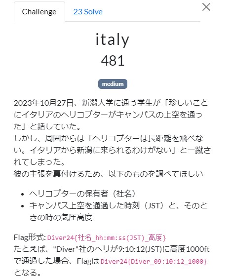
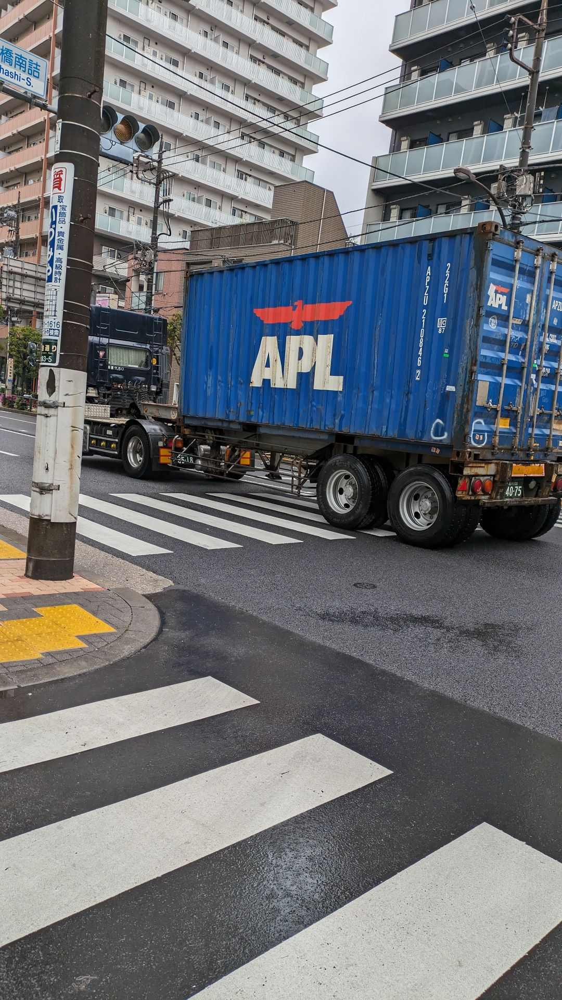
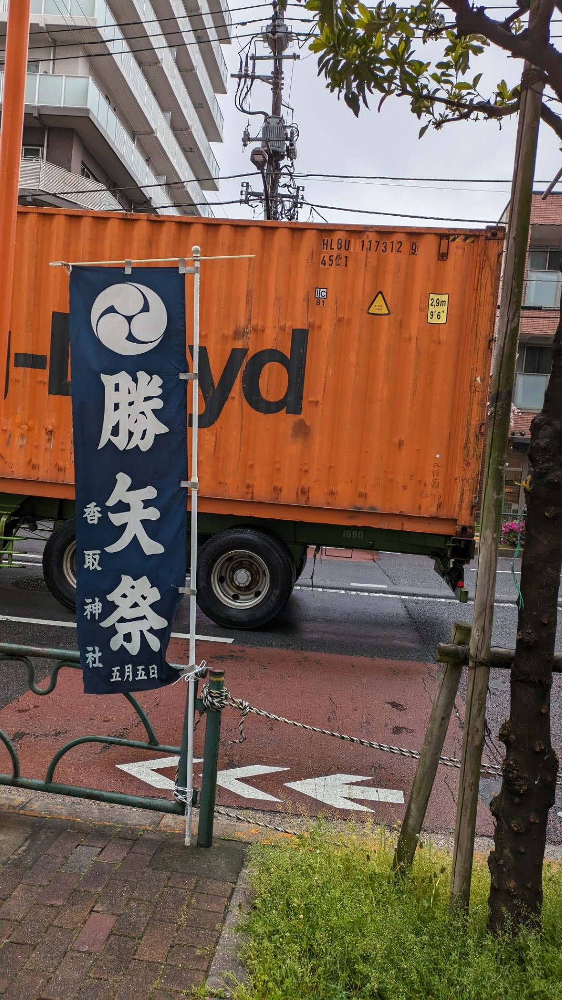

# DIVER OSINT CTF 2024 Writeup

DIVER OSINT CTF 2024（<https://ctftime.org/event/2365/>）に参加しました。  
2024/06/08 (土) 12:00 - 06/09 (日) 12:00

チーム0nePaddingで参加して14位でした。（欲を言うと、一桁入りたかったです）  
どの問題も学びがあって、チームメンバーと協力しながら取り組めたのでとても楽しかったです。


<!-- @import "[TOC]" {cmd="toc" depthFrom=2 depthTo=3 orderedList=false} -->

<!-- code_chunk_output -->

- [introduction](#introduction)
  - [office](#office)
- [misc](#misc)
  - [number](#number)
  - [label](#label)
  - [wumpus](#wumpus)
  - [timestamp](#timestamp)
- [military](#military)
  - [osprey1](#osprey1)
  - [osprey2](#osprey2)
  - [satellite(途中まで)](#satellite途中まで)
- [transporation](#transporation)
  - [youtuber](#youtuber)
  - [accident](#accident)
  - [italy](#italy)
  - [container](#container)

<!-- /code_chunk_output -->

## introduction

### office


`.odt`ファイルがダウンロードできる。  
試しにzip解凍してみると、Flagが書かれた画像ファイルが見つかりました。

## misc

### number


車のナンバーを見ると、外交官ナンバーであることがわかる。  
国番号(49)がわかれば特定できそうです。  
チームメンバーに聞いたところ、`クウェート`が該当することがわかりました。

<https://www.weblio.jp/content/%E5%A4%96%E4%BA%A4%E5%AE%98%E8%BB%8A%E4%B8%A1>

大使館を調べると1つだけ見つかり、そこの電話番号がFlagでした。

<https://www.mofa.go.jp/mofaj/link/emblist/middleeast.html#09>

### label


以下が問題の画像。


宛先の部分が削られているが、下のQRコードは完全な状態でした。
それぞれQRコードを読み取ると、2つ目(rMQRコード)にSHIPMENT ADDRESSが書いてありました。


```text
SHIPMENT ADDRESS:
Baba-cho 14-1, Tsuruoka City, Yamagata, Japan
```

読み取りには、デンソーウェーブのQRQRを使いました。  
<https://play.google.com/store/apps/details?id=com.arara.q>

後は郵便番号を調べるだけです。

### wumpus


画像に移っているブラウザのロケーションバーから、サーバIDがわかります。  
サーバIDを入れた以下のリンクにアクセスすると該当のDiscordサーバが見つかりました。

<https://discordservers.com/server/1244302408402735114>

joinすると、チャンネルにFlagのQRコードがありました。

### timestamp


xに投稿されている画像にはexif情報などは含まれていませんでした。  
関係がありそうな文言でGoogle検索すると、以下のPDFが見つかりました。
<https://www.mod.go.jp/js/pdf/2024/p20240312_01.pdf>

試しにpdfから画像を抽出してみると、時刻が書かれた画像がありました。

```sh
pdfimages p20240312_01.pdf output -j
```

## military

### osprey1


Google検索すると情報が見つかりました。  
（以下の記事の追記部分）  
<https://fr24.quora.com/2023-11-29-%E4%BB%8A%E6%97%A5-%E5%B1%8B%E4%B9%85%E5%B3%B6%E6%B2%96%E3%81%A7%E7%B1%B3%E7%A9%BA%E8%BB%8D%E3%81%AECV-22-%E3%82%AA%E3%82%B9%E3%83%97%E3%83%AC%E3%82%A4%E3%81%8C%E5%A2%9C%E8%90%BD%E3%81%97%E3%81%9F%E3%82%88%E3%81%86%E3%81%A7%E3%81%99-%E3%81%93%E3%81%AE%E6%A9%9F%E4%BD%93%E3%81%AF%E6%A8%AA%E7%94%B0%E5%9F%BA%E5%9C%B0%E3%81%AB%E9%85%8D%E5%B1%9E%E3%81%95%E3%82%8C%E3%81%A6%E3%81%84%E3%82%8B-%E3%82%A2%E3%83%A1%E3%83%AA%E3%82%AB%E7%A9%BA%E8%BB%8D-%E7%AC%AC353%E7%89%B9%E6%AE%8A%E4%BD%9C%E6%88%A6%E8%88%AA%E7%A9%BA%E5%9B%A3-%E7%AC%AC21%E7%89%B9%E6%AE%8A%E4%BD%9C%E6%88%A6%E9%A3%9B%E8%A1%8C%E9%9A%8A-%E6%89%80%E5%B1%9E%E3%81%AE%E6%A9%9F%E4%BD%93%E3%81%AE%E3%82%88%E3%81%86%E3%81%A7%E3%81%99-%E7%AC%AC21%E7%89%B9%E6%AE%8A%E4%BD%9C%E6%88%A6%E9%A3%9B%E8%A1%8C%E9%9A%8A%E3%81%AE%E4%BB%BB>

```text
Flag: Diver24{12-0065_GUNDAM22}
```

### osprey2


調べると以下の記事が見つかりました。

<https://www.stripes.com/branches/air_force/2024-02-15/osprey-crash-japan-yokota-service-13010379.html>

横田基地のSamurai Fitness Centerの近くの運動場で行われたらしいです。

```text
A half-hour before sunset, approximately 600 people, mostly airmen in uniform, gathered for a brief retreat ceremony on the athletic field outside Yokota’s Samurai Fitness Center.
```

後はOpenStreetMapで探すだけのはずが、TrackとFieldで別のWay番号だったのではまりました。

不正解: <https://www.openstreetmap.org/way/810021665>
正解: <https://www.openstreetmap.org/way/810021666>

```text
Flag: Diver24{810021666}
```

### satellite(途中まで)


チームメンバーが偵察衛星は`MALLIGYONG-1`だと教えてくれました。  
衛星の追跡サイト（<https://stdkmd.net/sat/>）で探すと下図のようになりました。  
（CTFの終了間際でサイトの使い方を調べる時間がなかったので、500倍速の巻き戻し機能で頑張りました）


高度は503kmと思われますが、軍用飛行場までは特定できなかったです。（時間切れ）

## transporation

### youtuber


youtuberの記事を探すと、以下の動画が見つかりました。  
<https://youtu.be/VER6-0Pk0-A?t=215>

この動画から、捕まった駅は新幹線のNextに書いてある`博多`だと思ったんですが、違いました。
乗り継いだ駅は他の記事に書いてありました。  
<https://news.yahoo.co.jp/articles/bc10510d5fed2d71ed80c26b7c6b64eb80aefc16>

後は列車番号を調べるだけです。  
単なる`572`だとダメだったので、以下の表から`572A`であることがわかりました。
<https://munexpress.web.fc2.com/skse/tita/2023/582-20230318.pdf>

```text
Flag: Diver24{新鳥栖_572A}
```

### accident


画像にある建物の看板`愛爾麗集團`から、台湾であることがわかります。  
2023に起こった台湾のバスの事故で調べると、以下の記事が見つかりました。  
バスが似ているので、この事故だと思われます。

<https://www.ettoday.net/news/20231021/2607225.htm>

この記事の下にある動画を見ると、事故当時の日時がわかります。  
（最初、動画に気づかなかったのですが、チームメンバーが気づいてくれました）

後は場所を特定するだけなのですが、台湾の地名がわからなかったのでいろいろ調べていると、映像で映っていたのと同様のライブカメラが見つかりました。  
<https://www.1968services.tw/cam/n3-s-263k+760>

場所（緯度と経度）はライブカメラのもので大丈夫でした。

```text
Flag: Diver24{2023-10-21 09:43:02_23.703N120.603E}
```

### italy



<https://globe.adsbexchange.com/>のリプレイ機能を使って、新潟大学の上空を眺めていると、イタリアのヘリコプターが飛んでいました。

<https://globe.adsbexchange.com/?icao=3007a7&lat=37.871&lon=138.942&zoom=15.6&showTrace=2023-10-27>

大学の丁度真上の時間があったので、時間とその時の気圧高度はすぐにわかりました。  
ただ、社名がよくわからなかったので何パターンかを試しました。

```text
// 以下はダメだったパターン
Diver24{AgustaWestland_13:45:47_1600}
Diver24{Leonardo S.p.A._13:45:47_1600}
Diver24{Leonardo_13:45:47_1600}
```

チームメンバーに聞いてみると、社名は`Alidaunia`であることがわかりました。  
<https://www.helis.com/database/cn/52458/>

```text
Flag: Diver24{Alidaunia_13:45:47_1600}
```

### container


以下は問題の画像2枚です。




トラックのコンテナ番号がわかるので、それを使って追跡する問題だと予想できます。

- 1台目: APZU2108462
- 2台目: HLBU1173129

後は、勝矢祭 5月5日がヒントになりそうです。

追跡サービスで、1台目を検索すると、以下の情報がわかります。  
<https://www.cma-cgm.com/ebusiness/tracking/search>

- APZU2108462
  - Empty to shipper: 19 Apr 2024 15:25 (SHINAGAWA CONTAINER TERMINAL C-D-E)
  - Ready to be loaded: 22 Apr 2024 13:18 (TICT)
  - Loaded on board: 30 Apr 2024 11:24 (TICT)
  - Vessel Departure: 30 Apr 2024 16:36 (TICT)

2台目は別のサイトで検索しましたが、5/22～の情報だったので、おそらく違うと思われます。
<https://www.hapag-lloyd.com/en/online-business/track/track-by-container-solution.html?container=HLBU++1173129>

以上から、2024-04-19 AM から2024-04-22 PM までの間と推測できます。  
ただし、この問題は3回までしか回答できないので、もう少し絞りこむ必要があります。

改めて画像を見直すと、地面が濡れているように見えるので、雨が降った日で絞り込んでみます。  
<https://www.data.jma.go.jp/obd/stats/etrn/view/daily_s1.php?prec_no=44&block_no=47662&year=2024&month=4&day=20&view=>

後は以下の3つを試すだけです。（3回までの回答制限があったので、終了間際に試しました。）

```text
Diver24{2024-04-21-PM}
Diver24{2024-04-22-AM}
Diver24{2024-04-22-PM}
```

```text
Flag: Diver24{2024-04-22-AM}
```

後から思うと、TICTに13:18なら、その時間の少し前ぐらいが近そうな気がします。
